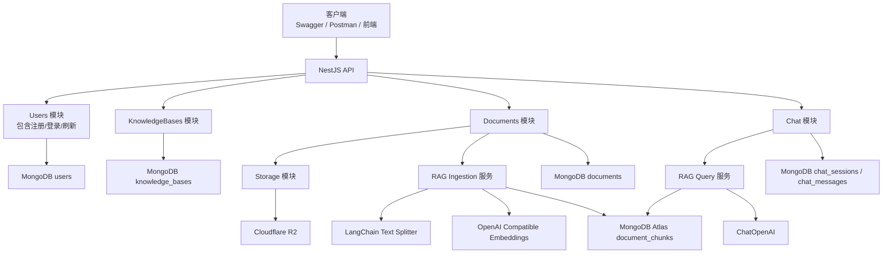
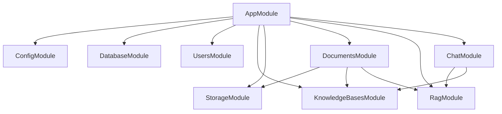
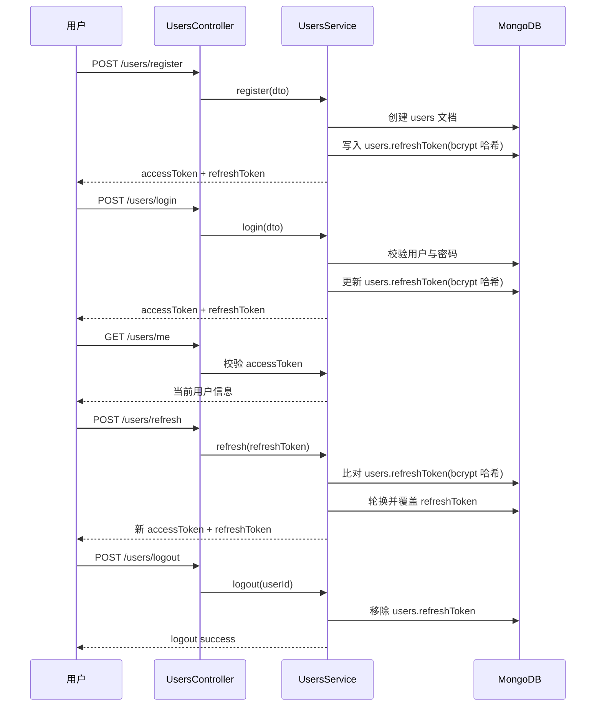
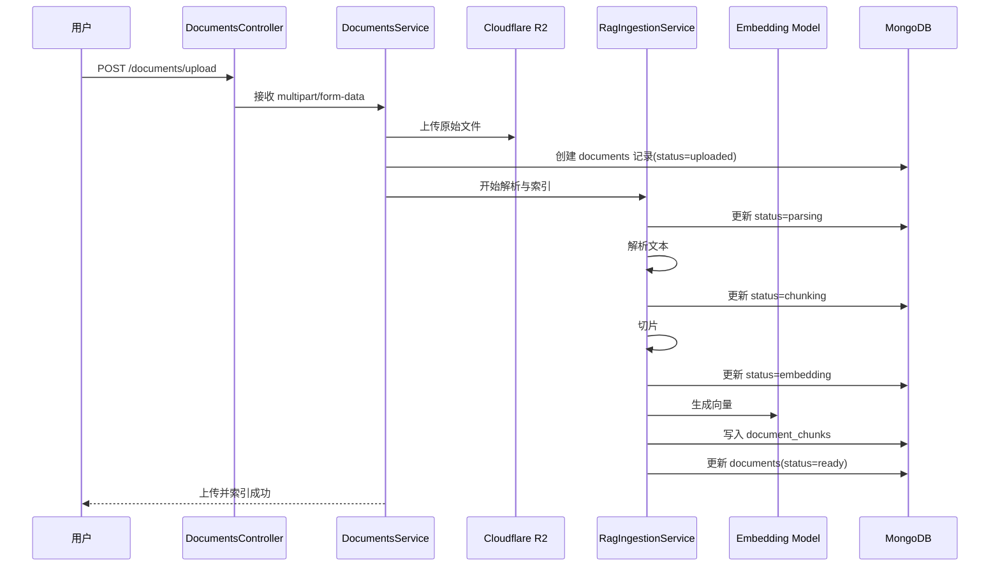
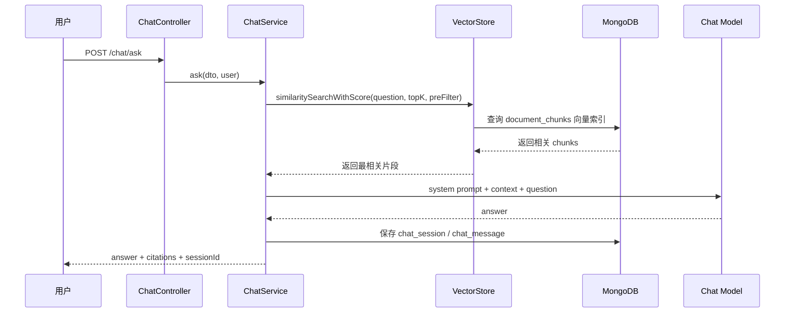
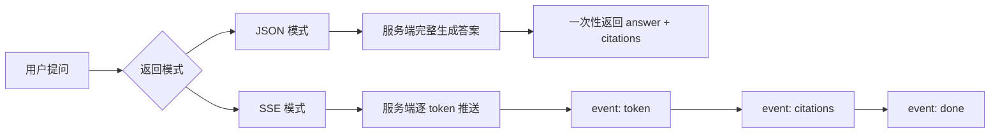

# Nest + MongoDB + LangChain 知识库问答系统从 0 到 1 完整实战文档

> 文档定位：一份给初学者的、可以直接照着做完整项目的后端实战手册  
> 适用日期：2026-03-12  
> 默认项目形态：`NestJS 单体后端 + Swagger + MongoDB Atlas Vector Search + Cloudflare R2 + OpenAI 兼容模型 + JWT access/refresh 双令牌 + JSON 与 SSE 两种问答接口`  
> 文档目标：你不是“读完懂概念”，而是“按步骤做完项目”

---

## 目录

1. [先看最终要做什么](#1-先看最终要做什么)
2. [这个项目到底解决什么问题](#2-这个项目到底解决什么问题)
3. [你做完后会真正掌握什么](#3-你做完后会真正掌握什么)
4. [适合谁，不适合谁](#4-适合谁不适合谁)
5. [开始前你至少要知道的基础知识](#5-开始前你至少要知道的基础知识)
6. [核心名词表，先用人话解释清楚](#6-核心名词表先用人话解释清楚)
7. [技术选型和为什么这样选](#7-技术选型和为什么这样选)
8. [系统架构图](#8-系统架构图)
9. [Nest 模块关系图](#9-nest-模块关系图)
10. [认证流程图](#10-认证流程图)
11. [上传并入库流程时序图](#11-上传并入库流程时序图)
12. [RAG 检索问答时序图](#12-rag-检索问答时序图)
13. [JSON 和 SSE 两种回答模式对比图](#13-json-和-sse-两种回答模式对比图)
14. [项目最终功能清单](#14-项目最终功能清单)
15. [推荐目录结构](#15-推荐目录结构)
16. [按模块整理 Schema 与 Module 引入](#16-按模块整理-schema-与-module-引入)
17. [API 设计与 DTO 设计](#17-api-设计与-dto-设计)
18. [环境变量设计](#18-环境变量设计)
19. [4 周学习路线](#19-4-周学习路线)
20. [阶段 1：环境准备](#20-阶段-1环境准备)
21. [阶段 2：Nest 项目初始化](#21-阶段-2nest-项目初始化)
22. [阶段 3：配置管理](#22-阶段-3配置管理)
23. [阶段 4：MongoDB 连接与 Schema](#23-阶段-4mongodb-连接与-schema)
24. [阶段 5：认证系统](#24-阶段-5认证系统)
25. [阶段 6：知识库与文档上传](#25-阶段-6知识库与文档上传)
26. [阶段 7：文档解析与切片](#26-阶段-7文档解析与切片)
27. [阶段 8：Embedding 与向量检索](#27-阶段-8embedding-与向量检索)
28. [阶段 9：RAG 问答（JSON）](#28-阶段-9rag-问答json)
29. [阶段 10：RAG 问答（SSE）](#29-阶段-10rag-问答sse)
30. [测试与验收](#30-测试与验收)
31. [常见报错排查](#31-常见报错排查)
32. [部署与环境变量说明](#32-部署与环境变量说明)
33. [下一步升级路线](#33-下一步升级路线)
34. [官方参考资料](#34-官方参考资料)

---

## 1. 先看最终要做什么

我们要做的不是一个“会聊天的接口”，而是一个**真正可用的知识库问答后端**。

用户可以：

1. 注册账号并登录。
2. 拿到 `accessToken` 和 `refreshToken`。
3. 创建自己的知识库。
4. 上传 `pdf`、`md`、`txt` 文档。
5. 后端把文档上传到 Cloudflare R2。
6. 后端解析文档内容，切成很多小块。
7. 后端调用 Embedding 模型把文本块变成向量。
8. 向量写入 MongoDB Atlas 的 `document_chunks` 集合。
9. 用户提问时，系统先去知识库里找最相关的内容。
10. 再把检索结果交给大模型生成回答。
11. 返回最终答案，并附带引用来源。
12. 聊天记录保存到数据库。
13. 同一个问题既支持普通 JSON 返回，也支持 SSE 流式输出。

如果你以前只写过普通 CRUD，这个项目会帮你跨过一大步，因为它同时覆盖了：

- 传统后端能力：认证、上传、数据库设计、Swagger、异常处理
- AI 工程能力：RAG、Embedding、向量检索、Prompt 组织、流式输出
- 工程意识：模块拆分、状态流转、数据冗余取舍、后续可扩展性

---

## 2. 这个项目到底解决什么问题

一句人话版：

> 我有一堆自己的文档，我不想手动翻，我想像问 ChatGPT 一样直接问它，但答案必须尽量基于我上传的资料，而不是胡说。

这就是知识库问答系统的价值。

这个项目的核心不是“让模型回答问题”，而是：

1. 让模型先看到**对的问题背景**。
2. 让模型只基于**检索到的资料**来回答。
3. 让答案有**来源引用**。
4. 让用户可以持续上传资料和复用知识库。

---

## 3. 你做完后会真正掌握什么

如果你把这份文档完整做完，你会真正掌握下面这些能力。

### 3.1 后端能力

- NestJS 项目的模块化组织方式
- DTO、ValidationPipe、Guard、Decorator 的实际用法
- JWT 双令牌认证
- MongoDB/Mongoose 的集合设计与索引设计
- 文件上传与对象存储接入
- Swagger 接口文档整理

### 3.2 AI 应用能力

- 什么是 RAG
- 什么是 Embedding
- 为什么要切片
- 为什么要做向量检索
- 如何把 LangChain 用在真实接口里，而不是只写 demo
- 如何设计“只能基于知识库回答”的 Prompt
- 如何返回引用来源

### 3.3 工程能力

- 如何让文档处理状态可追踪
- 如何处理失败重试
- 如何为后续队列、缓存、权限扩展留接口
- 为什么某些地方要冗余存储
- 为什么流式接口不能简单照搬普通接口

---

## 4. 适合谁，不适合谁

### 4.1 适合谁

- 学过一点 JavaScript / TypeScript
- 会基本的 `npm` / `pnpm`
- 知道 HTTP 请求是什么
- 想做一个真正能写进简历或作品集的 AI 后端项目
- 想系统学习 `NestJS + MongoDB + LangChain`

### 4.2 不太适合谁

- 完全没接触过 JavaScript
- 连 `async/await`、类、模块导入导出都还不熟
- 希望一上来就做多租户、权限系统、工作流 Agent、Redis、消息队列

如果你现在基础还比较弱，也完全不用担心。你只需要先补到下面这些程度：

- 看得懂一个 TypeScript 类
- 知道 `Promise` 是异步
- 能理解请求体、响应体、状态码
- 知道 MongoDB 是文档数据库

只要这些基础有了，这份文档就可以跟下来。

---

## 5. 开始前你至少要知道的基础知识

这部分不是让你精通，而是知道个大概。

### 5.1 Node.js 是什么

Node.js 让你可以用 JavaScript 写服务端程序。

### 5.2 NestJS 是什么

NestJS 是一个适合做大型后端项目的 Node.js 框架。它最大的特点是：

- 模块化很强
- 结构清晰
- 很适合团队协作
- 很适合做规范项目

### 5.3 MongoDB 是什么

MongoDB 是文档型数据库，数据通常长这样：

```json
{
  "_id": "67d0f7d2f0c2e4e7c1a00001",
  "email": "alice@example.com",
  "username": "Alice"
}
```

它不像 MySQL 那样强依赖表结构和 join，所以对“文档、聊天记录、知识片段、元数据”这类业务很友好。

### 5.4 LangChain 是什么

LangChain 不是模型本身，而是一个帮助你**组织模型调用流程**的工具库。

在这个项目里，LangChain 主要帮我们做 4 件事：

1. 文档切片
2. Embedding
3. MongoDB Atlas Vector Search 封装
4. 模型调用与 Prompt 组织

### 5.5 JWT 是什么

JWT 可以理解成“服务端签发的身份凭证”。

本项目会用两个：

- `accessToken`：有效期短，用来访问接口
- `refreshToken`：有效期长，用来在 accessToken 过期后刷新

---

## 6. 核心名词表，先用人话解释清楚

| 名词       | 人话解释                                     |
| ---------- | -------------------------------------------- |
| 知识库     | 一组文档的集合，比如“我的面试资料库”         |
| 文档       | 一份上传的 PDF、Markdown 或 TXT              |
| 切片 Chunk | 把长文档拆成很多小段                         |
| Embedding  | 把一段文本变成一串数字，方便做相似度搜索     |
| 向量检索   | 根据“语义相似”而不是“关键词完全一致”去找内容 |
| RAG        | 先检索资料，再让模型基于资料回答             |
| Retriever  | 负责从向量库里取回最相关内容的组件           |
| Citation   | 引用来源，告诉用户答案基于哪段资料           |
| SSE        | 一种服务器持续推送数据的方式，适合流式输出   |
| DTO        | 用来约束请求参数结构的类                     |
| Guard      | 用来拦截和放行请求的守卫，比如鉴权           |
| Schema     | MongoDB 中文档结构的定义                     |
| TTL Index  | 到期自动删除的索引，常用于会话、临时数据     |

---

## 7. 技术选型和为什么这样选

这一章非常重要，因为你不仅要知道“用什么”，还要知道“为什么不用别的”。

### 7.1 NestJS

我们选择 NestJS，而不是 Express 直接裸写，原因是：

- 文档多，社区大
- 非常适合模块化
- 自带 Controller、Service、Guard、Pipe 等结构
- 跟 Swagger、Mongoose 集成成熟
- 后续扩展认证、任务队列、缓存都很顺

### 7.2 Mongoose + MongoDB Atlas

我们选择 `Mongoose + MongoDB Atlas`，而不是本地 MongoDB 或 PostgreSQL，原因是：

- 你本来就想学 MongoDB
- 文档类项目很适合文档数据库
- Atlas 免费层适合练习
- Atlas 原生支持 Vector Search
- 以后做上线也比较顺

### 7.3 MongoDB Atlas Vector Search

我们不额外接 Pinecone、Qdrant、Weaviate，原因是：

- 你当前主线是 `Nest + MongoDB + LangChain`
- 初学阶段少一个中间件，就少一层心智负担
- MongoDB 业务数据和向量数据在一起，便于理解与维护

> 重要说明  
> 根据 MongoDB 官方文档，`M0` 免费集群可以用于练习，但在免费层上如果你**通过程序创建 Vector Search 索引**可能会遇到 `Command not found`。官方建议在这种情况下直接通过 **Atlas UI** 创建向量索引。  
> 这也是本教程为什么会明确要求你在 Atlas 控制台里手动建索引。

### 7.4 Cloudflare R2

我们选择 R2，而不是 Supabase Storage、GridFS 或本地磁盘，原因是：

- 你明确希望练习对象存储
- 你不想为了文件上传再引入第二个数据库
- R2 是标准对象存储，不是数据库
- 它兼容 S3 API，Node.js 接入简单
- 官方公开了免费层，适合练习

> 截至 2026-03-12，Cloudflare R2 官方页面显示的免费层为：  
> `10 GB-month` 存储、`100 万 Class A` 请求、`1000 万 Class B` 请求，且标准存储出网免费。  
> 这些数字以后可能变化，请始终以官方页面为准。

### 7.5 LangChain

我们不是为了“追热点”而用 LangChain，而是因为它正好能解决本项目的 4 个关键问题：

- 文档切片
- 模型封装
- 向量库封装
- Prompt 组织

### 7.6 OpenAI 兼容接口

你明确希望这套方案支持自定义 `apiKey` 和 `baseURL`，所以本教程会基于 `@langchain/openai` 来写。

这样做的好处是：

- 可以接官方 OpenAI
- 可以接支持 OpenAI 兼容协议的平台
- 可以接代理或统一网关

LangChain 官方文档也明确支持在 `ChatOpenAI` 和 `OpenAIEmbeddings` 中自定义 `baseURL`。

### 7.7 JWT 双令牌

本教程默认采用：

- `accessToken`: 15 分钟
- `refreshToken`: 7 天

这样设计是因为：

- accessToken 短，有利于降低泄漏风险
- refreshToken 长，用户体验更好
- 是最常见、最适合教学的认证模式

### 7.8 为什么主线不加入这些能力

本教程主线不加入：

- Redis
- 队列
- 多租户
- RBAC
- 邮箱验证码
- 忘记密码
- 后台管理端

原因很简单：**你现在要先从 0 到 1 跑通主链路**。

先能上传、切片、入库、检索、回答、引用、鉴权，再谈增强。

---

## 8. 系统架构图



这张图一定要看懂。

它告诉你整个系统其实只有 3 条核心主线：

1. 认证主线
2. 文档入库主线
3. 问答主线

---

## 9. Nest 模块关系图



这里你要建立一个很重要的工程习惯：

> Controller 不直接操作数据库，Controller 只收请求和回响应，真正业务逻辑放到 Service。

---

## 10. 认证流程图



---

## 11. 上传并入库流程时序图



---

## 12. RAG 检索问答时序图



---

## 13. JSON 和 SSE 两种回答模式对比图



### 13.1 两种模式的区别

| 模式 | 优点               | 缺点               | 适合什么                 |
| ---- | ------------------ | ------------------ | ------------------------ |
| JSON | 简单、稳定、好调试 | 用户要等完整答案   | 后端主链路、Swagger 调试 |
| SSE  | 体验更像 ChatGPT   | 实现复杂、调试稍难 | 真实聊天产品、前端联调   |

本教程会采用：

1. 先做 JSON，保证链路先跑通
2. 再升级到 SSE，理解流式输出

---

## 14. 项目最终功能清单

做完后，你的系统应该至少包含以下接口。

### 14.1 认证接口

| 方法 | 路径              | 说明         | 是否鉴权 |
| ---- | ----------------- | ------------ | -------- |
| POST | `/users/register` | 注册         | 否       |
| POST | `/users/login`    | 登录         | 否       |
| POST | `/users/refresh`  | 刷新 token   | 否       |
| POST | `/users/logout`   | 退出登录     | 是       |
| GET  | `/users/me`       | 获取当前用户 | 是       |

### 14.2 知识库接口

| 方法   | 路径                         | 说明                               | 是否鉴权 |
| ------ | ---------------------------- | ---------------------------------- | -------- |
| POST   | `/knowledge-bases`           | 创建知识库                         | 是       |
| GET    | `/knowledge-bases`           | 获取知识库列表                     | 是       |
| GET    | `/knowledge-bases/documents` | 获取当前用户所有知识库下的文档列表 | 是       |
| GET    | `/knowledge-bases/:id`       | 获取知识库详情                     | 是       |
| PATCH  | `/knowledge-bases/:id`       | 修改知识库                         | 是       |
| DELETE | `/knowledge-bases/:id`       | 删除知识库                         | 是       |

### 14.3 文档接口

| 方法   | 路径                     | 说明           | 是否鉴权 |
| ------ | ------------------------ | -------------- | -------- |
| POST   | `/documents/upload`      | 上传并索引文档 | 是       |
| GET    | `/documents`             | 文档列表       | 是       |
| GET    | `/documents/:id`         | 文档详情       | 是       |
| DELETE | `/documents/:id`         | 删除文档       | 是       |
| POST   | `/documents/:id/reindex` | 重新索引       | 是       |

### 14.4 聊天接口

| 方法 | 路径                          | 说明           | 是否鉴权 |
| ---- | ----------------------------- | -------------- | -------- |
| POST | `/chat/ask`                   | 普通 JSON 问答 | 是       |
| POST | `/chat/stream`                | SSE 流式问答   | 是       |
| GET  | `/chat/sessions`              | 会话列表       | 是       |
| GET  | `/chat/sessions/:id/messages` | 会话消息列表   | 是       |

---

## 15. 推荐目录结构

这一章要特别强调一件事：

这一轮你只需要把 **Schema 设计** 和 **Module 引入方式** 看懂、整理进文档即可。

你**不需要**因为看这份教程，就立刻在 `src` 目录下把所有文件都创建出来。

下面这些路径和代码块的作用是：

- 告诉你 schema 建议放在哪里
- 告诉你 module 应该怎样 `forFeature(...)`
- 让你未来真正动手实现时，有一套可直接复制的骨架

### 15.1 推荐目录落点

> 下文默认你的 Nest 项目目录名叫 `knowledge-base-api`

```text
knowledge-base-api
├─ src
│  ├─ main.ts
│  ├─ app.module.ts
│  ├─ app.controller.ts
│  ├─ app.service.ts
│  ├─ common
│  │  ├─ filters
│  │  │  └─ exception.filter.ts
│  │  ├─ guard
│  │  │  └─ jwt-auth.guard.ts
│  │  ├─ interceptor
│  │  │  └─ response.interceptor.ts
│  │  ├─ plugins
│  │  │  └─ mongoose-serialize.plugin.ts
│  │  └─ utils
│  │     ├─ jwt.strategy.ts
│  │     ├─ public.decorator.ts
│  │     └─ response.util.ts
│  ├─ users
│  │  ├─ dto
│  │  │  ├─ register.dto.ts
│  │  │  ├─ login.dto.ts
│  │  │  └─ refresh-token.dto.ts
│  │  ├─ schemas
│  │  │  └─ user.schema.ts
│  │  ├─ users.controller.ts
│  │  ├─ users.service.ts
│  │  └─ users.module.ts
│  ├─ knowledge-bases
│  │  ├─ schemas
│  │  │  └─ knowledge-base.schema.ts
│  │  └─ knowledge-bases.module.ts
│  ├─ documents
│  │  ├─ schemas
│  │  │  ├─ document.schema.ts
│  │  │  └─ document-chunk.schema.ts
│  │  └─ documents.module.ts
│  └─ chat
│     ├─ schemas
│     │  ├─ chat-session.schema.ts
│     │  └─ chat-message.schema.ts
│     └─ chat.module.ts
├─ docs
│  └─ Nest-MongoDB-LangChain-知识库问答系统-从0到1.md
├─ .env.local
├─ package.json
├─ tsconfig.json
└─ nest-cli.json
```

### 15.2 后续实现时会继续补上的目录

随着教程往后推进，你还会继续补这些目录：

```text
src
├─ common
│  └─ types
│     └─ auth.types.ts
├─ knowledge-bases
│  └─ dto
│     ├─ create-knowledge-base.dto.ts
│     ├─ update-knowledge-base.dto.ts
│     └─ list-knowledge-bases-query.dto.ts
├─ documents
│  └─ dto
│     ├─ upload-document.dto.ts
│     └─ list-documents-query.dto.ts
├─ chat
│  ├─ dto
│  │  ├─ ask-question.dto.ts
│  │  ├─ stream-ask.dto.ts
│  │  ├─ list-chat-sessions-query.dto.ts
│  │  └─ list-chat-messages-query.dto.ts
│  └─ types
│     └─ chat.types.ts
├─ storage
│  └─ types
│     └─ storage.types.ts
└─ rag
   └─ types
      └─ rag.types.ts
```

这里你要注意两件事：

- `storage` 和 `rag` 是**服务模块**，不是持久化模块
- 这一轮它们**不会创建任何 Mongoose schema**

### 15.3 每个目录的职责

- `common`: 公共守卫、过滤器、拦截器、Mongoose 插件和 JWT 工具
- `users`: 用户主数据和认证入口都放这里，同时负责 `/users/*` 路由和 `users` 集合
- `knowledge-bases`: 知识库主数据，只拥有 `knowledge_bases` 集合
- `documents`: 文档元数据和切片数据，拥有 `documents` 与 `document_chunks`
- `chat`: 会话与消息持久化，拥有 `chat_sessions` 与 `chat_messages`
- `storage`: 后续负责 R2 对象存储交互，不拥有 MongoDB 集合
- `rag`: 后续负责解析、切片、embedding、检索和 prompt 组织，不拥有 MongoDB 集合

### 15.4 依赖方向要记住

- `users` 自己承载登录、注册、刷新和当前用户信息
- `documents` 后续可以依赖 `storage`
- `documents` 后续可以依赖 `rag`
- `chat` 后续可以依赖 `rag`
- `storage` 与 `rag` 都不需要拥有自己的集合
- `controller` 不应该直接依赖 `mongoose model`

---

## 16. 按模块整理 Schema 与 Module 引入

这一章是整个项目最核心的章节之一。

你要做的不是“把数据随便存进去”，而是设计一套：

- 能支撑认证
- 能支撑上传和索引
- 能支撑 RAG 检索
- 能支撑聊天历史

本项目固定使用 6 个集合：

1. `users`
2. `knowledge_bases`
3. `documents`
4. `document_chunks`
5. `chat_sessions`
6. `chat_messages`

下面不再按“孤立集合”来回跳着看，而是按实际开发时更顺手的模块顺序整理：

1. `UsersModule`
2. `KnowledgeBasesModule`
3. `DocumentsModule`
4. `ChatModule`
5. `AppModule`

### 16.0 先记住这一轮的 schema 约定

本教程推荐的 schema 设计统一遵循下面几条规则：

- 全部使用 `@Schema({ collection, timestamps: true, versionKey: false })`
- 全部导出 `XxxDocument = HydratedDocument<Xxx>`
- 关联字段统一写成 `@Prop({ type: Types.ObjectId, ref: '...' })`
- 需要索引的地方用 `SchemaFactory.createForClass(...)` 之后显式 `index(...)`
- `mongooseSerializePlugin` 在 `src/app.module.ts` 里通过 `connectionFactory` 全局挂载，所以 schema 文件里不再重复 `schema.plugin(...)`

### 16.0.1 先把集合之间的关系看清楚

虽然 MongoDB 没有关系型数据库那种真正的外键约束，但这个项目的 6 张核心集合之间，仍然存在非常明确的“归属关系”。

你可以先把它理解成下面这张关系图：

```text
users
  └─ knowledge_bases
       └─ documents
            └─ document_chunks

users
  └─ chat_sessions
       └─ chat_messages

knowledge_bases
  ├─ documents
  ├─ document_chunks
  ├─ chat_sessions
  └─ chat_messages
```

如果改成更接近关系型数据库的说法，就是：

| 主集合            | 从集合            | 关系   | 说明                                                   |
| ----------------- | ----------------- | ------ | ------------------------------------------------------ |
| `users`           | `knowledge_bases` | 1 对多 | 一个用户可以拥有多个知识库，一个知识库只属于一个用户   |
| `knowledge_bases` | `documents`       | 1 对多 | 一个知识库下可以上传多份文档，一个文档只属于一个知识库 |
| `documents`       | `document_chunks` | 1 对多 | 一份文档会被切成多个 chunk，一个 chunk 只来自一份文档  |
| `users`           | `documents`       | 1 对多 | 文档冗余保存 `userId`，方便按用户过滤和做权限校验      |
| `users`           | `document_chunks` | 1 对多 | chunk 冗余保存 `userId`，方便向量检索时做用户隔离      |
| `knowledge_bases` | `document_chunks` | 1 对多 | chunk 冗余保存 `knowledgeBaseId`，方便按知识库过滤     |
| `users`           | `chat_sessions`   | 1 对多 | 一个用户可以在多个知识库里产生多个会话                 |
| `knowledge_bases` | `chat_sessions`   | 1 对多 | 一个知识库下可以有多个聊天会话                         |
| `chat_sessions`   | `chat_messages`   | 1 对多 | 一个会话里会有多轮问答消息                             |
| `users`           | `chat_messages`   | 1 对多 | 聊天消息冗余保存 `userId`，方便权限校验与查询          |
| `knowledge_bases` | `chat_messages`   | 1 对多 | 聊天消息冗余保存 `knowledgeBaseId`，方便按知识库筛选   |

这里要特别注意两点：

- `documents` 和 `document_chunks` 里同时保存 `userId`、`knowledgeBaseId`，不是“设计重复了”，而是为了减少跨集合查询，尤其是检索和权限判断时更高效
- `chat_messages.citations` 里虽然保存了 `documentId`、`chunkId`，但它更像“回答生成当时的引用快照”，不是严格依赖外键实时反查

所以这套数据模型不是单纯的链式关系，而是：

- 主归属链：`user -> knowledgeBase -> document -> chunk`
- 查询加速字段：`document`、`chunk`、`chat_message` 中冗余保存上层归属 ID
- 历史快照字段：`chat_messages.citations` 保存生成回答时的引用信息，避免后续文档变化影响历史对话展示

### 16.0.2 这些关系由谁来保证

MongoDB 不会像 MySQL/PostgreSQL 那样帮你自动维护外键，所以这些关系主要靠三层保证：

- schema 层：字段类型统一是 `ObjectId`
- service 层：写入前检查“这个知识库/文档是否属于当前用户”
- 删除流程：显式做级联删除，而不是指望数据库自动处理

也就是说，本项目的“关系完整性”更多是业务层约束，而不是数据库硬约束。

也就是说，下面这些代码块不是“泛泛而谈的概念示意”，而是你后面真正实现时几乎可以直接复制的版本。

但请注意：

- 这一轮你只需要把它们补充到 md 文档中
- 不要求你现在马上去 `src` 下逐个创建实现文件

### 16.1 用户模块 `UsersModule`

这个模块只拥有一张集合：

- `users`

#### `users` 集合的作用

存用户基础信息，同时顺手保存当前有效的 `refreshToken`。

这里要补一句和当前代码一致的话：

- 用户刚注册完成、或者已经 logout 之后，`refreshToken` 字段可能不存在
- 只有在 `register/login/refresh` 这些会重新签发 token 的动作之后，才会把新的 refreshToken 哈希写回去

#### 字段设计

| 字段           | 类型     | 必填 | 说明                                 |
| -------------- | -------- | ---- | ------------------------------------ |
| `_id`          | ObjectId | 是   | 用户主键                             |
| `email`        | string   | 是   | 登录邮箱，唯一                       |
| `password`     | string   | 是   | 密码哈希                             |
| `username`     | string   | 是   | 显示名称                             |
| `status`       | string   | 是   | `active` / `disabled`                |
| `refreshToken` | string   | 否   | 当前有效 refreshToken 的 bcrypt 哈希 |
| `lastLoginAt`  | Date     | 否   | 最近登录时间                         |
| `createdAt`    | Date     | 是   | 创建时间                             |
| `updatedAt`    | Date     | 是   | 更新时间                             |

#### 索引

- `email` 唯一索引

#### 示例文档

```json
{
  "_id": { "$oid": "67d0f7d2f0c2e4e7c1a00001" },
  "email": "alice@example.com",
  "password": "$2b$10$S5I........",
  "username": "Alice",
  "status": "active",
  "refreshToken": "6c4f0e8d8c7f4e3....",
  "lastLoginAt": { "$date": "2026-03-12T10:00:00.000Z" },
  "createdAt": { "$date": "2026-03-12T09:00:00.000Z" },
  "updatedAt": { "$date": "2026-03-12T10:00:00.000Z" }
}
```

#### 文件：`src/users/schemas/user.schema.ts`

```ts
import { Prop, Schema, SchemaFactory } from '@nestjs/mongoose';
import { HydratedDocument } from 'mongoose';
import bcrypt from 'bcryptjs';

export type UserDocument = HydratedDocument<User> & {
  comparePassword(password: string): Promise<boolean>;
};

export enum UserStatus {
  Active = 'active',
  Disabled = 'disabled',
}

@Schema({
  collection: 'users',
  timestamps: true,
  versionKey: false,
})
export class User {
  @Prop({
    required: true,
    trim: true,
  })
  email: string;

  @Prop({ required: true })
  password: string;

  @Prop({
    required: true,
    trim: true,
  })
  username: string;

  @Prop({
    type: String,
    enum: Object.values(UserStatus),
    default: UserStatus.Active,
    required: true,
  })
  status: UserStatus;

  @Prop({
    type: String,
    default: undefined,
    trim: true,
  })
  refreshToken?: string;

  @Prop({
    type: Date,
    default: Date.now,
  })
  lastLoginAt?: Date;
}

export const UserSchema = SchemaFactory.createForClass(User);

UserSchema.index({ email: 1 }, { unique: true });

UserSchema.pre<UserDocument>('save', async function () {
  if (!this.isModified('password')) {
    return;
  }

  const salt = await bcrypt.genSalt(10);

  if (this.password) {
    this.password = await bcrypt.hash(this.password, salt);
  }
});

UserSchema.methods.comparePassword = async function (
  candidatePassword: string,
): Promise<boolean> {
  if (!this.password) return false;
  return await bcrypt.compare(candidatePassword, this.password as string);
};
```

#### `UsersModule` 中如何引入

```ts
import { Module } from '@nestjs/common';
import { MongooseModule } from '@nestjs/mongoose';
import { User, UserSchema } from './schemas/user.schema';
import { UsersController } from './users.controller';
import { UsersService } from './users.service';

@Module({
  imports: [
    MongooseModule.forFeature([{ name: User.name, schema: UserSchema }]),
  ],
  controllers: [UsersController],
  providers: [UsersService],
  exports: [UsersService],
})
export class UsersModule {}
```

### 16.2 `UsersModule` 中的认证能力

这次我们故意采用一个更适合个人练习项目的简化方案：

- 不再单独创建 `auth_sessions`
- 不再保留 `AuthModule`
- 注册、登录、刷新、退出、当前用户都放进 `UsersModule`
- `refreshToken` 直接存在 `users` 集合里

这个方案为什么更适合练习：

- 少一张表，少一层模型注入
- 少一个模块，目录更简单
- 单人开发时更容易把心力放在文档上传、切片、检索和回答主链路

这个方案的边界也要知道：

- 默认只适合单设备或单会话
- 后一次登录或刷新会覆盖上一次保存的 `refreshToken`
- 当前 service 会顺手检查 `username` 是否重复，但数据库硬约束仍然只有 `email` 唯一索引
- 不适合做多端登录、设备管理、会话列表

如果你以后要升级为更正式的项目，再把 `auth_sessions` 拆出来就可以。

### 16.3 知识库模块 `KnowledgeBasesModule`

这个模块只拥有一张集合：

- `knowledge_bases`

#### `knowledge_bases` 集合的作用

存知识库本身。

一个用户可以有多个知识库，比如：

- `Nest 学习资料`
- `面试题库`
- `项目文档`

#### 字段设计

| 字段            | 类型     | 必填 | 说明             |
| --------------- | -------- | ---- | ---------------- |
| `_id`           | ObjectId | 是   | 知识库主键       |
| `userId`        | ObjectId | 是   | 所属用户         |
| `name`          | string   | 是   | 知识库名称       |
| `description`   | string   | 否   | 知识库描述       |
| `documentCount` | number   | 是   | 文档数量缓存     |
| `chunkCount`    | number   | 是   | 切片数量缓存     |
| `lastIndexedAt` | Date     | 否   | 最近一次索引时间 |
| `createdAt`     | Date     | 是   | 创建时间         |
| `updatedAt`     | Date     | 是   | 更新时间         |

#### 索引

- `userId`
- `userId + updatedAt`

#### 示例文档

```json
{
  "_id": { "$oid": "67d0f7d2f0c2e4e7c1a20001" },
  "userId": { "$oid": "67d0f7d2f0c2e4e7c1a00001" },
  "name": "Nest 学习资料",
  "description": "NestJS 与工程化相关文档",
  "documentCount": 3,
  "chunkCount": 128,
  "lastIndexedAt": { "$date": "2026-03-12T11:00:00.000Z" },
  "createdAt": { "$date": "2026-03-12T10:30:00.000Z" },
  "updatedAt": { "$date": "2026-03-12T11:00:00.000Z" }
}
```

#### 文件：`src/knowledge-bases/schemas/knowledge-base.schema.ts`

```ts
import { Prop, Schema, SchemaFactory } from '@nestjs/mongoose';
import { HydratedDocument, Types } from 'mongoose';

export type KnowledgeBaseDocument = HydratedDocument<KnowledgeBase>;

@Schema({
  collection: 'knowledge_bases',
  timestamps: true,
  versionKey: false,
})
export class KnowledgeBase {
  @Prop({
    type: Types.ObjectId,
    ref: 'User',
    required: true,
    index: true,
  })
  userId: Types.ObjectId;

  @Prop({
    required: true,
    trim: true,
    maxlength: 100,
  })
  name: string;

  @Prop({
    trim: true,
    maxlength: 500,
  })
  description?: string;

  @Prop({
    required: true,
    default: 0,
    min: 0,
  })
  documentCount: number;

  @Prop({
    required: true,
    default: 0,
    min: 0,
  })
  chunkCount: number;

  @Prop()
  lastIndexedAt?: Date;
}

export const KnowledgeBaseSchema = SchemaFactory.createForClass(KnowledgeBase);

KnowledgeBaseSchema.index({ userId: 1, updatedAt: -1 });
```

#### `KnowledgeBasesModule` 中如何引入

```ts
import { Module } from '@nestjs/common';
import { MongooseModule } from '@nestjs/mongoose';
import {
  KnowledgeBase,
  KnowledgeBaseSchema,
} from './schemas/knowledge-base.schema';

@Module({
  imports: [
    MongooseModule.forFeature([
      { name: KnowledgeBase.name, schema: KnowledgeBaseSchema },
    ]),
  ],
  exports: [MongooseModule],
})
export class KnowledgeBasesModule {}
```

### 16.4 文档模块 `DocumentsModule`

这个模块同时拥有两张集合：

- `documents`
- `document_chunks`

你可以把它理解成：

- `documents` 负责“原始文档元数据”
- `document_chunks` 负责“切片和向量”

#### `documents` 集合的作用

存上传文档的元数据，不存大文本内容本体。

原始文件放 R2，数据库只存“这份文件是谁的、在哪个知识库里、在 R2 里的 key 是什么、当前处理到哪一步了”。

#### 文档状态设计

`status` 推荐固定为下面 6 个值：

- `uploaded`
- `parsing`
- `chunking`
- `embedding`
- `ready`
- `failed`

#### 字段设计

| 字段                | 类型     | 必填 | 说明           |
| ------------------- | -------- | ---- | -------------- |
| `_id`               | ObjectId | 是   | 文档主键       |
| `userId`            | ObjectId | 是   | 所属用户       |
| `knowledgeBaseId`   | ObjectId | 是   | 所属知识库     |
| `title`             | string   | 是   | 显示标题       |
| `originalName`      | string   | 是   | 原文件名       |
| `ext`               | string   | 是   | 文件扩展名     |
| `mimeType`          | string   | 是   | MIME 类型      |
| `size`              | number   | 是   | 文件大小，字节 |
| `sha256`            | string   | 否   | 文件内容摘要   |
| `storageProvider`   | string   | 是   | 固定为 `r2`    |
| `bucket`            | string   | 是   | R2 bucket 名称 |
| `objectKey`         | string   | 是   | R2 对象 key    |
| `status`            | string   | 是   | 当前处理状态   |
| `pageCount`         | number   | 否   | PDF 页数       |
| `chunkCount`        | number   | 否   | 切片数量       |
| `parseErrorMessage` | string   | 否   | 失败原因       |
| `indexedAt`         | Date     | 否   | 完成索引时间   |
| `createdAt`         | Date     | 是   | 创建时间       |
| `updatedAt`         | Date     | 是   | 更新时间       |

#### 索引

- `userId`
- `knowledgeBaseId`
- `userId + knowledgeBaseId`
- `status`

#### 示例文档

```json
{
  "_id": { "$oid": "67d0f7d2f0c2e4e7c1a30001" },
  "userId": { "$oid": "67d0f7d2f0c2e4e7c1a00001" },
  "knowledgeBaseId": { "$oid": "67d0f7d2f0c2e4e7c1a20001" },
  "title": "Nest 实战手册",
  "originalName": "nest-guide.pdf",
  "ext": "pdf",
  "mimeType": "application/pdf",
  "size": 245612,
  "sha256": "cb8e00d4...",
  "storageProvider": "r2",
  "bucket": "knowledge-base-files",
  "objectKey": "67d0.../67d0.../2026/03/12/67d0...-nest-guide.pdf",
  "status": "ready",
  "pageCount": 18,
  "chunkCount": 42,
  "parseErrorMessage": null,
  "indexedAt": { "$date": "2026-03-12T11:30:00.000Z" },
  "createdAt": { "$date": "2026-03-12T11:25:00.000Z" },
  "updatedAt": { "$date": "2026-03-12T11:30:00.000Z" }
}
```

#### 文件：`src/documents/schemas/document.schema.ts`

```ts
import { Prop, Schema, SchemaFactory } from '@nestjs/mongoose';
import { HydratedDocument, Types } from 'mongoose';

export type KnowledgeDocumentDocument = HydratedDocument<KnowledgeDocument>;

export enum DocumentStatus {
  Uploaded = 'uploaded',
  Parsing = 'parsing',
  Chunking = 'chunking',
  Embedding = 'embedding',
  Ready = 'ready',
  Failed = 'failed',
}

export enum StorageProvider {
  R2 = 'r2',
}

@Schema({
  collection: 'documents',
  timestamps: true,
  versionKey: false,
})
export class KnowledgeDocument {
  @Prop({
    type: Types.ObjectId,
    ref: 'User',
    required: true,
    index: true,
  })
  userId: Types.ObjectId;

  @Prop({
    type: Types.ObjectId,
    ref: 'KnowledgeBase',
    required: true,
    index: true,
  })
  knowledgeBaseId: Types.ObjectId;

  @Prop({
    required: true,
    trim: true,
    maxlength: 200,
  })
  title: string;

  @Prop({
    required: true,
    trim: true,
  })
  originalName: string;

  @Prop({
    required: true,
    trim: true,
    lowercase: true,
  })
  ext: string;

  @Prop({
    required: true,
    trim: true,
    lowercase: true,
  })
  mimeType: string;

  @Prop({
    required: true,
    min: 0,
  })
  size: number;

  @Prop({ trim: true })
  sha256?: string;

  @Prop({
    type: String,
    enum: Object.values(StorageProvider),
    required: true,
    default: StorageProvider.R2,
  })
  storageProvider: StorageProvider;

  @Prop({
    required: true,
    trim: true,
  })
  bucket: string;

  @Prop({
    required: true,
    trim: true,
  })
  objectKey: string;

  @Prop({
    type: String,
    enum: Object.values(DocumentStatus),
    required: true,
    default: DocumentStatus.Uploaded,
    index: true,
  })
  status: DocumentStatus;

  @Prop({ min: 0 })
  pageCount?: number;

  @Prop({ min: 0 })
  chunkCount?: number;

  @Prop({
    default: null,
    trim: true,
  })
  parseErrorMessage?: string | null;

  @Prop()
  indexedAt?: Date;
}

export const KnowledgeDocumentSchema =
  SchemaFactory.createForClass(KnowledgeDocument);

KnowledgeDocumentSchema.index({ userId: 1, knowledgeBaseId: 1 });
```

#### `document_chunks` 集合的作用

存切片后的文本和对应向量。

这张表是整个 RAG 项目最关键的集合。

#### 设计原则

1. 一条记录只代表一个文本块
2. 文本块必须能追溯回原文档
3. 文本块必须可用于向量检索
4. 为了减少查询联表成本，可以保存少量冗余字段

#### 字段设计

| 字段               | 类型     | 必填 | 说明                        |
| ------------------ | -------- | ---- | --------------------------- |
| `_id`              | ObjectId | 是   | 切片主键                    |
| `userId`           | ObjectId | 是   | 所属用户                    |
| `knowledgeBaseId`  | ObjectId | 是   | 所属知识库                  |
| `documentId`       | ObjectId | 是   | 来源文档                    |
| `documentTitle`    | string   | 是   | 文档标题快照，便于 citation |
| `chunkIndex`       | number   | 是   | 第几个切片                  |
| `text`             | string   | 是   | 切片文本                    |
| `embedding`        | number[] | 是   | 向量数组                    |
| `pageNumber`       | number   | 否   | 页码，PDF 时可用            |
| `charCount`        | number   | 是   | 字符数                      |
| `tokenCountApprox` | number   | 否   | 估算 token 数               |
| `createdAt`        | Date     | 是   | 创建时间                    |
| `updatedAt`        | Date     | 是   | 更新时间                    |

#### 普通索引

- `userId`
- `knowledgeBaseId`
- `documentId`
- `documentId + chunkIndex` 唯一索引

#### Vector Search 索引

`embedding` 字段要在 Atlas 中创建向量索引。

同时如果你希望在检索时按 `userId`、`knowledgeBaseId`、`documentId` 过滤，这些字段也必须在 Atlas 向量索引里以 `filter` 类型声明。

#### 示例文档

```json
{
  "_id": { "$oid": "67d0f7d2f0c2e4e7c1a40001" },
  "userId": { "$oid": "67d0f7d2f0c2e4e7c1a00001" },
  "knowledgeBaseId": { "$oid": "67d0f7d2f0c2e4e7c1a20001" },
  "documentId": { "$oid": "67d0f7d2f0c2e4e7c1a30001" },
  "documentTitle": "Nest 实战手册",
  "chunkIndex": 0,
  "text": "NestJS 是一个用于构建高效、可扩展 Node.js 服务端应用程序的框架...",
  "embedding": [0.0123, -0.0456, 0.0912],
  "pageNumber": 1,
  "charCount": 356,
  "tokenCountApprox": 220,
  "createdAt": { "$date": "2026-03-12T11:28:00.000Z" },
  "updatedAt": { "$date": "2026-03-12T11:28:00.000Z" }
}
```

#### 文件：`src/documents/schemas/document-chunk.schema.ts`

```ts
import { Prop, Schema, SchemaFactory } from '@nestjs/mongoose';
import { HydratedDocument, Types } from 'mongoose';

export type DocumentChunkDocument = HydratedDocument<DocumentChunk>;

@Schema({
  collection: 'document_chunks',
  timestamps: true,
  versionKey: false,
})
export class DocumentChunk {
  @Prop({
    type: Types.ObjectId,
    ref: 'User',
    required: true,
    index: true,
  })
  userId: Types.ObjectId;

  @Prop({
    type: Types.ObjectId,
    ref: 'KnowledgeBase',
    required: true,
    index: true,
  })
  knowledgeBaseId: Types.ObjectId;

  @Prop({
    type: Types.ObjectId,
    ref: 'KnowledgeDocument',
    required: true,
    index: true,
  })
  documentId: Types.ObjectId;

  @Prop({
    required: true,
    trim: true,
    maxlength: 200,
  })
  documentTitle: string;

  @Prop({
    required: true,
    min: 0,
  })
  chunkIndex: number;

  @Prop({
    required: true,
    trim: true,
  })
  text: string;

  @Prop({
    type: [Number],
    required: true,
  })
  embedding: number[];

  @Prop({ min: 1 })
  pageNumber?: number;

  @Prop({
    required: true,
    min: 0,
  })
  charCount: number;

  @Prop({ min: 0 })
  tokenCountApprox?: number;
}

export const DocumentChunkSchema = SchemaFactory.createForClass(DocumentChunk);

DocumentChunkSchema.index({ documentId: 1, chunkIndex: 1 }, { unique: true });
```

#### 推荐 Atlas 向量索引 JSON

> 如果你使用的是 `text-embedding-3-small`，默认维度一般是 `1536`。  
> 如果你接入的 OpenAI 兼容厂商返回其他维度，你必须把这里的 `numDimensions` 一起改掉。

```json
{
  "fields": [
    {
      "type": "vector",
      "path": "embedding",
      "numDimensions": 1536,
      "similarity": "cosine"
    },
    {
      "type": "filter",
      "path": "userId"
    },
    {
      "type": "filter",
      "path": "knowledgeBaseId"
    },
    {
      "type": "filter",
      "path": "documentId"
    }
  ]
}
```

#### `DocumentsModule` 中如何引入

```ts
import { Module } from '@nestjs/common';
import { MongooseModule } from '@nestjs/mongoose';
import {
  KnowledgeDocument,
  KnowledgeDocumentSchema,
} from './schemas/document.schema';
import {
  DocumentChunk,
  DocumentChunkSchema,
} from './schemas/document-chunk.schema';

@Module({
  imports: [
    MongooseModule.forFeature([
      { name: KnowledgeDocument.name, schema: KnowledgeDocumentSchema },
      { name: DocumentChunk.name, schema: DocumentChunkSchema },
    ]),
  ],
  exports: [MongooseModule],
})
export class DocumentsModule {}
```

### 16.5 聊天模块 `ChatModule`

这个模块同时拥有两张集合：

- `chat_sessions`
- `chat_messages`

#### `chat_sessions` 集合的作用

存一个会话本身。

比如你在同一个知识库里连续问 10 个问题，这 10 个问题可以归到一个 `chat_session` 里。

#### 字段设计

| 字段              | 类型     | 必填 | 说明                         |
| ----------------- | -------- | ---- | ---------------------------- |
| `_id`             | ObjectId | 是   | 会话主键                     |
| `userId`          | ObjectId | 是   | 所属用户                     |
| `knowledgeBaseId` | ObjectId | 是   | 所属知识库                   |
| `title`           | string   | 是   | 会话标题，可由第一问截断生成 |
| `lastMessageAt`   | Date     | 是   | 最近一条消息时间             |
| `createdAt`       | Date     | 是   | 创建时间                     |
| `updatedAt`       | Date     | 是   | 更新时间                     |

#### 索引

- `userId + lastMessageAt`
- `knowledgeBaseId`

#### 示例文档

```json
{
  "_id": { "$oid": "67d0f7d2f0c2e4e7c1a50001" },
  "userId": { "$oid": "67d0f7d2f0c2e4e7c1a00001" },
  "knowledgeBaseId": { "$oid": "67d0f7d2f0c2e4e7c1a20001" },
  "title": "Nest 模块和服务的关系",
  "lastMessageAt": { "$date": "2026-03-12T12:10:00.000Z" },
  "createdAt": { "$date": "2026-03-12T12:00:00.000Z" },
  "updatedAt": { "$date": "2026-03-12T12:10:00.000Z" }
}
```

#### 文件：`src/chat/schemas/chat-session.schema.ts`

```ts
import { Prop, Schema, SchemaFactory } from '@nestjs/mongoose';
import { HydratedDocument, Types } from 'mongoose';

export type ChatSessionDocument = HydratedDocument<ChatSession>;

@Schema({
  collection: 'chat_sessions',
  timestamps: true,
  versionKey: false,
})
export class ChatSession {
  @Prop({
    type: Types.ObjectId,
    ref: 'User',
    required: true,
    index: true,
  })
  userId: Types.ObjectId;

  @Prop({
    type: Types.ObjectId,
    ref: 'KnowledgeBase',
    required: true,
    index: true,
  })
  knowledgeBaseId: Types.ObjectId;

  @Prop({
    required: true,
    trim: true,
    maxlength: 200,
  })
  title: string;

  @Prop({
    required: true,
    default: Date.now,
  })
  lastMessageAt: Date;
}

export const ChatSessionSchema = SchemaFactory.createForClass(ChatSession);

ChatSessionSchema.index({ userId: 1, lastMessageAt: -1 });
```

#### `chat_messages` 集合的作用

存一次完整的问答轮次。

为了便于教学，本教程不把用户消息和模型消息拆成两条，而是一条记录同时保存：

- 用户问题
- 模型回答
- 引用来源
- 模型元信息

这种设计更适合初学阶段快速落地。

#### 字段设计

| 字段               | 类型           | 必填 | 说明           |
| ------------------ | -------------- | ---- | -------------- |
| `_id`              | ObjectId       | 是   | 消息主键       |
| `sessionId`        | ObjectId       | 是   | 所属会话       |
| `userId`           | ObjectId       | 是   | 所属用户       |
| `knowledgeBaseId`  | ObjectId       | 是   | 所属知识库     |
| `question`         | string         | 是   | 用户问题       |
| `answer`           | string         | 是   | 模型回答       |
| `citations`        | ChatCitation[] | 是   | 引用来源       |
| `responseMode`     | string         | 是   | `json` / `sse` |
| `modelName`        | string         | 是   | 使用的聊天模型 |
| `topK`             | number         | 是   | 检索数量       |
| `promptTokens`     | number         | 否   | 输入 token     |
| `completionTokens` | number         | 否   | 输出 token     |
| `totalTokens`      | number         | 否   | 总 token       |
| `latencyMs`        | number         | 否   | 耗时           |
| `createdAt`        | Date           | 是   | 创建时间       |
| `updatedAt`        | Date           | 是   | 更新时间       |

#### 引用对象 `ChatCitation`

```ts
export type ChatCitation = {
  chunkId: string;
  documentId: string;
  documentName: string;
  chunkIndex: number;
  pageNumber?: number;
  score?: number;
  contentPreview: string;
};
```

#### 示例文档

```json
{
  "_id": { "$oid": "67d0f7d2f0c2e4e7c1a60001" },
  "sessionId": { "$oid": "67d0f7d2f0c2e4e7c1a50001" },
  "userId": { "$oid": "67d0f7d2f0c2e4e7c1a00001" },
  "knowledgeBaseId": { "$oid": "67d0f7d2f0c2e4e7c1a20001" },
  "question": "Nest 的 Controller 和 Service 有什么区别？",
  "answer": "Controller 负责处理请求入口，Service 负责承载业务逻辑...",
  "citations": [
    {
      "chunkId": "67d0f7d2f0c2e4e7c1a40001",
      "documentId": "67d0f7d2f0c2e4e7c1a30001",
      "documentName": "Nest 实战手册",
      "chunkIndex": 3,
      "pageNumber": 2,
      "score": 0.912,
      "contentPreview": "Controller 作为路由入口，Service 作为业务层..."
    }
  ],
  "responseMode": "json",
  "modelName": "gpt-4.1-mini",
  "topK": 5,
  "promptTokens": 890,
  "completionTokens": 188,
  "totalTokens": 1078,
  "latencyMs": 2430,
  "createdAt": { "$date": "2026-03-12T12:10:00.000Z" },
  "updatedAt": { "$date": "2026-03-12T12:10:00.000Z" }
}
```

#### 文件：`src/chat/schemas/chat-message.schema.ts`

```ts
import { Prop, Schema, SchemaFactory } from '@nestjs/mongoose';
import { HydratedDocument, Types } from 'mongoose';

export type ChatMessageDocument = HydratedDocument<ChatMessage>;

export enum ChatResponseMode {
  Json = 'json',
  Sse = 'sse',
}

@Schema({
  _id: false,
  versionKey: false,
})
export class ChatCitation {
  @Prop({
    required: true,
    trim: true,
  })
  chunkId: string;

  @Prop({
    required: true,
    trim: true,
  })
  documentId: string;

  @Prop({
    required: true,
    trim: true,
  })
  documentName: string;

  @Prop({
    required: true,
    min: 0,
  })
  chunkIndex: number;

  @Prop({ min: 1 })
  pageNumber?: number;

  @Prop({ min: 0 })
  score?: number;

  @Prop({
    required: true,
    trim: true,
  })
  contentPreview: string;
}

const ChatCitationSchema = SchemaFactory.createForClass(ChatCitation);

@Schema({
  collection: 'chat_messages',
  timestamps: true,
  versionKey: false,
})
export class ChatMessage {
  @Prop({
    type: Types.ObjectId,
    ref: 'ChatSession',
    required: true,
    index: true,
  })
  sessionId: Types.ObjectId;

  @Prop({
    type: Types.ObjectId,
    ref: 'User',
    required: true,
    index: true,
  })
  userId: Types.ObjectId;

  @Prop({
    type: Types.ObjectId,
    ref: 'KnowledgeBase',
    required: true,
    index: true,
  })
  knowledgeBaseId: Types.ObjectId;

  @Prop({
    required: true,
    trim: true,
  })
  question: string;

  @Prop({
    required: true,
    trim: true,
  })
  answer: string;

  @Prop({
    type: [ChatCitationSchema],
    default: [],
  })
  citations: ChatCitation[];

  @Prop({
    type: String,
    enum: Object.values(ChatResponseMode),
    required: true,
  })
  responseMode: ChatResponseMode;

  @Prop({
    required: true,
    trim: true,
  })
  modelName: string;

  @Prop({
    required: true,
    min: 1,
  })
  topK: number;

  @Prop({ min: 0 })
  promptTokens?: number;

  @Prop({ min: 0 })
  completionTokens?: number;

  @Prop({ min: 0 })
  totalTokens?: number;

  @Prop({ min: 0 })
  latencyMs?: number;
}

export const ChatMessageSchema = SchemaFactory.createForClass(ChatMessage);

ChatMessageSchema.index({ sessionId: 1, createdAt: 1 });
ChatMessageSchema.index({ userId: 1, knowledgeBaseId: 1 });
```

#### `ChatModule` 中如何引入

```ts
import { Module } from '@nestjs/common';
import { MongooseModule } from '@nestjs/mongoose';
import { ChatSession, ChatSessionSchema } from './schemas/chat-session.schema';
import { ChatMessage, ChatMessageSchema } from './schemas/chat-message.schema';

@Module({
  imports: [
    MongooseModule.forFeature([
      { name: ChatSession.name, schema: ChatSessionSchema },
      { name: ChatMessage.name, schema: ChatMessageSchema },
    ]),
  ],
  exports: [MongooseModule],
})
export class ChatModule {}
```

### 16.6 顶层组合 `AppModule`

当各个业务模块都把自己的 schema 注册好之后，`AppModule` 负责把它们组合起来。

你可以把它理解成：

- 连接 MongoDB
- 全局挂载 `mongooseSerializePlugin`
- 当前仓库这一步先只导入 `UsersModule`
- 其他业务模块等你后面真正实现到那一章时再逐步接进来

```ts
import { Module } from '@nestjs/common';
import { AppController } from './app.controller';
import { AppService } from './app.service';
import { ConfigModule, ConfigService } from '@nestjs/config';
import { MongooseModule } from '@nestjs/mongoose';
import { JwtModule, JwtSignOptions } from '@nestjs/jwt';
import { PassportModule } from '@nestjs/passport';
import { APP_FILTER, APP_GUARD, APP_INTERCEPTOR } from '@nestjs/core';
import { UsersModule } from './users/users.module';
import { mongooseSerializePlugin } from './common/plugins/mongoose-serialize.plugin';
import { ResponseInterceptor } from './common/interceptor/response.interceptor';
import { AllExceptionsFilter } from './common/filters/exception.filter';
import { JwtAuthGuard } from './common/guard/jwt-auth.guard';
import { JwtStrategy } from './common/utils/jwt.strategy';

@Module({
  imports: [
    ConfigModule.forRoot({
      envFilePath: ['.env.local', '.env'],
      isGlobal: true,
    }),
    MongooseModule.forRootAsync({
      imports: [ConfigModule],
      inject: [ConfigService],
      useFactory: async (configService: ConfigService) => ({
        uri:
          configService.get<string>('MONGODB_URI') ||
          'mongodb://localhost:27017/knowledge-base-api',
        connectionFactory: (connection) => {
          connection.plugin(mongooseSerializePlugin);
          return connection;
        },
      }),
    }),
    JwtModule.registerAsync({
      imports: [ConfigModule],
      useFactory: async (configService: ConfigService) => {
        const accessTokenSecret =
          configService.get<string>('JWT_ACCESS_SECRET') ??
          'knowledge-base-api-access';
        const accessTokenExpiresIn =
          configService.get<JwtSignOptions['expiresIn']>(
            'JWT_ACCESS_EXPIRESIN',
          ) ?? '15m';

        return {
          secret: accessTokenSecret,
          signOptions: {
            expiresIn: accessTokenExpiresIn,
          },
        };
      },
      inject: [ConfigService],
      global: true,
    }),
    PassportModule,
    UsersModule,
  ],
  controllers: [AppController],
  providers: [
    {
      provide: APP_INTERCEPTOR,
      useClass: ResponseInterceptor,
    },
    {
      provide: APP_FILTER,
      useClass: AllExceptionsFilter,
    },
    {
      provide: APP_GUARD,
      useClass: JwtAuthGuard,
    },
    AppService,
    JwtStrategy,
  ],
})
export class AppModule {}
```

### 16.7 删除策略要提前定清楚

很多新手项目做不下去，不是因为 CRUD 不会写，而是因为“删除时关联数据怎么办”没有想清楚。

本教程默认策略如下：

#### 删除文档时

- 删除 `documents` 当前记录
- 删除该文档对应的 `document_chunks`
- 删除 R2 里的原始文件
- **不删除历史聊天记录**

为什么聊天记录不删？

因为聊天记录里已经保存了答案和 citation 快照，它本身就是历史记录。

#### 删除知识库时

- 删除 `knowledge_bases`
- 删除该知识库下所有 `documents`
- 删除该知识库下所有 `document_chunks`
- 删除该知识库下所有 `chat_sessions`
- 删除该知识库下所有 `chat_messages`
- 删除 R2 中该知识库目录下的对象

---

## 17. API 设计与 DTO 设计

### 17.1 DTO 设计原则

这一章我们不再只讲“核心 DTO”，而是把项目里真正会用到的请求 DTO 和内部类型都补齐。

先记住 5 条规则：

1. DTO 只负责 **HTTP 边界校验**
2. service 内部传递的数据用 `type`，不要伪装成 DTO
3. `:id` 这类单一路径参数优先交给 `ParseObjectIdPipe`
4. 列表接口只做最小分页 DTO，不在主线中引入复杂筛选
5. 面向初学者时，优先写“显式完整类”，而不是过度抽象

### 17.2 用户模块中的认证 DTO

#### 这一组 DTO 用在哪些接口

- `RegisterDto` -> `POST /users/register`
- `LoginDto` -> `POST /users/login`
- `RefreshTokenDto` -> `POST /users/refresh`

这次我们把认证能力并进 `UsersModule`，所以这组 DTO 的推荐落点也改成：

- `src/users/dto/*`

#### 文件：`src/users/dto/register.dto.ts`

```ts
import { IsEmail, IsString, MaxLength, MinLength } from 'class-validator';

export class RegisterDto {
  @IsEmail({}, { message: '请输入合法邮箱' })
  @MaxLength(100, { message: '邮箱长度不能超过 100 个字符' })
  email: string;

  @IsString()
  @MinLength(8, { message: '密码至少 8 位' })
  @MaxLength(32, { message: '密码长度不能超过 32 位' })
  password: string;

  @IsString()
  @MinLength(2, { message: '昵称至少 2 个字符' })
  @MaxLength(30, { message: '昵称长度不能超过 30 个字符' })
  username: string;
}
```

为什么这样校验：

- `email` 限长是为了避免极端脏数据
- `password` 设最小长度 8，是最常见的入门安全下限
- `username` 控制在 2 到 30，足够展示又不会太宽

最小请求示例：

```json
{
  "email": "alice@example.com",
  "password": "12345678",
  "username": "Alice"
}
```

#### 文件：`src/users/dto/login.dto.ts`

```ts
import { IsEmail, IsString, MaxLength, MinLength } from 'class-validator';

export class LoginDto {
  @IsEmail({}, { message: '请输入合法邮箱' })
  @MaxLength(100, { message: '邮箱长度不能超过 100 个字符' })
  email: string;

  @IsString()
  @MinLength(8, { message: '密码至少 8 位' })
  @MaxLength(32, { message: '密码长度不能超过 32 位' })
  password: string;
}
```

为什么这样校验：

- 登录 DTO 跟注册 DTO 不完全共用，是为了让初学者清楚看到“注册”和“登录”是两种不同请求
- 后期如果你要在登录时加验证码、登录来源，也更容易单独扩展

最小请求示例：

```json
{
  "email": "alice@example.com",
  "password": "12345678"
}
```

#### 文件：`src/users/dto/refresh-token.dto.ts`

```ts
import { IsNotEmpty, IsString, MaxLength } from 'class-validator';

export class RefreshTokenDto {
  @IsString()
  @IsNotEmpty({ message: 'refreshToken 不能为空' })
  @MaxLength(2000, { message: 'refreshToken 长度异常' })
  refreshToken: string;
}
```

为什么这样校验：

- JWT 很长，所以不要把长度上限写得太短
- 这里校验的是“它是一个非空字符串”，真正的合法性校验在 service 中做验签和比对 `users.refreshToken`

最小请求示例：

```json
{
  "refreshToken": "eyJhbGciOi..."
}
```

#### 为什么 `logout` 不再需要 DTO

因为当前简化方案里：

- `logout` 只要求用户已经带着有效 `accessToken`
- 服务端根据当前登录用户直接把 `users.refreshToken` 设为 `undefined`

也就是说，`POST /users/logout` 在这个练习版本里可以不传 body。

### 17.3 知识库模块 DTO

#### 这一组 DTO 用在哪些接口

- `CreateKnowledgeBaseDto` -> `POST /knowledge-bases`
- `UpdateKnowledgeBaseDto` -> `PATCH /knowledge-bases/:id`
- `ListKnowledgeBasesQueryDto` -> `GET /knowledge-bases`
- `ListKnowledgeBasesQueryDto` -> `GET /knowledge-bases/documents`

#### 文件：`src/knowledge-bases/dto/create-knowledge-base.dto.ts`

```ts
import { IsOptional, IsString, MaxLength, MinLength } from 'class-validator';

export class CreateKnowledgeBaseDto {
  @IsString()
  @MinLength(1, { message: '知识库名称不能为空' })
  @MaxLength(100, { message: '知识库名称长度不能超过 100 个字符' })
  name: string;

  @IsOptional()
  @IsString()
  @MaxLength(500, { message: '知识库描述长度不能超过 500 个字符' })
  description?: string;
}
```

为什么这样校验：

- `name` 是知识库最核心的展示字段，必须有
- `description` 是可选补充信息，所以只做长度限制

最小请求示例：

```json
{
  "name": "Nest 学习资料",
  "description": "用于存放 Nest 相关 PDF 和 Markdown"
}
```

#### 文件：`src/knowledge-bases/dto/update-knowledge-base.dto.ts`

```ts
import { IsOptional, IsString, MaxLength, MinLength } from 'class-validator';

export class UpdateKnowledgeBaseDto {
  @IsOptional()
  @IsString()
  @MinLength(1, { message: '知识库名称不能为空' })
  @MaxLength(100, { message: '知识库名称长度不能超过 100 个字符' })
  name?: string;

  @IsOptional()
  @IsString()
  @MaxLength(500, { message: '知识库描述长度不能超过 500 个字符' })
  description?: string;
}
```

为什么这样校验：

- 更新接口允许只传一部分字段，所以每个字段都要 `@IsOptional()`
- 我们这里没有用 `PartialType(CreateKnowledgeBaseDto)`，是为了让初学者看到“更新 DTO 的本质就是可选字段”

最小请求示例：

```json
{
  "name": "Nest 学习资料 V2"
}
```

#### 文件：`src/knowledge-bases/dto/list-knowledge-bases-query.dto.ts`

```ts
import { Type } from 'class-transformer';
import { IsInt, IsOptional, Max, Min } from 'class-validator';

export class ListKnowledgeBasesQueryDto {
  @IsOptional()
  @Type(() => Number)
  @IsInt({ message: 'page 必须是整数' })
  @Min(1, { message: 'page 不能小于 1' })
  page?: number = 1;

  @IsOptional()
  @Type(() => Number)
  @IsInt({ message: 'pageSize 必须是整数' })
  @Min(1, { message: 'pageSize 不能小于 1' })
  @Max(50, { message: 'pageSize 不能大于 50' })
  pageSize?: number = 10;
}
```

为什么这样校验：

- 我们这次只补最小分页，不补搜索和状态筛选，避免把主线 API 变复杂
- `@Type(() => Number)` 是 query DTO 非常关键的一步，不然 `"1"` 会一直是字符串

最小请求示例：

```http
GET /knowledge-bases?page=1&pageSize=10
```

列表接口返回时，统一放在响应体的 `data` 字段里，结构如下：

```json
{
  "dataList": [],
  "total": 0
}
```

- `dataList`：当前页查询出来的数据数组
- `total`：当前用户在数据库中的总数量
- `GET /knowledge-bases` 返回的是知识库列表
- `GET /knowledge-bases/documents` 返回的是当前用户所有知识库下的文档列表

### 17.4 文档模块 DTO

#### 这一组 DTO 用在哪些接口

- `UploadDocumentDto` -> `POST /documents/upload`
- `ListDocumentsQueryDto` -> `GET /documents`

#### 文件：`src/documents/dto/upload-document.dto.ts`

```ts
import { IsMongoId, IsOptional, IsString, MaxLength } from 'class-validator';

export class UploadDocumentDto {
  @IsMongoId({ message: 'knowledgeBaseId 必须是合法 ObjectId' })
  knowledgeBaseId: string;

  @IsOptional()
  @IsString()
  @MaxLength(200, { message: '标题长度不能超过 200 个字符' })
  title?: string;
}
```

为什么这样校验：

- `knowledgeBaseId` 决定文档归属，必须明确合法
- `title` 是展示层字段，所以做长度限制即可
- `file` 本身不写进 DTO，因为它来自 `@UploadedFile()`，这是一种 HTTP 文件边界，不是 JSON 字段

最小请求示例：

```text
multipart/form-data
- knowledgeBaseId: 67d0f7d2f0c2e4e7c1a20001
- title: Nest 实战手册
- file: nest-guide.pdf
```

#### 文件：`src/documents/dto/list-documents-query.dto.ts`

```ts
import { Type } from 'class-transformer';
import { IsInt, IsOptional, Max, Min } from 'class-validator';

export class ListDocumentsQueryDto {
  @IsOptional()
  @Type(() => Number)
  @IsInt({ message: 'page 必须是整数' })
  @Min(1, { message: 'page 不能小于 1' })
  page?: number = 1;

  @IsOptional()
  @Type(() => Number)
  @IsInt({ message: 'pageSize 必须是整数' })
  @Min(1, { message: 'pageSize 不能小于 1' })
  @Max(50, { message: 'pageSize 不能大于 50' })
  pageSize?: number = 10;
}
```

为什么这样校验：

- 文档列表未来很容易越来越多，所以分页是必要的基础能力
- 本教程先不引入 `status`、`knowledgeBaseId` 之外的筛选规则，避免把 DTO 章节变成高级搜索教程

最小请求示例：

```http
GET /documents?page=1&pageSize=10
```

### 17.5 聊天模块 DTO

#### 这一组 DTO 用在哪些接口

- `AskQuestionDto` -> `POST /chat/ask`
- `StreamAskDto` -> `POST /chat/stream`
- `ListChatSessionsQueryDto` -> `GET /chat/sessions`
- `ListChatMessagesQueryDto` -> `GET /chat/sessions/:id/messages`

#### 文件：`src/chat/dto/ask-question.dto.ts`

```ts
import { Type } from 'class-transformer';
import {
  IsInt,
  IsMongoId,
  IsOptional,
  IsString,
  Max,
  MaxLength,
  Min,
  MinLength,
} from 'class-validator';

export class AskQuestionDto {
  @IsMongoId({ message: 'knowledgeBaseId 必须是合法 ObjectId' })
  knowledgeBaseId: string;

  @IsString()
  @MinLength(1, { message: '问题不能为空' })
  @MaxLength(2000, { message: '问题长度不能超过 2000 个字符' })
  question: string;

  @IsOptional()
  @IsMongoId({ message: 'sessionId 必须是合法 ObjectId' })
  sessionId?: string;

  @IsOptional()
  @Type(() => Number)
  @IsInt({ message: 'topK 必须是整数' })
  @Min(1, { message: 'topK 不能小于 1' })
  @Max(10, { message: 'topK 不能大于 10' })
  topK?: number;
}
```

为什么这样校验：

- `question` 需要设置上限，避免用户直接塞一篇论文进来
- `topK` 是检索数量，不应该无限大，否则成本和噪声都会上升
- `sessionId` 可选，是为了支持“新会话”和“继续已有会话”两种路径

最小请求示例：

```json
{
  "knowledgeBaseId": "67d0f7d2f0c2e4e7c1a20001",
  "question": "Nest 的 Controller 和 Service 有什么区别？",
  "topK": 5
}
```

#### 文件：`src/chat/dto/stream-ask.dto.ts`

```ts
import { Type } from 'class-transformer';
import {
  IsInt,
  IsMongoId,
  IsOptional,
  IsString,
  Max,
  MaxLength,
  Min,
  MinLength,
} from 'class-validator';

export class StreamAskDto {
  @IsMongoId({ message: 'knowledgeBaseId 必须是合法 ObjectId' })
  knowledgeBaseId: string;

  @IsString()
  @MinLength(1, { message: '问题不能为空' })
  @MaxLength(2000, { message: '问题长度不能超过 2000 个字符' })
  question: string;

  @IsOptional()
  @IsMongoId({ message: 'sessionId 必须是合法 ObjectId' })
  sessionId?: string;

  @IsOptional()
  @Type(() => Number)
  @IsInt({ message: 'topK 必须是整数' })
  @Min(1, { message: 'topK 不能小于 1' })
  @Max(10, { message: 'topK 不能大于 10' })
  topK?: number;
}
```

为什么这里故意不写成 `extends AskQuestionDto`：

- 你要求的是“可复制程度高”
- 对初学者来说，单独打开一个文件就能直接复制使用，比追继承链更友好
- 将来如果 JSON 和 SSE 的入参出现细微差异，这两个类也更容易独立演进

最小请求示例：

```json
{
  "knowledgeBaseId": "67d0f7d2f0c2e4e7c1a20001",
  "question": "Nest 的 Controller 和 Service 有什么区别？",
  "sessionId": "67d0f7d2f0c2e4e7c1a50001"
}
```

#### 文件：`src/chat/dto/list-chat-sessions-query.dto.ts`

```ts
import { Type } from 'class-transformer';
import { IsInt, IsOptional, Max, Min } from 'class-validator';

export class ListChatSessionsQueryDto {
  @IsOptional()
  @Type(() => Number)
  @IsInt({ message: 'page 必须是整数' })
  @Min(1, { message: 'page 不能小于 1' })
  page?: number = 1;

  @IsOptional()
  @Type(() => Number)
  @IsInt({ message: 'pageSize 必须是整数' })
  @Min(1, { message: 'pageSize 不能小于 1' })
  @Max(50, { message: 'pageSize 不能大于 50' })
  pageSize?: number = 10;
}
```

最小请求示例：

```http
GET /chat/sessions?page=1&pageSize=10
```

#### 文件：`src/chat/dto/list-chat-messages-query.dto.ts`

```ts
import { Type } from 'class-transformer';
import { IsInt, IsOptional, Max, Min } from 'class-validator';

export class ListChatMessagesQueryDto {
  @IsOptional()
  @Type(() => Number)
  @IsInt({ message: 'page 必须是整数' })
  @Min(1, { message: 'page 不能小于 1' })
  page?: number = 1;

  @IsOptional()
  @Type(() => Number)
  @IsInt({ message: 'pageSize 必须是整数' })
  @Min(1, { message: 'pageSize 不能小于 1' })
  @Max(50, { message: 'pageSize 不能大于 50' })
  pageSize?: number = 10;
}
```

最小请求示例：

```http
GET /chat/sessions/67d0f7d2f0c2e4e7c1a50001/messages?page=1&pageSize=10
```

### 17.6 内部类型设计

这一节非常重要。

很多初学者会把一切东西都命名为 DTO，但其实：

- HTTP 入参是 DTO
- service 层边界数据更适合用 `type`
- 向量检索结果、流式事件、对象存储输入输出都不应该伪装成 DTO

#### 文件：`src/users/users.ts`

```ts
export type UserProfile = {
  id: string;
  email: string;
  username: string;
  lastLoginAt?: Date;
};

export type TokenPairResult = {
  user: UserProfile;
  accessToken: string;
  refreshToken: string;
};

export type LogoutResult = {
  success: boolean;
};

export type JwtTokenPayload = {
  userId: string;
  email: string;
  tokenType: 'access' | 'refresh';
};

export type AuthenticatedUser = {
  userId: string;
  email: string;
  tokenType: 'access';
};

export type UserRequest = {
  user: AuthenticatedUser;
};

export const isJwtTokenPayload = (value: unknown): value is JwtTokenPayload => {
  if (typeof value !== 'object' || value === null) {
    return false;
  }

  const candidate = value as Record<string, unknown>;

  return (
    typeof candidate.userId === 'string' &&
    typeof candidate.email === 'string' &&
    (candidate.tokenType === 'access' || candidate.tokenType === 'refresh')
  );
};
```

这些类型的作用：

- `UserProfile`：统一当前用户的对外返回结构
- `TokenPairResult`：统一 `register/login/refresh` 的返回结构
- `LogoutResult`：统一 `logout` 的返回结构
- `JwtTokenPayload`：当前项目里 accessToken / refreshToken 共用的 payload 结构
- `AuthenticatedUser` / `UserRequest`：当前仓库没有额外抽 `CurrentUser` 装饰器，而是直接通过 `@Request() req: UserRequest` 读取用户信息
- `isJwtTokenPayload`：让 `JwtStrategy` 和 `refresh` 验签后的 payload 有明确结构

这一节和以前最大的不同是：

- 当前项目没有单独的 `src/common/types/auth.types.ts`
- 认证相关类型都先集中放在 `src/users/users.ts`
- 这样更适合你现在这种“先把 users 模块看明白”的学习节奏

#### 文件：`src/chat/types/chat.types.ts`

```ts
export type ChatCitation = {
  chunkId: string;
  documentId: string;
  documentName: string;
  chunkIndex: number;
  pageNumber?: number;
  score?: number;
  contentPreview: string;
};

export type ChatAnswerResult = {
  sessionId: string;
  messageId: string;
  answer: string;
  citations: ChatCitation[];
  usage: {
    promptTokens?: number;
    completionTokens?: number;
    totalTokens?: number;
  };
};

export type ChatStreamEvent =
  | {
      event: 'start';
      data: { sessionId: string };
    }
  | {
      event: 'token';
      data: { token: string };
    }
  | {
      event: 'citations';
      data: ChatCitation[];
    }
  | {
      event: 'done';
      data: {
        messageId: string;
        answer: string;
        citations: ChatCitation[];
      };
    }
  | {
      event: 'error';
      data: { message: string };
    };
```

这些类型的作用：

- `ChatCitation`：返回给前端和持久化进 `chat_messages`
- `ChatAnswerResult`：普通 JSON 问答的服务返回结构
- `ChatStreamEvent`：SSE 事件的统一契约

#### 文件：`src/rag/types/rag.types.ts`

```ts
export type ParsedSourceDocument = {
  pageContent: string;
  metadata: {
    source: string;
    pageNumber?: number;
  };
};

export type ChunkDraft = {
  userId: string;
  knowledgeBaseId: string;
  documentId: string;
  documentTitle: string;
  chunkIndex: number;
  text: string;
  pageNumber?: number;
  charCount: number;
  tokenCountApprox?: number;
};

export type EmbeddedChunkDraft = ChunkDraft & {
  embedding: number[];
};

export type RagSearchInput = {
  userId: string;
  knowledgeBaseId: string;
  question: string;
  topK: number;
};

export type RetrievedChunk = {
  chunkId: string;
  documentId: string;
  documentTitle: string;
  chunkIndex: number;
  pageNumber?: number;
  text: string;
  score: number;
};

export type PromptContextBlock = {
  rank: number;
  documentTitle: string;
  pageNumber?: number;
  score: number;
  content: string;
};
```

这些类型的作用：

- `ParsedSourceDocument`：文档解析阶段的原始结构
- `ChunkDraft`：切片后、embedding 前的数据
- `EmbeddedChunkDraft`：向量生成后、入库前的数据
- `RagSearchInput`：检索服务的统一输入
- `RetrievedChunk`：把 LangChain 原始结果映射后的稳定结构
- `PromptContextBlock`：Prompt 服务用于组织上下文的中间结构

#### 文件：`src/storage/types/storage.types.ts`

```ts
export type UploadObjectInput = {
  key: string;
  body: Buffer;
  contentType: string;
};

export type StoredObjectRef = {
  storageProvider: 'r2';
  bucket: string;
  key: string;
  contentType: string;
  size: number;
};
```

这些类型的作用：

- `UploadObjectInput`：约束上传到 R2 的输入
- `StoredObjectRef`：统一返回对象存储元数据，方便后续写入 `documents`

### 17.7 统一的返回结构建议

为了降低学习难度，本教程不把响应体系统化拆成 Response DTO / VO。

当前阶段更适合：

- 请求体用 DTO 做强校验
- service 内部用 type 管边界
- 响应体用清晰 JSON 结构 + Swagger 示例即可

例如认证成功可以直接返回：

```json
{
  "user": {
    "id": "67d0f7d2f0c2e4e7c1a00001",
    "email": "alice@example.com",
    "username": "Alice"
  },
  "accessToken": "eyJhbGciOi...",
  "refreshToken": "eyJhbGciOi..."
}
```

错误仍然推荐直接使用 Nest 内置异常：

- `BadRequestException`
- `UnauthorizedException`
- `ForbiddenException`
- `NotFoundException`
- `ConflictException`

### 17.8 哪些接口不需要 DTO

DTO 不是越多越好。

下面这些地方我们刻意**不**新增 DTO：

#### 1. 单一路径参数 `:id`

例如：

- `GET /knowledge-bases/:id`
- `PATCH /knowledge-bases/:id`
- `DELETE /knowledge-bases/:id`
- `GET /documents/:id`
- `DELETE /documents/:id`
- `POST /documents/:id/reindex`
- `GET /chat/sessions/:id/messages`

这些地方统一交给：

```ts
@Param("id", ParseObjectIdPipe) id: string
```

原因是：

- 只有一个参数时，pipe 更直接
- 可读性更高
- 不用为了一个 `id` 再建一个 params DTO 文件

#### 2. `GET /users/me`

这个接口没有 body，也不需要 query DTO。

它只依赖：

- `JwtAuthGuard`
- `@Request() req: UserRequest`

#### 3. `POST /documents/:id/reindex`

这个接口的动作是“对指定文档重新做一遍索引”，所以主线里不额外发明 body DTO。

它只需要：

- 一个合法的文档 `id`
- 当前登录用户

#### 4. `multipart/form-data` 里的文件本体

上传接口中的二进制文件不是 DTO 字段，而是：

```ts
@UploadedFile() file: Express.Multer.File
```

DTO 只负责非文件字段，比如：

- `knowledgeBaseId`
- `title`

#### 5. service 内部流转数据

像下面这些都不是 HTTP DTO：

- `ChatCitation`
- `ChatStreamEvent`
- `RagSearchInput`
- `RetrievedChunk`
- `UploadObjectInput`

它们属于内部类型，不应该塞进 `dto` 目录。

---

## 18. 环境变量设计

下面是一份建议的 `.env.example`。

```env
NODE_ENV=development
PORT=3000
APP_NAME=knowledge-base-api

MONGODB_URI=mongodb+srv://<username>:<password>@cluster0.xxxxx.mongodb.net/?retryWrites=true&w=majority&appName=Cluster0
MONGODB_DB_NAME=knowledge_base_app
MONGODB_VECTOR_INDEX_NAME=kb_chunk_vector_index

JWT_ACCESS_SECRET=replace-with-a-very-long-random-string
JWT_ACCESS_EXPIRESIN=15m
JWT_REFRESH_SECRET=replace-with-another-very-long-random-string
JWT_REFRESH_EXPIRESIN=30d
BCRYPT_SALT_ROUNDS=10

R2_ACCOUNT_ID=your-cloudflare-account-id
R2_ACCESS_KEY_ID=your-r2-access-key-id
R2_SECRET_ACCESS_KEY=your-r2-secret-access-key
R2_BUCKET_NAME=knowledge-base-files
R2_REGION=auto

OPENAI_API_KEY=your-openai-compatible-api-key
OPENAI_BASE_URL=https://your-compatible-base-url.com/v1
OPENAI_CHAT_MODEL=gpt-4.1-mini
OPENAI_EMBEDDING_MODEL=text-embedding-3-small
OPENAI_EMBEDDING_DIMENSIONS=1536
OPENAI_STREAM_USAGE=false

RAG_CHUNK_SIZE=1000
RAG_CHUNK_OVERLAP=200
RAG_TOP_K=5
UPLOAD_MAX_FILE_SIZE_MB=10
```

如果你走的是“个人练习最低成本方案”，可以把 embedding 改成本地 Ollama，并增加一组可选变量：

```env
EMBEDDING_PROVIDER=ollama
OLLAMA_BASE_URL=http://127.0.0.1:11434
OLLAMA_EMBEDDING_MODEL=nomic-embed-text-v2-moe
```

此时你可以理解为：

- `OPENAI_CHAT_MODEL` 继续负责问答生成
- `OLLAMA_EMBEDDING_MODEL` 负责本地 embedding

这样做的好处是：

- 先把最容易产生持续费用的 embedding 本地化
- 问答链的 LLM 仍沿用教程主线，整体改动最小

### 18.1 每个变量的意思

| 变量                          | 说明                                          |
| ----------------------------- | --------------------------------------------- |
| `MONGODB_URI`                 | Atlas 连接串                                  |
| `MONGODB_DB_NAME`             | 业务数据库名                                  |
| `MONGODB_VECTOR_INDEX_NAME`   | 你在 Atlas UI 里创建的向量索引名称            |
| `JWT_ACCESS_SECRET`           | accessToken 的签名密钥                        |
| `JWT_ACCESS_EXPIRESIN`        | accessToken 默认有效期                        |
| `JWT_REFRESH_SECRET`          | refreshToken 的签名密钥                       |
| `JWT_REFRESH_EXPIRESIN`       | refreshToken 默认有效期                       |
| `R2_ACCOUNT_ID`               | Cloudflare 账户 ID                            |
| `R2_ACCESS_KEY_ID`            | R2 访问 key                                   |
| `R2_SECRET_ACCESS_KEY`        | R2 密钥                                       |
| `R2_BUCKET_NAME`              | 存原始文件的 bucket                           |
| `OPENAI_BASE_URL`             | OpenAI 兼容接口地址                           |
| `OPENAI_CHAT_MODEL`           | 问答模型                                      |
| `OPENAI_EMBEDDING_MODEL`      | Embedding 模型                                |
| `OPENAI_EMBEDDING_DIMENSIONS` | 向量维度，必须跟索引一致                      |
| `OPENAI_STREAM_USAGE`         | 某些兼容平台不支持 `stream_options`，需要关掉 |

---

## 19. 4 周学习路线

这份路线是给完全初学者的节奏建议。

### 第 1 周：把 Nest 项目骨架和配置跑起来

目标：

- 理解 Nest 的模块、控制器、服务
- 跑通 Swagger
- 能连接 MongoDB Atlas
- 知道每个模块放什么

交付结果：

- 项目启动成功
- Swagger 可以打开
- MongoDB 连接成功
- 所有 schema 初步建好

### 第 2 周：做完整认证系统

目标：

- 注册
- 登录
- accessToken 鉴权
- refreshToken 刷新
- logout 失效

交付结果：

- 可以拿着 token 访问受保护接口
- accessToken 过期后可以刷新

### 第 3 周：完成知识库和文档入库

目标：

- 创建知识库
- 上传文档到 R2
- 解析 PDF / MD / TXT
- 切片并写入 MongoDB

交付结果：

- Atlas 里可以看到 `documents` 和 `document_chunks`
- 一个文档成功变成多个 chunk

### 第 4 周：完成 RAG 问答和 SSE

目标：

- 根据问题检索相关 chunk
- 基于检索结果生成回答
- 返回 citation
- 支持 JSON 和 SSE 两种输出

交付结果：

- `POST /chat/ask` 正常返回答案
- `POST /chat/stream` 能边生成边返回

---

## 20. 阶段 1：环境准备

### 20.1 你将学到什么

- 本项目依赖哪些账号和服务
- 本地开发要安装哪些工具
- MongoDB Atlas、Cloudflare R2、OpenAI 兼容模型平台分别负责什么

### 20.2 为什么需要这一步

AI 项目最容易卡死的地方，不是代码，而是环境。

很多人一上来就写业务代码，结果：

- 数据库连不上
- 向量索引没建
- R2 key 配错
- 模型地址不兼容

所以第一步不是写代码，而是把基础设施准备好。

### 20.3 本阶段目标

完成后你应该具备：

- Node.js 20 LTS
- pnpm
- MongoDB Atlas 免费集群
- Cloudflare R2 bucket
- 一个可用的 OpenAI 兼容模型接口

### 20.4 本地软件安装

你至少需要：

- Node.js 20 LTS
- pnpm
- Git
- VS Code

建议额外安装：

- MongoDB Compass
- Postman 或 Apifox

检查命令：

```bash
node -v
pnpm -v
git --version
```

### 20.5 创建 MongoDB Atlas 免费集群

步骤：

1. 打开 MongoDB Atlas 官网并注册账号。
2. 创建一个 Project。
3. 创建一个 Free Tier 集群。
4. 选择离你较近的云厂商区域。
5. 创建数据库用户。
6. 添加网络访问规则。
7. 复制连接串。

#### 关键提醒 1：网络访问

开发阶段推荐优先添加你当前 IP。

如果你网络经常变化，也可以**临时**使用 `0.0.0.0/0` 进行练习，但练习结束应收紧。

#### 关键提醒 2：MongoDB 版本

LangChain 官方 MongoDB Atlas 向量库文档要求集群为 MongoDB 7.0 或更高。

#### 关键提醒 3：M0 免费层的现实限制

官方 pricing 页面显示，`M0` 免费层适合学习，包含：

- `512 MB` 存储
- `32 MB` sort memory
- 最多约 `100 ops/sec`

这对我们的教学项目完全够用。

### 20.6 在 Atlas 中创建数据库

本教程默认数据库名：

```text
knowledge_base_app
```

集合会在你首次写入时自动创建。

### 20.7 创建 Cloudflare R2

步骤：

1. 注册 Cloudflare 账号。
2. 进入 R2。
3. 创建一个 bucket，例如 `knowledge-base-files`。
4. 创建 API Token 或 Access Key。
5. 记录：
   - `Account ID`
   - `Access Key ID`
   - `Secret Access Key`
   - `Bucket Name`

#### 关键提醒

- 本教程默认 bucket 保持私有
- 不需要一开始就做公共域名
- 后端通过 S3 API 上传和下载对象即可

### 20.8 准备 OpenAI 兼容模型接口

你至少要拿到这 4 个信息：

- `API Key`
- `Base URL`
- `Chat Model Name`
- `Embedding Model Name`

你要特别确认：

1. 这个平台是否真的兼容 OpenAI 风格接口
2. Embedding 模型输出维度是多少
3. 流式输出是否支持

### 20.9 记录你的项目参数

在一个临时记事文件里先记住这些值：

```text
MONGODB_URI=
MONGODB_DB_NAME=knowledge_base_app
MONGODB_VECTOR_INDEX_NAME=kb_chunk_vector_index

R2_ACCOUNT_ID=
R2_ACCESS_KEY_ID=
R2_SECRET_ACCESS_KEY=
R2_BUCKET_NAME=knowledge-base-files

OPENAI_API_KEY=
OPENAI_BASE_URL=
OPENAI_CHAT_MODEL=
OPENAI_EMBEDDING_MODEL=
OPENAI_EMBEDDING_DIMENSIONS=
```

### 20.10 常见错误

- Atlas 账号建好了，但没创建数据库用户
- 连接串中的密码里有特殊字符，没有 URL 编码
- Atlas 网络白名单没放行
- R2 bucket 名对了，但 accountId 写错了
- Base URL 少了 `/v1`
- Embedding 维度没确认，后面建索引会错

### 20.11 完成检查清单

- [ ] `node -v` 正常
- [ ] `pnpm -v` 正常
- [ ] Atlas 集群创建完成
- [ ] Atlas 用户和网络访问配置完成
- [ ] R2 bucket 创建完成
- [ ] 拿到 R2 key
- [ ] 拿到可用模型接口
- [ ] 确认 embedding 维度

---

## 21. 阶段 2：Nest 项目初始化

### 21.1 你将学到什么

- 如何创建 Nest 项目
- 如何安装本项目需要的依赖
- 如何初始化 Swagger
- 如何生成基础模块

### 21.2 为什么需要这一步

你现在不是在写 demo，而是在搭一个**长期可扩展**的工程骨架。

骨架阶段决定了后续所有代码是不是清晰。

### 21.3 创建项目

```bash
pnpm dlx @nestjs/cli@latest new knowledge-base-api --package-manager pnpm
cd knowledge-base-api
```

### 21.4 安装依赖

```bash
pnpm add @nestjs/config @nestjs/swagger swagger-ui-express
pnpm add @nestjs/mongoose mongoose
pnpm add @nestjs/jwt bcrypt
pnpm add class-validator class-transformer joi
pnpm add multer @aws-sdk/client-s3
pnpm add @langchain/core @langchain/openai @langchain/textsplitters @langchain/mongodb @langchain/community
pnpm add pdf-parse

pnpm add -D @types/bcrypt @types/multer @types/pdf-parse
```

### 21.5 生成模块

```bash
pnpm exec nest g module users
pnpm exec nest g service users --no-spec
pnpm exec nest g controller users --no-spec

pnpm exec nest g module auth
pnpm exec nest g service auth --no-spec
pnpm exec nest g controller auth --no-spec

pnpm exec nest g module knowledge-bases
pnpm exec nest g service knowledge-bases --no-spec
pnpm exec nest g controller knowledge-bases --no-spec

pnpm exec nest g module documents
pnpm exec nest g service documents --no-spec
pnpm exec nest g controller documents --no-spec

pnpm exec nest g module storage
pnpm exec nest g service storage --no-spec

pnpm exec nest g module rag
pnpm exec nest g service rag --no-spec

pnpm exec nest g module chat
pnpm exec nest g service chat --no-spec
pnpm exec nest g controller chat --no-spec
```

### 21.6 初始化 `main.ts`

这一步的目标是：

- 全局验证
- 开启 CORS
- 初始化 Swagger

推荐写法：

```ts
import { ValidationPipe } from '@nestjs/common';
import { NestFactory } from '@nestjs/core';
import { DocumentBuilder, SwaggerModule } from '@nestjs/swagger';
import { AppModule } from './app.module';

async function bootstrap() {
  const app = await NestFactory.create(AppModule);

  app.enableCors();
  app.useGlobalPipes(
    new ValidationPipe({
      whitelist: true,
      forbidNonWhitelisted: true,
      transform: true,
    }),
  );

  const config = new DocumentBuilder()
    .setTitle('Knowledge Base API')
    .setDescription('Nest + MongoDB + LangChain knowledge base backend')
    .setVersion('1.0.0')
    .addBearerAuth()
    .build();

  const document = SwaggerModule.createDocument(app, config);
  SwaggerModule.setup('api', app, document);

  await app.listen(process.env.PORT ?? 3000);
}

bootstrap();
```

### 21.7 为什么全局 `ValidationPipe` 要这样配

- `whitelist: true`  
  自动去掉 DTO 之外的脏字段

- `forbidNonWhitelisted: true`  
  如果用户传了你没定义的字段，直接报错，避免静默污染

- `transform: true`  
  让 DTO 类型转换生效

### 21.8 启动项目

```bash
pnpm start:dev
```

打开：

```text
http://localhost:3000/api
```

如果 Swagger 能打开，说明骨架已经跑通。

### 21.9 常见错误

- `@nestjs/swagger` 没装
- `swagger-ui-express` 没装
- 代码能启动但 `/api` 打不开，说明 Swagger 没 setup
- DTO 传错了还能进接口，说明全局 ValidationPipe 没生效

### 21.10 完成检查清单

- [ ] Nest 项目成功创建
- [ ] 依赖安装完成
- [ ] 基础模块生成完成
- [ ] `main.ts` 已加入 Swagger 和 ValidationPipe
- [ ] `http://localhost:3000/api` 可访问

---

## 22. 阶段 3：配置管理

### 22.1 你将学到什么

- 如何使用 `@nestjs/config`
- 如何用 `Joi` 校验环境变量
- 如何把环境变量分领域组织

### 22.2 为什么需要这一步

AI 项目会连接很多外部服务：

- 数据库
- 对象存储
- 模型接口
- JWT 密钥

如果你把这些配置散落在代码里，后面会非常难维护。

### 22.3 创建 `src/config/env.validation.ts`

```ts
import * as Joi from 'joi';

export const envValidationSchema = Joi.object({
  NODE_ENV: Joi.string()
    .valid('development', 'test', 'production')
    .default('development'),
  PORT: Joi.number().default(3000),
  APP_NAME: Joi.string().default('knowledge-base-api'),

  MONGODB_URI: Joi.string().required(),
  MONGODB_DB_NAME: Joi.string().required(),
  MONGODB_VECTOR_INDEX_NAME: Joi.string().required(),

  JWT_ACCESS_SECRET: Joi.string().required(),
  JWT_ACCESS_EXPIRESIN: Joi.string().default('15m'),
  JWT_REFRESH_SECRET: Joi.string().required(),
  JWT_REFRESH_EXPIRESIN: Joi.string().default('30d'),
  BCRYPT_SALT_ROUNDS: Joi.number().default(10),

  R2_ACCOUNT_ID: Joi.string().required(),
  R2_ACCESS_KEY_ID: Joi.string().required(),
  R2_SECRET_ACCESS_KEY: Joi.string().required(),
  R2_BUCKET_NAME: Joi.string().required(),
  R2_REGION: Joi.string().default('auto'),

  OPENAI_API_KEY: Joi.string().required(),
  OPENAI_BASE_URL: Joi.string().required(),
  OPENAI_CHAT_MODEL: Joi.string().required(),
  OPENAI_EMBEDDING_MODEL: Joi.string().required(),
  OPENAI_EMBEDDING_DIMENSIONS: Joi.number().required(),
  OPENAI_STREAM_USAGE: Joi.boolean().default(false),

  RAG_CHUNK_SIZE: Joi.number().default(1000),
  RAG_CHUNK_OVERLAP: Joi.number().default(200),
  RAG_TOP_K: Joi.number().default(5),
  UPLOAD_MAX_FILE_SIZE_MB: Joi.number().default(10),
});
```

### 22.4 创建分领域配置文件

如果你走的是当前这条“个人练习简化版”主线，其实可以不再额外拆 `auth.config.ts`，
直接先用 `ConfigService.get('JWT_ACCESS_SECRET')`、`ConfigService.get('JWT_ACCESS_EXPIRESIN')`、
`ConfigService.get('JWT_REFRESH_SECRET')` 和 `ConfigService.get('JWT_REFRESH_EXPIRESIN')` 就够了。

如果你仍然想保留分领域配置文件，也可以简化成下面这样：

```ts
import { registerAs } from '@nestjs/config';

export default registerAs('auth', () => ({
  accessSecret: process.env.JWT_ACCESS_SECRET!,
  accessExpiresIn: process.env.JWT_ACCESS_EXPIRESIN ?? '15m',
  refreshSecret: process.env.JWT_REFRESH_SECRET!,
  refreshExpiresIn: process.env.JWT_REFRESH_EXPIRESIN ?? '30d',
  bcryptSaltRounds: Number(process.env.BCRYPT_SALT_ROUNDS ?? 10),
}));
```

例如 `src/config/database.config.ts`：

```ts
import { registerAs } from '@nestjs/config';

export default registerAs('database', () => ({
  uri: process.env.MONGODB_URI!,
  dbName: process.env.MONGODB_DB_NAME!,
  vectorIndexName: process.env.MONGODB_VECTOR_INDEX_NAME!,
}));
```

例如 `src/config/ai.config.ts`：

```ts
import { registerAs } from '@nestjs/config';

export default registerAs('ai', () => ({
  apiKey: process.env.OPENAI_API_KEY!,
  baseUrl: process.env.OPENAI_BASE_URL!,
  chatModel: process.env.OPENAI_CHAT_MODEL!,
  embeddingModel: process.env.OPENAI_EMBEDDING_MODEL!,
  embeddingDimensions: Number(process.env.OPENAI_EMBEDDING_DIMENSIONS ?? 1536),
  streamUsage: String(process.env.OPENAI_STREAM_USAGE ?? 'false') === 'true',
  topK: Number(process.env.RAG_TOP_K ?? 5),
  chunkSize: Number(process.env.RAG_CHUNK_SIZE ?? 1000),
  chunkOverlap: Number(process.env.RAG_CHUNK_OVERLAP ?? 200),
}));
```

例如 `src/config/storage.config.ts`：

```ts
import { registerAs } from '@nestjs/config';

export default registerAs('storage', () => ({
  accountId: process.env.R2_ACCOUNT_ID!,
  accessKeyId: process.env.R2_ACCESS_KEY_ID!,
  secretAccessKey: process.env.R2_SECRET_ACCESS_KEY!,
  bucketName: process.env.R2_BUCKET_NAME!,
  region: process.env.R2_REGION ?? 'auto',
}));
```

例如 `src/config/app.config.ts`：

```ts
import { registerAs } from '@nestjs/config';

export default registerAs('app', () => ({
  nodeEnv: process.env.NODE_ENV ?? 'development',
  port: Number(process.env.PORT ?? 3000),
  name: process.env.APP_NAME ?? 'knowledge-base-api',
}));
```

### 22.5 在 `AppModule` 中启用

```ts
import { Module } from '@nestjs/common';
import { ConfigModule } from '@nestjs/config';
import appConfig from './config/app.config';
import aiConfig from './config/ai.config';
import authConfig from './config/auth.config';
import databaseConfig from './config/database.config';
import storageConfig from './config/storage.config';
import { envValidationSchema } from './config/env.validation';

@Module({
  imports: [
    ConfigModule.forRoot({
      isGlobal: true,
      load: [appConfig, authConfig, databaseConfig, aiConfig, storageConfig],
      validationSchema: envValidationSchema,
    }),
  ],
})
export class AppModule {}
```

### 22.6 创建 `.env.example`

把前面第 18 章那份内容复制进去。

然后创建 `.env`，填自己的真实值。

### 22.7 为什么不用把 `process.env` 到处直接读

因为这样会带来 3 个问题：

1. 代码分散，难排查
2. 类型不清晰
3. 测试和重构都更痛苦

### 22.8 常见错误

- `.env` 写了，但 `ConfigModule` 没有全局导入
- 数字类型没 `Number()` 转换
- 布尔类型用字符串 `"false"` 导致误判
- `OPENAI_EMBEDDING_DIMENSIONS` 跟 Atlas 向量索引不一致

### 22.9 完成检查清单

- [ ] `.env.example` 已创建
- [ ] `.env` 已填写
- [ ] `ConfigModule` 已全局配置
- [ ] 环境变量有校验
- [ ] 能通过 `ConfigService` 正常读到配置

---

## 23. 阶段 4：MongoDB 连接与 Schema

### 23.1 你将学到什么

- 如何在 Nest 中接入 Mongoose
- 如何注册 Schema
- 如何设计索引
- 如何写一个最小可维护的数据层

### 23.2 为什么需要这一步

很多初学者写 MongoDB 项目时会犯两个错误：

1. 没有 Schema 约束，数据越来越乱
2. 只会存数据，不会设计索引

### 23.3 在 `AppModule` 中连接 MongoDB

```ts
import { MongooseModule } from "@nestjs/mongoose";
import { ConfigService } from "@nestjs/config";
import { mongooseSerializePlugin } from "./common/plugins/mongoose-serialize.plugin";

MongooseModule.forRootAsync({
  inject: [ConfigService],
  useFactory: (configService: ConfigService) => ({
    uri:
      configService.get<string>("MONGODB_URI") ||
      "mongodb://localhost:27017/knowledge-base-api",
    connectionFactory: (connection) => {
      connection.plugin(mongooseSerializePlugin);
      return connection;
    },
  }),
}),
```

这里有两个你要特别注意的点：

- 最简单的写法可以先直接读取 `MONGODB_URI`
- `mongooseSerializePlugin` 是在连接层统一挂载，不是在每个 schema 文件里重复调用

如果你已经按前一章把配置收口成 `databaseConfig`，也可以把这里再改回：

- `configService.getOrThrow<string>("database.uri")`
- `configService.getOrThrow<string>("database.dbName")`

但这不影响这一轮的 schema 与模块注入主线。

### 23.4 推荐创建一个 `ParseObjectIdPipe`

很多接口都会收到 `:id` 路径参数。

你不应该每次手动判断 ObjectId 是否合法。

```ts
import { BadRequestException, Injectable, PipeTransform } from '@nestjs/common';
import { Types } from 'mongoose';

@Injectable()
export class ParseObjectIdPipe implements PipeTransform<string, string> {
  transform(value: string): string {
    if (!Types.ObjectId.isValid(value)) {
      throw new BadRequestException('非法的 ObjectId');
    }
    return value;
  }
}
```

### 23.5 注册各模块 schema

这一节你现在可以直接按**模块顺序**回看第 16 章，不需要再在本章重复跳读：

- `16.1 用户模块 UsersModule`
- `16.2 UsersModule 中的认证能力`
- `16.3 知识库模块 KnowledgeBasesModule`
- `16.4 文档模块 DocumentsModule`
- `16.5 聊天模块 ChatModule`
- `16.6 顶层组合 AppModule`

你在阶段 4 这里只需要记住 3 条规则：

- 谁拥有集合，谁就在自己的 module 里 `MongooseModule.forFeature(...)`
- 依赖别的集合时，优先依赖对方的 module，不要把别人的 schema 再注册一遍
- `storage` 和 `rag` 在这一轮不注册任何 Mongoose schema

### 23.6 documents 状态流转一定要写清楚

文档处理状态建议固定按下面流转：

```text
uploaded -> parsing -> chunking -> embedding -> ready
uploaded -> parsing -> failed
uploaded -> chunking -> failed
uploaded -> embedding -> failed
```

不要让 `status` 随便写字符串。

最好定义枚举：

```ts
export enum DocumentStatus {
  Uploaded = 'uploaded',
  Parsing = 'parsing',
  Chunking = 'chunking',
  Embedding = 'embedding',
  Ready = 'ready',
  Failed = 'failed',
}
```

### 23.7 在 Schema 中冗余哪些字段

这是设计能力的一部分。

例如 `document_chunks` 里保存 `documentTitle`，看起来重复了，但好处是：

- 返回 citation 更方便
- 不用每次为了展示文档标题再查 documents
- 聊天回答时可以直接组装结果

这就是典型的“为读取性能和业务便利适度冗余”。

### 23.8 常见错误

- 忘记给 `users.email` 建唯一索引
- TTL 索引写错成普通索引
- `document_chunks.embedding` 没定义成数字数组
- 以为 Mongoose 索引写了就立刻生效，但 Atlas 向量索引是另一套

### 23.9 完成检查清单

- [ ] MongoDB Atlas 已连接成功
- [ ] 6 个集合对应的 Schema 都已定义
- [ ] 唯一索引、TTL 索引已配置
- [ ] 文档状态枚举已定义
- [ ] `ParseObjectIdPipe` 已可复用

---

## 24. 阶段 5：认证系统

### 24.1 你将学到什么

- 注册
- 登录
- accessToken 鉴权
- refreshToken 刷新
- logout 失效

### 24.2 为什么认证设计这么重要

很多 AI 项目一开始只顾着模型调用，最后发现：

- 谁都能访问接口
- token 过期后体验很差
- 无法退出登录
- refreshToken 泄漏风险很高

所以认证系统不能敷衍。

### 24.3 认证策略定稿

当前仓库已经定下来的方案是：

- 不单独创建 `AuthModule`
- 不单独创建 `auth_sessions`
- 认证逻辑全部落在 `UsersModule`
- 对外认证路由统一为 `/users/*`
- `refreshToken` 字段继续放在 `users` 集合里
- `users.refreshToken` 字段名不改，但保存的是 **bcrypt 哈希**，不是明文
- `accessToken` 使用 `JWT_ACCESS_SECRET`
- `refreshToken` 使用 `JWT_REFRESH_SECRET`
- `JWT_ACCESS_EXPIRESIN` 是 `JwtModule.registerAsync` 的全局默认过期时间，当前主线里它就是 accessToken 的有效期
- `JWT_SECRET_REFRESH_EXPIRESIN` 只在签发 refreshToken 时单独覆盖 `expiresIn`
- 当前实现不会强制把 email 转成小写，而是按用户输入原样保存和查询
- 当前 `register` 逻辑除了检查 email，也会顺手检查 `username` 是否重复；但数据库的硬约束只有 `users.email` 唯一索引

#### accessToken 建议 payload

```json
{
  "userId": "userId",
  "email": "alice@example.com",
  "tokenType": "access"
}
```

#### refreshToken 建议 payload

```json
{
  "userId": "userId",
  "email": "alice@example.com",
  "tokenType": "refresh"
}
```

### 24.4 为什么这次不拆 `auth_sessions`

因为你当前做的是个人练习项目，主线目标是先把：

- 注册登录
- 文档上传
- RAG 检索问答

完整跑通。

如果现在就拆 `auth_sessions`，你还要多维护：

- 一张额外集合
- 一套会话查询和失效逻辑
- 多端登录、多设备信息、TTL 等更复杂的边界

所以这版主线选择：

- `users` 同时存用户基础信息和当前有效 refreshToken 的哈希
- `UsersModule` 直接提供 `/users/register`、`/users/login`、`/users/refresh`、`/users/logout`、`/users/me`

这个方案的边界也要明确：

- 更偏向单用户、单设备、单会话练习
- 后一次登录或刷新会覆盖上一次保存的 refreshToken 哈希
- 以后如果你要做多设备管理，再把 `auth_sessions` 拆出去

### 24.5 为什么 refreshToken 也用 bcrypt

你现在的密码就是用 `bcryptjs` 哈希的，所以 refreshToken 也统一用同一种思路：

- 签发给客户端的是原始 refreshToken
- 落库到 `users.refreshToken` 的是 bcrypt 哈希
- 刷新时不是直接字符串相等，而是 `bcrypt.compare(原始 refreshToken, 哈希值)`

这样做的好处是：

- 如果数据库泄漏，攻击者拿不到可直接使用的 refreshToken
- 密码和 refreshToken 的保护方式一致，初学者更容易记住
- 你不会误把 refreshToken 当成普通文本随手存起来

### 24.6 当前项目里的文件分工

认证主线现在落在这些文件里：

- `src/users/schemas/user.schema.ts`
- `src/users/users.service.ts`
- `src/users/users.controller.ts`
- `src/common/utils/jwt.strategy.ts`
- `src/common/guard/jwt-auth.guard.ts`

它们各自负责什么：

- `user.schema.ts`：定义 `users` 集合结构，密码在 `pre('save')` 中做 bcrypt 哈希
- `users.service.ts`：真正的注册、登录、刷新、退出、当前用户逻辑
- `users.controller.ts`：只接 HTTP 请求和返回统一响应
- `jwt.strategy.ts`：校验 accessToken，拒绝把 refreshToken 当 accessToken 用
- `jwt-auth.guard.ts`：配合 `@Public()` 决定哪些接口免鉴权，哪些接口必须带 Bearer Token

### 24.7 `UsersService` 关键逻辑

#### 注册 `register`

1. 根据 `email` 和 `username` 查询是否已存在冲突
2. 创建 `User` 文档
3. 由 schema 的 `pre('save')` 自动把密码做 bcrypt 哈希
4. 调用统一的 `issueTokenPair`
5. 生成 accessToken 和 refreshToken
6. 把 refreshToken 做 bcrypt 哈希后写入 `users.refreshToken`
7. 返回用户信息和双 token

#### 登录 `login`

1. 按用户输入原样查询 `email`
2. 调用 `user.comparePassword(password)` 校验密码
3. 把 `UserDocument` 交给 `issueTokenPair`
4. `issueTokenPair` 内部会顺手更新 `lastLoginAt`
5. 重新签发双 token，并覆盖保存新的 refreshToken 哈希

#### 刷新 `refresh`

1. 先用 `jwtService.verifyAsync` 验签 refreshToken
   这里没有额外再传 `secret`，直接复用 `JwtModule.registerAsync` 的全局配置
2. 校验 payload 至少包含 `userId`、`email`、`tokenType`
3. 强制要求 `tokenType === 'refresh'`
4. 根据 `userId` 找用户
5. 使用 `bcrypt.compare(原始 refreshToken, users.refreshToken)` 比对
6. 校验通过后重新签发 accessToken 和 refreshToken
7. 用新 refreshToken 的哈希覆盖旧值

#### 退出登录 `logout`

1. 先通过 accessToken 拿到当前用户 `userId`
2. 查询用户
3. 把 `users.refreshToken` 设为 `undefined`
4. 返回 `{ success: true }`

#### 获取当前用户 `me`

1. 先通过 accessToken 拿到当前用户 `userId`
2. 查询用户
3. 返回脱敏后的用户信息，不返回 `password` 和 `refreshToken`

### 24.8 `UsersService` 核心代码骨架

下面这段代码要和你当前仓库里的实现保持同一思路：

```ts
@Injectable()
export class UsersService {
  constructor(
    @InjectModel(User.name) private readonly userModel: Model<UserDocument>,
    private readonly jwtService: JwtService,
    private readonly configService: ConfigService,
  ) {}

  async register(dto: RegisterDto): Promise<TokenPairResult> {
    const existingUser = await this.userModel.findOne({
      $or: [{ email: dto.email }, { username: dto.username }],
    });

    if (existingUser) {
      throw new ConflictException('邮箱或用户名已存在');
    }

    const user = new this.userModel({
      email: dto.email,
      password: dto.password,
      username: dto.username,
    });

    await user.save();

    return this.issueTokenPair(user, { touchLastLoginAt: true });
  }

  async login(dto: LoginDto): Promise<TokenPairResult> {
    const user = await this.userModel.findOne({ email: dto.email });

    if (!user) {
      throw new UnauthorizedException('邮箱或密码错误');
    }

    const isPasswordValid = await user.comparePassword(dto.password);
    if (!isPasswordValid) {
      throw new UnauthorizedException('邮箱或密码错误');
    }

    return this.issueTokenPair(user, { touchLastLoginAt: true });
  }

  async refresh(dto: RefreshTokenDto): Promise<TokenPairResult> {
    const payload = await this.verifyRefreshToken(dto.refreshToken);
    const user = await this.userModel.findById(payload.userId);

    if (!user || !user.refreshToken) {
      throw new UnauthorizedException('refreshToken 无效或已过期');
    }

    const matched = await bcrypt.compare(dto.refreshToken, user.refreshToken);
    if (!matched) {
      throw new UnauthorizedException('refreshToken 无效或已过期');
    }

    return this.issueTokenPair(user);
  }

  async logout(userId: string): Promise<LogoutResult> {
    const user = await this.userModel.findById(userId);

    if (!user) {
      throw new UnauthorizedException('登录状态已失效，请重新登录');
    }

    user.refreshToken = undefined;
    await user.save();

    return {
      success: true,
    };
  }
}
```

### 24.9 统一签发 token 并回写 `users.refreshToken`

当前简化版的重点是：`register/login/refresh` 最后都只盯一个 `issueTokenPair()`。

它的真实实现逻辑是：

- accessToken 直接复用 `JwtModule.registerAsync` 里的全局默认配置
- refreshToken 只额外覆盖自己的 `expiresIn`
- `refreshToken` 的哈希仍然使用 `bcrypt`

对应代码骨架如下：

```ts
private async issueTokenPair(
  user: UserDocument,
  options: { touchLastLoginAt?: boolean } = {},
): Promise<TokenPairResult> {
  if (options.touchLastLoginAt) {
    user.lastLoginAt = new Date();
  }

  const [accessToken, refreshToken] = await Promise.all([
    this.jwtService.signAsync({
      userId: user.id,
      email: user.email,
      tokenType: 'access',
    }),
    this.jwtService.signAsync(
      {
        userId: user.id,
        email: user.email,
        tokenType: 'refresh',
        jti: randomUUID(),
      },
      {
        secret: this.configService.get<string>('JWT_REFRESH_SECRET'),
        expiresIn:
          this.configService.get<JwtSignOptions['expiresIn']>(
            'JWT_REFRESH_EXPIRESIN',
          ) ?? '30d',
      },
    ),
  ]);

  const salt = await bcrypt.genSalt(10);
  user.refreshToken = await bcrypt.hash(refreshToken, salt);
  await user.save();

  return {
    user: {
      id: user.id,
      email: user.email,
      username: user.username,
      lastLoginAt: user.lastLoginAt,
    },
    accessToken,
    refreshToken,
  };
}
```

这一步你要特别记住两件事：

- accessToken 不再在 service 里重复传 `secret` 或默认 `expiresIn`
- 它直接吃 `AppModule` 里 `JwtModule.registerAsync` 的全局默认配置
- 返回给客户端的是原始 refreshToken
- 写进数据库的是它的 bcrypt 哈希

当前 `users.service.ts` 里你还会看到 `createTokenPayload()` 和 `signToken()` 两个辅助方法。

它们现在还保留在文件里，但主链路已经没有直接走这两个方法了。你在学习时，先重点盯：

- `register`
- `login`
- `refresh`
- `issueTokenPair`
- `verifyRefreshToken`

### 24.10 `JwtStrategy` 和 `JwtAuthGuard`

当前仓库已经用了 `passport-jwt`，所以 accessToken 鉴权的关键点是：

- 只从 `Authorization: Bearer <token>` 读取 token
- 只允许 `tokenType === 'access'` 的 token 通过
- refreshToken 不允许直接访问受保护接口

```ts
validate(payload: unknown): AuthenticatedUser {

  if (!isJwtTokenPayload(payload) || payload.tokenType !== 'access') {
    throw new UnauthorizedException('accessToken 无效');
  }

  return {
    userId: payload.userId,
    email: payload.email,
    tokenType: 'access',
  };
}
```

`JwtAuthGuard` 的职责则是：

- 如果接口上有 `@Public()`，直接放行
- 否则进入 JWT 验证流程
- 对过期 token、格式错误、签名错误返回更友好的提示

如果你现在的目标是分析请求经过了哪一层，这两个日志是有帮助的。

### 24.11 `UsersController` 实际对外接口

这一版最终对外暴露的是：

- `POST /users/register`
- `POST /users/login`
- `POST /users/refresh`
- `POST /users/logout`
- `GET /users/me`

其中：

- `register`、`login`、`refresh` 是公开接口，要加 `@Public()`
- `logout`、`me` 是受保护接口，要依赖 `JwtAuthGuard`
- `logout` 不需要 body DTO，因为它只需要当前登录用户
- `logout` 和 `me` 在 Swagger 中可以加 `@ApiBearerAuth()`

### 24.12 手动验收命令

注册：

```bash
curl -X POST http://localhost:3000/users/register \
  -H "Content-Type: application/json" \
  -d '{
    "email":"alice@example.com",
    "password":"12345678",
    "username":"Alice"
  }'
```

登录：

```bash
curl -X POST http://localhost:3000/users/login \
  -H "Content-Type: application/json" \
  -d '{
    "email":"alice@example.com",
    "password":"12345678"
  }'
```

获取当前用户：

```bash
curl -X GET http://localhost:3000/users/me \
  -H "Authorization: Bearer <你的 access token>"
```

刷新：

```bash
curl -X POST http://localhost:3000/users/refresh \
  -H "Content-Type: application/json" \
  -d '{"refreshToken":"<你的 refresh token>"}'
```

退出登录：

```bash
curl -X POST http://localhost:3000/users/logout \
  -H "Authorization: Bearer <你的 access token>"
```

你还应该多做一步验证：

1. 先拿旧 refreshToken 刷新一次，得到一对新的 token
2. 再用“旧 refreshToken”重复调用 `/users/refresh`
3. 它应该失败，因为数据库里已经换成了新 refreshToken 的哈希

### 24.13 常见错误

- 刷新 token 时只验签，不做 `bcrypt.compare`
- 把 refreshToken 明文存进 `users.refreshToken`
- `logout` 只在前端删 token，后端没有把 `users.refreshToken` 设为 `undefined`
- `JwtStrategy` 不校验 `tokenType`，导致 refreshToken 被误当成 accessToken
- 误以为 accessToken 也必须在 service 里重复传 `secret` 和默认 `expiresIn`

### 24.14 完成检查清单

- [ ] 注册成功
- [ ] 重复邮箱会报错
- [ ] 登录成功
- [ ] `users.password` 是 bcrypt 哈希
- [ ] `users.refreshToken` 是 bcrypt 哈希
- [ ] accessToken 可用于 `GET /users/me`
- [ ] refreshToken 可刷新
- [ ] 刷新后旧 refreshToken 失效
- [ ] logout 后 refreshToken 失效
- [ ] `GET /users/me` 正常返回真实用户信息

---

## 25. 阶段 6：知识库与文档上传

### 25.1 你将学到什么

- 知识库 CRUD
- 文件上传
- R2 对象存储接入
- 文档元数据入库

### 25.2 为什么先做知识库再做文档

因为文档不是孤立存在的。

每个文档必须属于一个知识库，否则后续检索就没有边界。

### 25.3 知识库模块需要实现什么

#### `KnowledgeBasesService`

- `create`
- `findAllByUser`
- `findAllDocuments`
- `findOneById`
- `update`
- `remove`

#### `KnowledgeBasesController`

- `POST /knowledge-bases`
- `GET /knowledge-bases`
- `GET /knowledge-bases/documents`
- `GET /knowledge-bases/:id`
- `PATCH /knowledge-bases/:id`
- `DELETE /knowledge-bases/:id`

### 25.4 创建知识库的服务逻辑

创建时你只需要做 3 件事：

1. 绑定 `userId`
2. 初始化 `documentCount = 0`
3. 初始化 `chunkCount = 0`

### 25.4.1 先把后端 RAG 主链路串起来

从这一章开始，教程会正式进入“知识库为什么能回答问题”的主线。

如果你只记一句话，可以先记这个：

> 本项目的 RAG 不是“把整份 PDF 直接丢给模型”，而是先把文档解析成文本，再切成多个 chunk，给每个 chunk 生成 embedding 并写入 `document_chunks`，最后在用户提问时先检索相关 chunk，再让模型基于这些 chunk 回答。

也就是说，后端真正做的是两条链：

#### 1. 索引链

文档进入系统后，后端执行：

`上传文件 / 提交文本 -> 解析 -> 清洗 -> 切片 -> embedding -> 写入 document_chunks`

这条链解决的是：

- 文档怎么变成“可检索的数据”
- 哪些文本片段能被后续问题召回
- chunk 的来源、页码、所属用户、所属知识库怎么保留下来

#### 2. 问答链

用户提问时，后端执行：

`问题 -> 向量检索 -> 取回 topK chunks -> 组装 context -> 调用模型 -> 返回 answer + citations`

这条链解决的是：

- 当前问题应该从哪几个 chunk 里找依据
- 模型回答时看到哪些上下文
- 最终答案如何带上引用来源

### 25.4.2 为什么真正参与检索的是 `document_chunks`

在这套设计里：

- `documents` 保存的是原始文档元数据
- `document_chunks` 保存的是切片文本、向量和检索所需 metadata

所以问答时真正会被搜索的，不是 `documents`，而是 `document_chunks`。

这也是为什么文档后面会反复强调：

- `document_chunks` 是整个 RAG 项目最关键的集合
- `documents` 负责记录“这份文件是什么”
- `document_chunks` 负责记录“这份文件里哪些片段可以被召回”

### 25.4.3 为什么 chunk 不只是“切开的文本”

一个 chunk 在本项目里，至少要同时承担 3 个角色：

1. 检索单元  
   模型不会直接在整份文档里找答案，而是在多个 chunk 中找最相关的片段。

2. 权限过滤单元  
   chunk 上必须带 `userId`、`knowledgeBaseId`，这样检索时才能保证用户只查到自己的知识库内容。

3. 引用来源单元  
   chunk 上还要带 `documentId`、`documentTitle`、`pageNumber`、`chunkIndex`，这样回答返回时才能生成 citation。

所以 `document_chunks` 不是单纯的“向量表”，而是：

- 检索数据
- 权限隔离数据
- 来源追踪数据

三者合在一起的结果。

### 25.4.4 上传文件和直接提交 Markdown 文本，本质差别在哪里

从 RAG 主链路来看：

- 上传 PDF：先走 `PDFLoader` 解析
- 上传 TXT / MD：先把文件 buffer 转成字符串
- 直接提交 Markdown 文案：本质上等同于“已经拿到字符串的 MD 文档”

也就是说，它们真正不同的只有“解析入口”。

一旦进入解析后的统一文本结构，后面的步骤其实完全一样：

- `normalizeText`
- `splitDocuments`
- 构造 `chunkDocs`
- 生成 embedding
- 写入 `document_chunks`

所以你后面如果要扩展 `docx`、网页抓取、OCR，本质上也只是给“解析阶段”增加新的入口，而不是推翻整个 RAG 架构。

### 25.4.5 后面各章分别在补哪一段能力

为了避免学到一半觉得“东西很多很散”，这里先给你一张导航图：

- 第 25 章：文件上传、对象存储、`documents` 元数据落库
- 第 26 章：把原始文件内容解析成文本，并切成 chunk
- 第 27 章：给 chunk 生成 embedding，写入 `document_chunks`，并打通向量检索
- 第 28 章：把检索结果组装成 prompt，完成 JSON 问答
- 第 29 章：在同一条问答链上扩展 SSE 流式输出

你如果从工程视角看，这其实就是把一个完整的 RAG 系统拆成了 5 个连续步骤。

### 25.4.6 读到后面时要始终记住的核心判断

后面每一步设计是否合理，都可以回到这个标准来判断：

- 它有没有帮助“更准确地召回相关 chunk”
- 它有没有帮助“更安全地限制检索范围”
- 它有没有帮助“更清楚地展示答案来源”

如果答案是有，那它大概率就是 RAG 主链路里必须存在的步骤。

### 25.5 接入 Cloudflare R2

`StorageService` 推荐只做对象存储相关的事：

- `uploadObject`
- `downloadObjectAsBuffer`
- `deleteObject`

不要把文档解析逻辑写进 `StorageService`。

为了和第 17 章保持一致，建议 `StorageService` 的方法边界使用：

- `UploadObjectInput`
- `StoredObjectRef`

### 25.6 `StorageService` 核心初始化

下面这段示例默认你已经从 `src/storage/types/storage.types.ts` 导入了：

- `UploadObjectInput`
- `StoredObjectRef`

```ts
import {
  PutObjectCommand,
  GetObjectCommand,
  DeleteObjectCommand,
  S3Client,
} from '@aws-sdk/client-s3';

@Injectable()
export class StorageService {
  private readonly client: S3Client;
  private readonly bucketName: string;

  constructor(private readonly configService: ConfigService) {
    const accountId =
      this.configService.getOrThrow<string>('storage.accountId');
    const accessKeyId = this.configService.getOrThrow<string>(
      'storage.accessKeyId',
    );
    const secretAccessKey = this.configService.getOrThrow<string>(
      'storage.secretAccessKey',
    );

    this.bucketName =
      this.configService.getOrThrow<string>('storage.bucketName');

    this.client = new S3Client({
      region: 'auto',
      endpoint: `https://${accountId}.r2.cloudflarestorage.com`,
      credentials: {
        accessKeyId,
        secretAccessKey,
      },
    });
  }
}
```

如果你想把这段服务写成“类型先行”的版本，推荐把上传方法签名写成这样：

```ts
async uploadObject(input: UploadObjectInput): Promise<StoredObjectRef> {
  await this.client.send(
    new PutObjectCommand({
      Bucket: this.bucketName,
      Key: input.key,
      Body: input.body,
      ContentType: input.contentType,
    }),
  );

  return {
    storageProvider: "r2",
    bucket: this.bucketName,
    key: input.key,
    contentType: input.contentType,
    size: input.body.length,
  };
}
```

### 25.7 设计对象 key

一个非常实用的命名方案：

```text
{userId}/{knowledgeBaseId}/{yyyy}/{mm}/{dd}/{documentId}-{safeFilename}
```

例如：

```text
67d0f7d2.../67d0f7d2.../2026/03/12/67d0f7d2...-nest-guide.pdf
```

这样设计的好处：

- 用户级隔离清晰
- 知识库级隔离清晰
- 后期清理方便
- 出问题时也更容易排查

### 25.8 `POST /documents/upload` 的实现策略

本教程为了让主链路更容易理解，采用：

> 单请求同步完成：上传文件 + 创建 documents + 解析 + 切片 + embedding + 写 chunks

也就是说，这个接口返回成功时，文档已经可以被问答。

这不是生产环境的最佳吞吐方案，但非常适合初学者学习主链路。

### 25.9 文件类型限制

本教程主线只支持：

- `application/pdf`
- `text/plain`
- `text/markdown`

不要一开始就上：

- `docx`
- 网页抓取
- OCR

### 25.10 上传接口写法

```ts
@ApiBearerAuth()
@UseGuards(JwtAuthGuard)
@Post("upload")
@UseInterceptors(
  FileInterceptor("file", {
    limits: {
      fileSize: 10 * 1024 * 1024,
    },
  }),
)
@ApiConsumes("multipart/form-data")
@ApiBody({
  schema: {
    type: "object",
    required: ["knowledgeBaseId", "file"],
    properties: {
      knowledgeBaseId: { type: "string" },
      title: { type: "string" },
      file: { type: "string", format: "binary" },
    },
  },
})
upload(
  @CurrentUser() user: CurrentUser,
  @UploadedFile() file: Express.Multer.File,
  @Body() dto: UploadDocumentDto,
) {
  return this.documentsService.uploadAndIndex(user, dto, file);
}
```

### 25.11 为什么这里用 `multipart/form-data`

因为文件上传标准做法就是 multipart。

Nest 官方文件上传文档也明确基于 `multer` 和 `FileInterceptor` 处理这类请求。

### 25.12 文档元数据先入库

上传流程建议如下：

1. 校验知识库归属
2. 校验文件类型
3. 构造 object key
4. 上传 R2
5. 创建 `documents` 记录，状态 `uploaded`
6. 调用索引流程

### 25.13 文档标题怎么定

优先级建议：

1. 请求体里的 `title`
2. 原始文件名去掉扩展名

### 25.14 常见错误

- 直接把原始文件塞进 MongoDB 普通集合
- bucket 设置成公开暴露，但其实你根本不需要
- `FileInterceptor` 里没限制文件大小
- 只把文件传到 R2，没有 documents 元数据

### 25.15 完成检查清单

- [ ] 知识库 CRUD 已完成
- [ ] 能上传单个文档
- [ ] 文档原始文件已进入 R2
- [ ] `documents` 集合有元数据记录
- [ ] 文件类型限制生效

---

## 26. 阶段 7：文档解析与切片

### 26.1 你将学到什么

- 如何解析 PDF / MD / TXT
- 如何切片
- 为什么切片大小不能乱设
- 如何把页码元数据带到 chunk

### 26.2 为什么不能把整份文档直接喂给模型

因为：

- 太长，成本高
- 上下文窗口有限
- 检索精度差
- 引用来源难定位

所以必须先切片。

### 26.3 PDF 解析策略

本教程推荐：

- PDF 使用 LangChain 的 `PDFLoader`
- Markdown / TXT 直接从 buffer 转字符串

#### 为什么 PDF 用 `PDFLoader`

因为 LangChain 官方文档里它会把 PDF 解析成 `Document[]`，并且 metadata 可以携带 `loc.pageNumber`。

这对 citation 很有帮助。

### 26.4 解析 PDF 的推荐实现

因为上传文件在内存里，而 `PDFLoader` 需要文件路径，所以我们用一个临时文件方案。

下面这段代码默认你已经从 `src/rag/types/rag.types.ts` 导入了 `ParsedSourceDocument`。

```ts
import { promises as fs } from 'node:fs';
import { join } from 'node:path';
import { tmpdir } from 'node:os';
import { PDFLoader } from '@langchain/community/document_loaders/fs/pdf';

async function parseFile(
  file: Express.Multer.File,
  documentId: string,
): Promise<ParsedSourceDocument[]> {
  if (file.mimetype === 'application/pdf') {
    const tempPath = join(tmpdir(), `${documentId}.pdf`);
    await fs.writeFile(tempPath, file.buffer);

    try {
      const loader = new PDFLoader(tempPath, { splitPages: true });
      const docs = await loader.load();

      return docs
        .map((doc) => ({
          pageContent: normalizeText(doc.pageContent),
          metadata: {
            source: file.originalname,
            pageNumber: doc.metadata?.loc?.pageNumber,
          },
        }))
        .filter((item) => item.pageContent.length > 0);
    } finally {
      await fs.rm(tempPath, { force: true });
    }
  }

  const text = file.buffer.toString('utf-8');
  return [
    {
      pageContent: normalizeText(text),
      metadata: {
        source: file.originalname,
      },
    },
  ];
}
```

### 26.5 为什么要 `splitPages: true`

因为这样每一页都会成为一个初始文档块，metadata 里会带页码。

后续再切片时，你就更容易保留引用来源。

### 26.6 文本清洗

解析完之后，不要直接切片，先做一次最小清洗：

- 去掉首尾空白
- 连续多个空行缩成 2 个
- 过滤掉空字符串块

示例：

```ts
function normalizeText(text: string): string {
  return text
    .replace(/\r\n/g, '\n')
    .replace(/\n{3,}/g, '\n\n')
    .trim();
}
```

### 26.7 切片参数怎么定

本教程默认：

- `chunkSize = 1000`
- `chunkOverlap = 200`

#### 为什么不是 200 或 5000

- 太小：上下文碎掉，语义不完整
- 太大：检索命中后仍然太长，浪费 token

1000/200 是一个非常适合入门项目的折中值。

### 26.8 切片实现

```ts
import { Document } from '@langchain/core/documents';
import { RecursiveCharacterTextSplitter } from '@langchain/textsplitters';

const splitter = new RecursiveCharacterTextSplitter({
  chunkSize: 1000,
  chunkOverlap: 200,
});

const normalizedDocs = parsedDocs.map(
  (item) =>
    new Document({
      pageContent: item.pageContent,
      metadata: item.metadata,
    }),
);

const splitDocs = await splitter.splitDocuments(normalizedDocs);
```

### 26.9 如何把 metadata 带到 chunk

假设原始 PDF 第 3 页被拆出了 4 个 chunk，那么这些 chunk 都应该保留：

- `documentId`
- `knowledgeBaseId`
- `userId`
- `pageNumber`
- `documentTitle`
- `chunkIndex`

### 26.10 构造 chunk 文档

```ts
const chunkDocs: ChunkDraft[] = splitDocs.map((doc, index) => ({
  userId: user.userId,
  knowledgeBaseId: String(document.knowledgeBaseId),
  documentId: document.id,
  documentTitle: document.title,
  chunkIndex: index,
  text: normalizeText(doc.pageContent),
  pageNumber: doc.metadata?.pageNumber,
  charCount: doc.pageContent.length,
}));
```

### 26.11 什么时候判定解析失败

以下情况都应该直接失败：

- 解析后没有任何文本
- 清洗后文本为空
- 切片结果为空

这时候要把 `documents.status` 改成 `failed`，并记录 `parseErrorMessage`。

### 26.12 扫描版 PDF 的现实问题

如果 PDF 本身是图片扫描件，没有可提取文字，那么这套教程默认：

> 不做 OCR，直接判定为“文本为空或不可解析”

这是因为 OCR 会引入另一大块复杂度，不适合进入主线教程。

### 26.13 常见错误

- PDF 解析后不带页码，citation 没法显示页数
- 不做文本清洗，导致很多空 chunk
- chunk 太大或太小
- 解析失败了却没把 documents 状态改成 `failed`

### 26.14 完成检查清单

- [ ] PDF / MD / TXT 都能解析
- [ ] PDF 页码能保留下来
- [ ] 切片逻辑可用
- [ ] 空文档会失败
- [ ] 文档状态会按流程更新

---

## 27. 阶段 8：Embedding 与向量检索

### 27.1 你将学到什么

- 如何调用 OpenAI 兼容 Embedding 模型
- 如何在 Atlas 建向量索引
- 如何把 chunk 写入 `document_chunks`
- 如何用 LangChain 做相似度检索

### 27.2 为什么 Embedding 是 RAG 的核心

如果没有 Embedding，你只能用关键词搜索。

但用户问：

> “Nest 中控制器和服务层分工是什么？”

文档里可能写的是：

> “Controller 负责请求入口，Service 负责业务逻辑”

这两个句子关键词可能不完全一样，但语义非常接近。

Embedding 的价值就在这里。

### 27.3 初始化 `OpenAIEmbeddings`

LangChain 官方文档明确支持自定义 `configuration.baseURL`。

```ts
import { OpenAIEmbeddings } from '@langchain/openai';

const embeddings = new OpenAIEmbeddings({
  apiKey: process.env.OPENAI_API_KEY,
  model: process.env.OPENAI_EMBEDDING_MODEL,
  dimensions: Number(process.env.OPENAI_EMBEDDING_DIMENSIONS),
  configuration: {
    baseURL: process.env.OPENAI_BASE_URL,
  },
});
```

### 27.3.1 个人练习最低成本方案怎么选

如果你的目标是：

- 个人练习
- 尽量省钱
- 最好免费

那我给你的推荐顺序是：

#### 方案 A：阿里云百炼 `text-embedding-v4`，优先推荐

如果你本地无法部署 embedding 模型，这就是我最推荐给个人练习项目的方案。

原因很简单：

- 阿里云百炼官方明确提供 OpenAI 兼容的 Embedding 接口
- 中国内地部署模式下，`text-embedding-v4` 有 `100 万 Token` 免费额度，有效期 `90 天`
- 免费额度用完之后，价格仍然非常低：`0.5 元 / 百万 Token`
- 对中文、多语言检索都更友好
- 继续沿用本教程的 `OpenAIEmbeddings` 思路即可，迁移成本很低

也就是说，对“个人练习 + 远程调用 + 成本尽量低”这个目标来说，它比直接调用 OpenAI 官方 embedding 更适合。

#### 为什么这里优先推荐 `text-embedding-v4`

根据阿里云百炼官方文档：

- `text-embedding-v4` 支持 `100+` 主流语种
- 默认维度是 `1024`
- 在中国内地部署模式下有免费额度
- 并且支持 OpenAI 兼容接口

这几点正好和本教程主线非常契合：

- 你可以继续保留 `OpenAIEmbeddings`
- 只需要替换 `baseURL`
- 再把模型名改成 `text-embedding-v4`

所以它是“改动最小、成本最低、最适合个人练习”的远程 embedding 方案。

#### 方案 B：远程 `OpenAIEmbeddings`

这个方案接入最顺，和本教程主线完全一致。

优点：

- 配置简单
- 稳定
- 文档示例可以直接照抄

缺点：

- 会持续按 token 计费
- 不适合长期“零成本练习”

所以这个方案更适合：

- 你想先专注理解 RAG 主链路
- 你不想先折腾本地模型运行环境
- 你愿意接受少量 API 成本

#### 为什么我不建议你把“免费 OpenAI API 额度”当主方案

因为免费额度是否存在、给多少、能持续多久，并不是一个稳定可依赖的长期前提。

对于个人练习项目，更稳妥的思路应该是：

- 需要远程且低成本：百炼 `text-embedding-v4`
- 需要最少折腾：远程 OpenAI embedding

而不是把项目建立在“也许有免费额度”这件事上。

### 27.3.2 使用百炼时，教程主链路会变什么

核心结论是：

> RAG 主链路几乎不变，只是“embedding 服务提供方”从 OpenAI 官方切换成了百炼。

也就是说：

- 文件上传逻辑不变
- 解析逻辑不变
- 切片逻辑不变
- `document_chunks` 的结构不变
- Atlas 向量检索逻辑不变

真正变化的只有：

- `baseURL`
- `apiKey`
- `model`
- embedding 维度要和百炼模型保持一致

示例：

```ts
import { OpenAIEmbeddings } from '@langchain/openai';

const embeddings = new OpenAIEmbeddings({
  apiKey: process.env.OPENAI_API_KEY,
  model: 'text-embedding-v4',
  configuration: {
    baseURL: 'https://dashscope.aliyuncs.com/compatible-mode/v1',
  },
});
```

### 27.3.3 使用百炼时有一个很重要的维度提醒

百炼官方文档明确提到：

- `text-embedding-v3`
- `text-embedding-v4`

当前通过 LangChain 框架接口时，默认采用 `1024` 维。

所以如果你走这条方案，本教程中的配置要同步调整：

- `OPENAI_EMBEDDING_MODEL=text-embedding-v4`
- `OPENAI_BASE_URL=https://dashscope.aliyuncs.com/compatible-mode/v1`
- `OPENAI_EMBEDDING_DIMENSIONS=1024`

不要继续沿用 `1536`，否则 Atlas 向量索引维度会对不上。

### 27.3.4 如果你要走这条最低成本方案，需要额外准备什么

你需要多做 3 件事：

1. 开通阿里云百炼
2. 获取中国内地部署模式的 API Key
3. 把 `OPENAI_BASE_URL` 改成百炼的 OpenAI 兼容地址

如果你想保持本教程现有代码结构不变，还可以直接这样理解：

- `OPENAI_API_KEY` 这个变量名可以继续保留
- 但它的值改成“阿里云百炼 API Key”

也就是说，当前教程代码里的 `OpenAIEmbeddings` 仍然可以继续用，只是底层请求会转到百炼的 OpenAI 兼容接口。

### 27.3.5 我对个人练习项目的最终建议

如果你问我“最省钱、最适合个人练习”的组合，我会建议你这样分阶段：

#### 第一阶段：先把 embedding 切到百炼

- chat 模型先保持教程主线的远程方案
- embedding 换成百炼 `text-embedding-v4`

这样做的好处是：

- 改动最小
- 远程方案里成本几乎压到最低
- 你仍然可以专注学习 RAG 核心链路

#### 第二阶段：如果你还想继续降到接近 0 成本

再考虑把聊天模型也切到更便宜的远程服务，或者未来条件允许时再回到本地部署。

但这已经超出了“先把知识库检索主链路跑通”的第一优先级。

所以对于这份教程，我给你的推荐落点是：

> 如果本地无法部署模型，个人练习时优先把 embedding 改成阿里云百炼 `text-embedding-v4`；它有 OpenAI 兼容接口、免费额度明确、后续价格也非常低，非常适合这份教程的主线。

### 27.4 在 Atlas UI 里创建向量索引

这一步非常关键。

步骤：

1. 进入 Atlas 控制台。
2. 找到你的集群。
3. 进入对应数据库和集合 `document_chunks`。
4. 选择 `Atlas Search`。
5. 点击 `Create Search Index`。
6. 选择 `Atlas Vector Search - JSON Editor`。
7. 粘贴前面第 16.5 节的 JSON。
8. 索引名填写：`kb_chunk_vector_index`
9. 等待索引从 `initial sync` 变成可查询状态。

### 27.5 为什么一定要等索引建好

MongoDB 官方文档明确提到，索引在构建完成前，`$vectorSearch` 可能查不到结果。

所以：

> 如果你明明写入了 chunk，但查询永远空结果，第一件事先去 Atlas 看索引状态。

### 27.6 为什么 filter 字段也必须进索引

如果你想按 `knowledgeBaseId`、`userId` 过滤，但 Atlas 向量索引里没把它们声明成 `filter` 字段，你会在 LangChain 检索时遇到错误。

MongoDB 官方 troubleshooting 文档也专门提到了这一点。

### 27.7 生成向量并落库

思路：

1. 从 chunkDocs 取出所有 `text`
2. 调用 `embedDocuments`
3. 把返回的向量数组按顺序填回 chunk 文档
4. `insertMany` 到 `document_chunks`

```ts
const vectors = await embeddings.embedDocuments(
  chunkDocs.map((item) => item.text),
);

const documentsToInsert: EmbeddedChunkDraft[] = chunkDocs.map(
  (item, index) => ({
    ...item,
    embedding: vectors[index],
  }),
);

await this.documentChunkModel.insertMany(documentsToInsert);
```

### 27.8 重新索引时怎么处理旧数据

`POST /documents/:id/reindex` 建议流程：

1. 找到原文档
2. 从 R2 下载原始文件
3. 删除旧的 `document_chunks`
4. 重新解析、切片、embedding
5. 写入新的 chunk
6. 更新 documents 的统计信息

### 27.9 `MongoDBAtlasVectorSearch` 初始化

LangChain 官方示例中，需要指定：

- `collection`
- `indexName`
- `textKey`
- `embeddingKey`

```ts
import { MongoDBAtlasVectorSearch } from '@langchain/mongodb';

const vectorStore = new MongoDBAtlasVectorSearch(embeddings, {
  collection: this.connection.db.collection('document_chunks'),
  indexName: 'kb_chunk_vector_index',
  textKey: 'text',
  embeddingKey: 'embedding',
});
```

### 27.10 检索时加预过滤

你不能让用户在自己的知识库里检索到别人的内容。

所以检索时至少要带：

- `userId`
- `knowledgeBaseId`

```ts
const searchInput: RagSearchInput = {
  userId: user.userId,
  knowledgeBaseId: dto.knowledgeBaseId,
  question: dto.question,
  topK,
};

const rawResults = await vectorStore.similaritySearchWithScore(
  searchInput.question,
  searchInput.topK,
  {
    preFilter: {
      userId: { $eq: new Types.ObjectId(searchInput.userId) },
      knowledgeBaseId: { $eq: new Types.ObjectId(searchInput.knowledgeBaseId) },
    },
  },
);

const results: RetrievedChunk[] = rawResults.map(([doc, score]) => ({
  chunkId: String(doc.metadata?._id ?? ''),
  documentId: String(doc.metadata?.documentId ?? ''),
  documentTitle: String(doc.metadata?.documentTitle ?? '未知文档'),
  chunkIndex: Number(doc.metadata?.chunkIndex ?? 0),
  pageNumber: doc.metadata?.pageNumber,
  text: doc.pageContent,
  score,
}));
```

### 27.11 为什么我们选择 `similaritySearchWithScore`

因为返回分数后你可以：

- 更方便调试检索质量
- 在 citation 里展示 score
- 排查“为什么这段被召回”

### 27.12 检索结果长什么样

`similaritySearchWithScore` 在 LangChain 原始层会返回：

```ts
Array<[Document, number]>;
```

也就是：

- 第一个元素：LangChain `Document`
- 第二个元素：相似度分数

但在你自己的 `RagRetrievalService` 中，建议立刻把它映射成：

```ts
Promise<RetrievedChunk[]>;
```

这样上层的 `ChatService` 就不会被 LangChain 的底层结构绑死。

### 27.13 如果检索总是空结果，先排查这 5 件事

1. 向量索引是否建好了
2. 向量维度是否一致
3. 写入的字段是不是 `embedding`
4. filter 字段有没有加入向量索引
5. 问题和文档是不是用了不同 Embedding 模型

### 27.14 常见错误

- 用 `text-embedding-3-small` 生成 1536 维，但索引写成 1024
- 在 M0 上尝试程序化建向量索引
- 检索时 filter 字段不在索引里
- chunk 还没写完就去检索

### 27.15 完成检查清单

- [ ] Atlas 向量索引已创建
- [ ] `document_chunks` 已有 embedding
- [ ] 能做相似度检索
- [ ] 预过滤可生效
- [ ] 检索结果可带 score

---

## 28. 阶段 9：RAG 问答（JSON）

### 28.1 你将学到什么

- 如何把检索到的内容组织成 Prompt
- 如何让模型尽量只基于知识库回答
- 如何返回 citation
- 如何保存聊天记录

### 28.2 为什么这一步是“AI 项目”的灵魂

前面做的所有事，本质上都在为这一刻服务：

> 当用户提问时，系统能不能给出基于资料、尽量可信、可追溯来源的回答。

### 28.3 初始化 `ChatOpenAI`

```ts
import { ChatOpenAI } from '@langchain/openai';

const llm = new ChatOpenAI({
  apiKey: process.env.OPENAI_API_KEY,
  model: process.env.OPENAI_CHAT_MODEL,
  temperature: 0,
  streamUsage: String(process.env.OPENAI_STREAM_USAGE ?? 'false') === 'true',
  configuration: {
    baseURL: process.env.OPENAI_BASE_URL,
  },
});
```

> 为什么 `temperature` 设成 0  
> 因为知识库问答更偏“稳定和可控”，不是“创意写作”。

### 28.4 Prompt 设计原则

初学者最容易犯的错就是 Prompt 过度复杂。

本项目主线 Prompt 很简单，原则只有 4 条：

1. 只基于给定上下文回答
2. 如果上下文不足，就明确说不知道
3. 不要编造事实
4. 回答尽量清晰简洁

### 28.5 推荐系统提示词

```text
你是一个知识库问答助手。

你只能基于我提供的上下文回答问题。

规则：
1. 如果上下文中有答案，就直接回答。
2. 如果上下文不足以支持回答，明确回复：“我没有在知识库中找到足够依据来回答这个问题。”
3. 不要编造上下文中不存在的事实。
4. 优先使用清晰、结构化、简洁的表达。
```

### 28.6 把检索结果组装成上下文

推荐格式：

```ts
const contextBlocks: PromptContextBlock[] = retrieved.map((item, index) => ({
  rank: index + 1,
  documentTitle: item.documentTitle,
  pageNumber: item.pageNumber,
  score: item.score,
  content: item.text,
}));

const context = contextBlocks
  .map((item) =>
    [
      `片段 ${item.rank}`,
      `文档标题: ${item.documentTitle}`,
      `页码: ${item.pageNumber ?? '未知'}`,
      `相似度: ${item.score.toFixed(3)}`,
      `内容: ${item.content}`,
    ].join('\n'),
  )
  .join('\n\n----------------\n\n');
```

### 28.7 为什么上下文要编号

因为这样有两个好处：

- 调试时更容易看清模型用了哪段资料
- 将来你想让模型在回答里引用“片段 2、片段 4”也更容易

### 28.8 JSON 问答服务的完整流程

1. 校验知识库是否属于当前用户
2. 调用向量检索取回 topK 个 chunk
3. 如果结果为空，走“找不到依据”分支
4. 组装上下文
5. 调用模型生成回答
6. 生成 citation 数组
7. 创建或更新 chat session
8. 保存 chat message
9. 返回 answer + citations + usage

### 28.9 如果检索为空怎么办

不要让模型自由发挥。

推荐直接返回：

```json
{
  "answer": "我没有在知识库中找到足够依据来回答这个问题。",
  "citations": []
}
```

这比胡说强得多。

### 28.10 `ChatService.ask()` 代码骨架

```ts
async ask(user: CurrentUser, dto: AskQuestionDto): Promise<ChatAnswerResult> {
  const topK = dto.topK ?? this.configService.get<number>("ai.topK") ?? 5;

  await this.knowledgeBasesService.ensureOwnership(dto.knowledgeBaseId, user.userId);

  const searchInput: RagSearchInput = {
    userId: user.userId,
    knowledgeBaseId: dto.knowledgeBaseId,
    question: dto.question,
    topK,
  };

  const retrieved: RetrievedChunk[] =
    await this.ragRetrievalService.searchRelevantChunks(searchInput);

  if (retrieved.length === 0) {
    return this.createNoAnswerResult(user, dto, topK);
  }

  const context = this.ragPromptService.buildContext(retrieved);
  const messages = this.ragPromptService.buildMessages(dto.question, context);

  const startedAt = Date.now();
  const aiMessage = await this.chatModel.invoke(messages);
  const latencyMs = Date.now() - startedAt;

  const answer = typeof aiMessage.content === "string" ? aiMessage.content : JSON.stringify(aiMessage.content);
  const citations = this.buildCitations(retrieved);

  const session = await this.ensureSession(user.userId, dto.knowledgeBaseId, dto.sessionId, dto.question);
  const message = await this.chatMessageModel.create({
    sessionId: session._id,
    userId: new Types.ObjectId(user.userId),
    knowledgeBaseId: new Types.ObjectId(dto.knowledgeBaseId),
    question: dto.question,
    answer,
    citations,
    responseMode: "json",
    modelName: this.configService.get<string>("ai.chatModel"),
    topK,
    promptTokens: aiMessage.response_metadata?.tokenUsage?.promptTokens,
    completionTokens: aiMessage.response_metadata?.tokenUsage?.completionTokens,
    totalTokens: aiMessage.response_metadata?.tokenUsage?.totalTokens,
    latencyMs,
  });

  return {
    sessionId: session.id,
    messageId: message.id,
    answer,
    citations,
    usage: {
      promptTokens: message.promptTokens,
      completionTokens: message.completionTokens,
      totalTokens: message.totalTokens,
    },
  };
}
```

### 28.11 `chat_sessions` 标题怎么生成

最简单的办法：

- 用第一条问题的前 20 到 30 个字作为标题

例如：

```ts
const title = question.slice(0, 30);
```

### 28.12 citation 怎么构造

推荐直接基于检索结果生成：

```ts
private buildCitations(retrieved: RetrievedChunk[]): ChatCitation[] {
  return retrieved.map((item) => ({
    chunkId: item.chunkId,
    documentId: item.documentId,
    documentName: item.documentTitle,
    chunkIndex: item.chunkIndex,
    pageNumber: item.pageNumber,
    score: item.score,
    contentPreview: item.text.slice(0, 180),
  }));
}
```

### 28.13 为什么 citation 存快照而不是运行时再查

因为：

- 聊天记录是历史事实
- 就算原文档后来删除了，历史回答也不应完全失效
- 减少读取时的二次查询

### 28.14 手动验收命令

```bash
curl -X POST http://localhost:3000/chat/ask \
  -H "Authorization: Bearer <accessToken>" \
  -H "Content-Type: application/json" \
  -d '{
    "knowledgeBaseId":"<knowledgeBaseId>",
    "question":"Nest 的 Controller 和 Service 有什么区别？",
    "topK":5
  }'
```

### 28.15 常见错误

- 检索为空时还硬调用模型自由发挥
- citation 没保存分数或片段预览，后面不好调试
- 每问一次问题都新建会话，导致会话列表很乱
- 把大模型输出不做空值判断直接入库

### 28.16 完成检查清单

- [ ] `POST /chat/ask` 可用
- [ ] 返回 answer
- [ ] 返回 citations
- [ ] 返回 usage
- [ ] 聊天记录成功入库
- [ ] 空知识库或空检索时能安全返回

---

## 29. 阶段 10：RAG 问答（SSE）

### 29.1 你将学到什么

- 如何做服务端流式输出
- 为什么流式输出比普通 JSON 麻烦
- 如何在流式结束后保存完整答案

### 29.2 为什么 SSE 很重要

因为对用户来说，AI 聊天最直观的体验之一就是：

> 字一个字地出来，而不是等 10 秒后一次性吐完。

### 29.3 为什么流式接口要单独设计

因为它和普通 JSON 接口的差异很大：

- HTTP 连接要保持不断开
- 服务端要不断 `write`
- 客户端要持续接收事件
- 错误处理和最终落库时机都不一样

### 29.4 `POST /chat/stream` 的整体思路

1. 做跟 JSON 问答一样的检索和 prompt 准备
2. 打开 SSE 响应头
3. 调用模型流式接口
4. 每来一个 token 就写一个 SSE 帧
5. 最终累积完整 answer
6. 发送 citations
7. 持久化 chat_message
8. 发送 done 事件
9. 结束连接

### 29.5 Controller 的推荐写法

```ts
@ApiBearerAuth()
@UseGuards(JwtAuthGuard)
@Post("stream")
async stream(
  @CurrentUser() user: CurrentUser,
  @Body() dto: StreamAskDto,
  @Res() res: Response,
) {
  res.setHeader("Content-Type", "text/event-stream; charset=utf-8");
  res.setHeader("Cache-Control", "no-cache, no-transform");
  res.setHeader("Connection", "keep-alive");
  res.flushHeaders?.();

  try {
    for await (const event of this.chatService.streamAnswer(user, dto)) {
      res.write(`event: ${event.event}\n`);
      res.write(`data: ${JSON.stringify(event.data)}\n\n`);
    }
  } catch (error) {
    res.write(`event: error\n`);
    res.write(`data: ${JSON.stringify({ message: "stream failed" })}\n\n`);
  } finally {
    res.end();
  }
}
```

### 29.6 `ChatService.streamAnswer()` 的关键点

#### 关键点 1：先检索再流式

检索还是要先做完，不然模型没上下文。

#### 关键点 2：边流式边累积完整答案

你最终仍然需要：

- 保存完整回答到数据库
- 在 `done` 事件里返回完整结果

所以流式时必须在内存里拼接 answer。

#### 关键点 3：最后再落库

不要每来一个 token 就写数据库。

正确做法是：

- 流式期间只在内存累积
- 完成后一次性保存

### 29.7 流式问答代码骨架

下面这段代码默认你已经从：

- `src/chat/types/chat.types.ts`
- `src/rag/types/rag.types.ts`

导入了 `ChatStreamEvent`、`RetrievedChunk`、`RagSearchInput`。

```ts
async *streamAnswer(
  user: CurrentUser,
  dto: StreamAskDto,
): AsyncGenerator<ChatStreamEvent> {
  const topK = dto.topK ?? this.configService.get<number>("ai.topK") ?? 5;

  await this.knowledgeBasesService.ensureOwnership(dto.knowledgeBaseId, user.userId);

  const searchInput: RagSearchInput = {
    userId: user.userId,
    knowledgeBaseId: dto.knowledgeBaseId,
    question: dto.question,
    topK,
  };

  const retrieved: RetrievedChunk[] =
    await this.ragRetrievalService.searchRelevantChunks(searchInput);

  const session = await this.ensureSession(user.userId, dto.knowledgeBaseId, dto.sessionId, dto.question);
  yield { event: "start", data: { sessionId: session.id } };

  if (retrieved.length === 0) {
    const answer = "我没有在知识库中找到足够依据来回答这个问题。";
    const message = await this.chatMessageModel.create({
      sessionId: session._id,
      userId: new Types.ObjectId(user.userId),
      knowledgeBaseId: new Types.ObjectId(dto.knowledgeBaseId),
      question: dto.question,
      answer,
      citations: [],
      responseMode: "sse",
      modelName: this.configService.get<string>("ai.chatModel"),
      topK,
    });

    yield { event: "done", data: { messageId: message.id, answer, citations: [] } };
    return;
  }

  const citations = this.buildCitations(retrieved);
  const context = this.ragPromptService.buildContext(retrieved);
  const messages = this.ragPromptService.buildMessages(dto.question, context);

  const startedAt = Date.now();
  const stream = await this.chatModel.stream(messages);

  let answer = "";

  for await (const chunk of stream) {
    const token =
      typeof chunk.content === "string"
        ? chunk.content
        : Array.isArray(chunk.content)
          ? chunk.content.map((item: any) => item?.text ?? "").join("")
          : "";

    if (!token) {
      continue;
    }

    answer += token;
    yield { event: "token", data: { token } };
  }

  const latencyMs = Date.now() - startedAt;

  const message = await this.chatMessageModel.create({
    sessionId: session._id,
    userId: new Types.ObjectId(user.userId),
    knowledgeBaseId: new Types.ObjectId(dto.knowledgeBaseId),
    question: dto.question,
    answer,
    citations,
    responseMode: "sse",
    modelName: this.configService.get<string>("ai.chatModel"),
    topK,
    latencyMs,
  });

  yield { event: "citations", data: citations };
  yield {
    event: "done",
    data: {
      messageId: message.id,
      answer,
      citations,
    },
  };
}
```

### 29.8 关于 `streamUsage: false`

LangChain 官方 ChatOpenAI 文档提到：

有些代理或第三方兼容平台虽然接口长得像 OpenAI，但不支持较新的 `stream_options` 参数。

这时你可以：

```ts
new ChatOpenAI({
  streamUsage: false,
  configuration: {
    baseURL: '...',
  },
});
```

这也是为什么我们把 `OPENAI_STREAM_USAGE` 单独做成了环境变量。

### 29.9 测试 SSE 接口

Swagger 不太适合测试流式输出。

建议用 `curl -N`：

```bash
curl -N -X POST http://localhost:3000/chat/stream \
  -H "Authorization: Bearer <accessToken>" \
  -H "Accept: text/event-stream" \
  -H "Content-Type: application/json" \
  -d '{
    "knowledgeBaseId":"<knowledgeBaseId>",
    "question":"Nest 的 Controller 和 Service 有什么区别？"
  }'
```

### 29.10 如果你后面有前端，前端怎么接

前端可以用：

- `fetch` + `ReadableStream`
- 或者 `EventSource` 风格封装

但因为本项目使用 `POST` 而不是 `GET @Sse()`，前端更常见的做法会是：

- `fetch` 发 POST
- 解析返回流

### 29.11 常见错误

- 以为 `@Sse()` 可以直接拿来写 POST 流式接口
- 忘记设置 `Content-Type: text/event-stream`
- 每个 token 都写数据库
- 流式结束后没有 `done` 事件
- 出错后直接断流，没有发 `error` 事件

### 29.12 完成检查清单

- [ ] `POST /chat/stream` 可用
- [ ] 能持续收到 `token`
- [ ] 最后能收到 `citations`
- [ ] 最后能收到 `done`
- [ ] SSE 模式下答案也会入库

---

## 30. 测试与验收

这部分请你一定认真做，因为很多人“以为自己做完了”，其实只是“某几个 happy path 跑通了”。

### 30.1 认证链路测试

- [ ] 注册成功
- [ ] 重复邮箱失败
- [ ] 登录成功
- [ ] 密码错误失败
- [ ] accessToken 过期后访问受保护接口失败
- [ ] refresh 成功
- [ ] refresh 失效 token 失败
- [ ] logout 后 refresh 失效

### 30.2 文档链路测试

- [ ] 上传 PDF 成功
- [ ] 上传 TXT 成功
- [ ] 上传 Markdown 成功
- [ ] 上传不支持类型失败
- [ ] R2 上传失败时能报错
- [ ] 文本解析为空时状态改为 `failed`
- [ ] 重新索引成功

### 30.3 RAG 问答测试

- [ ] 空知识库提问时能安全返回
- [ ] 单文档问答成功
- [ ] 多文档问答成功
- [ ] 返回 citation
- [ ] 历史会话保存成功
- [ ] 同一会话多轮提问成功
- [ ] JSON 与 SSE 的答案主旨一致

### 30.4 数据正确性测试

- [ ] `users.email` 唯一索引生效
- [ ] `users.refreshToken` 会在登录、刷新、退出时按预期变化
- [ ] 删除文档会删除 chunks
- [ ] 删除知识库会清理关联数据
- [ ] 删除文档不会清理历史 chat_messages

### 30.5 最终验收标准

如果下面这些都做到了，你就真的完成了这个项目：

1. 可以注册并登录
2. 可以拿 accessToken 调用受保护接口
3. 可以创建知识库
4. 可以上传 PDF
5. MongoDB 中能看到 `documents`
6. MongoDB 中能看到 `document_chunks`
7. 能用问题检索并回答
8. 回答带 citation
9. refreshToken 可以刷新 accessToken
10. SSE 可以流式输出

---

## 31. 常见报错排查

### 31.1 Atlas 连接失败

常见原因：

- 用户名密码错误
- 密码有特殊字符没编码
- Atlas IP 白名单未放行
- `dbName` 配错

### 31.2 向量检索报错：`Command not found`

常见原因：

- 你尝试在 M0 免费层通过程序创建向量索引

解决：

- 改为在 Atlas UI 手动创建

### 31.3 向量检索没结果

常见原因：

- 索引还在 `initial sync`
- Embedding 模型和 query 模型不一致
- 维度不一致
- `document_chunks` 还没真正写入

### 31.4 LangChain 过滤时报错

常见原因：

- `userId`、`knowledgeBaseId` 没加入 Atlas 向量索引的 `filter` 字段

### 31.5 PDF 上传成功但解析为空

常见原因：

- 这是扫描件 PDF
- 本教程主线不做 OCR

### 31.6 SSE 没有实时输出

常见原因：

- 响应头没设对
- 客户端没用流式读取
- 代理层做了 buffering

### 31.7 refreshToken 总是失败

常见原因：

- 用 accessToken 调了 refresh 接口
- `sid` 不对
- hash 比对逻辑写错
- session 已被 revoke

---

## 32. 部署与环境变量说明

虽然你当前目标是“本地可运行”，但你至少要知道如何把它作为一个标准后端服务启动。

### 32.1 本地开发启动

```bash
pnpm start:dev
```

### 32.2 生产构建

```bash
pnpm build
pnpm start:prod
```

### 32.3 上线前至少要做的事

- 不要提交 `.env`
- 替换成强随机 JWT secret
- R2 bucket 保持私有
- Atlas 网络访问不要继续对全世界开放
- 如果有反向代理，SSE 路由要关闭缓冲

### 32.4 为什么本教程不提供 Docker 主线

不是因为 Docker 不重要，而是因为你当前最重要的是先理解：

- 项目结构
- 数据流
- RAG 主链路

等你把项目做完后，再加 Docker 非常自然。

---

## 33. 下一步升级路线

当你完成主线后，下一步可以按这个顺序升级。

### 33.1 第一层升级：体验增强

- 前端聊天页面
- 拖拽上传
- 文档上传进度条
- SSE 前端流式展示

### 33.2 第二层升级：稳定性增强

- 文档解析队列
- 失败重试
- 限流
- 请求日志
- 更细粒度错误码

### 33.3 第三层升级：能力增强

- 支持 `docx`
- 网页抓取入库
- OCR
- 混合检索
- 问答重排序

### 33.4 第四层升级：产品化增强

- 邮箱验证
- 忘记密码
- 多用户团队空间
- 多租户
- RBAC
- 管理后台

### 33.5 第五层升级：AI 增强

- Query Rewrite
- 历史对话摘要
- 多轮上下文压缩
- Agent 工具调用
- Web Search 辅助检索

---

## 34. 官方参考资料

下面这些链接是本教程写作时参考的官方资料。  
由于云平台免费额度、功能限制和 SDK 行为都可能变化，请始终以官方页面为准。

### 34.1 NestJS 官方文档

- Server-Sent Events  
  https://docs.nestjs.com/techniques/server-sent-events
- File Upload  
  https://docs.nestjs.com/techniques/file-upload
- OpenAPI / Swagger  
  https://docs.nestjs.com/openapi/introduction
- Validation  
  https://docs.nestjs.com/techniques/validation
- MongoDB / Mongoose  
  https://docs.nestjs.com/techniques/mongodb
- Authentication  
  https://docs.nestjs.com/techniques/authentication

### 34.2 MongoDB 官方文档

- MongoDB Pricing  
  https://www.mongodb.com/pricing
- Atlas Vector Search Troubleshooting  
  https://www.mongodb.com/docs/atlas/atlas-vector-search/troubleshooting/
- How to Index Fields for Vector Search  
  https://www.mongodb.com/docs/atlas/atlas-vector-search/vector-search-type/

### 34.3 Cloudflare 官方文档

- R2 Pricing  
  https://developers.cloudflare.com/r2/pricing/

### 34.4 LangChain 官方文档

- ChatOpenAI integration  
  https://docs.langchain.com/oss/javascript/integrations/chat/openai
- OpenAIEmbeddings integration  
  https://docs.langchain.com/oss/javascript/integrations/embeddings/openai
- MongoDB Atlas vector store integration  
  https://docs.langchain.com/oss/javascript/integrations/vectorstores/mongodb_atlas
- PDFLoader integration  
  https://docs.langchain.com/oss/javascript/integrations/document_loaders/file_loaders/pdf

---

## 最后给你的建议

如果你是第一次做 AI 后端项目，请一定坚持下面这个顺序：

1. 先把认证跑通
2. 再把上传跑通
3. 再把解析和切片跑通
4. 再把 embedding 和向量检索跑通
5. 最后做 JSON 问答
6. 最后再做 SSE

不要一开始就执着于：

- Prompt 写得多高级
- 前端多炫
- 一次接多少模型

对初学者来说，真正重要的是：

> 你有没有完整理解这条链路：用户上传资料 -> 系统解析 -> 系统检索 -> 模型回答 -> 返回引用

只要这条链路真的被你亲手做出来了，你就已经跨进 AI 后端工程的大门了。
