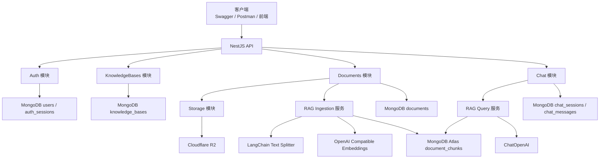
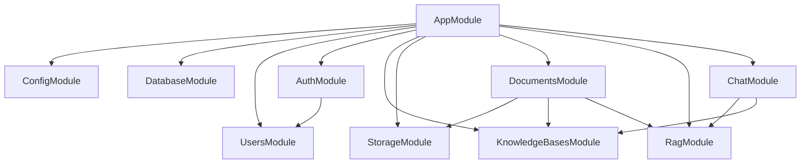
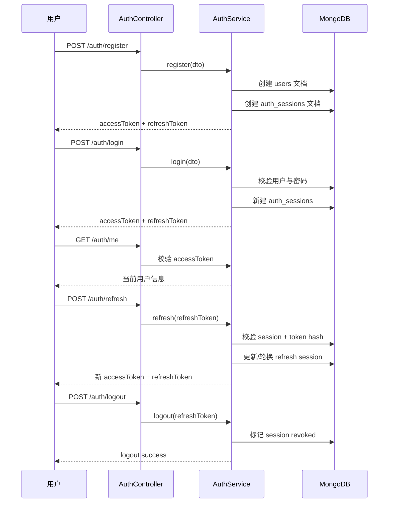
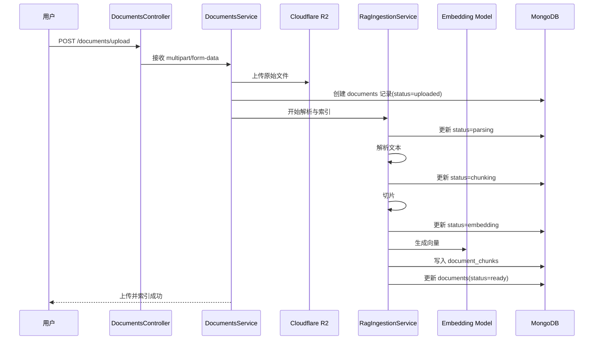
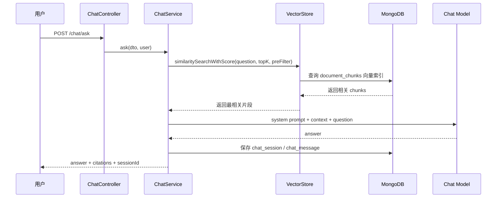
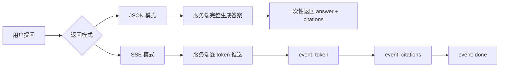

# Nest + MongoDB + LangChain 知识库问答系统从 0 到 1 完整实战文档

> 文档定位：一份给初学者的、可以直接照着做完整项目的后端实战手册  
> 适用日期：2026-03-12  
> 默认项目形态：`NestJS 单体后端 + Swagger + MongoDB Atlas Vector Search + Cloudflare R2 + OpenAI 兼容模型 + JWT access/refresh 双令牌 + JSON 与 SSE 两种问答接口`  
> 文档目标：你不是“读完懂概念”，而是“按步骤做完项目”

---

## 目录

1. [先看最终要做什么](#1-先看最终要做什么)
2. [这个项目到底解决什么问题](#2-这个项目到底解决什么问题)
3. [你做完后会真正掌握什么](#3-你做完后会真正掌握什么)
4. [适合谁，不适合谁](#4-适合谁不适合谁)
5. [开始前你至少要知道的基础知识](#5-开始前你至少要知道的基础知识)
6. [核心名词表，先用人话解释清楚](#6-核心名词表先用人话解释清楚)
7. [技术选型和为什么这样选](#7-技术选型和为什么这样选)
8. [系统架构图](#8-系统架构图)
9. [Nest 模块关系图](#9-nest-模块关系图)
10. [认证流程图](#10-认证流程图)
11. [上传并入库流程时序图](#11-上传并入库流程时序图)
12. [RAG 检索问答时序图](#12-rag-检索问答时序图)
13. [JSON 和 SSE 两种回答模式对比图](#13-json-和-sse-两种回答模式对比图)
14. [项目最终功能清单](#14-项目最终功能清单)
15. [推荐目录结构](#15-推荐目录结构)
16. [数据库与集合设计](#16-数据库与集合设计)
17. [API 设计与 DTO 设计](#17-api-设计与-dto-设计)
18. [环境变量设计](#18-环境变量设计)
19. [4 周学习路线](#19-4-周学习路线)
20. [阶段 1：环境准备](#20-阶段-1环境准备)
21. [阶段 2：Nest 项目初始化](#21-阶段-2nest-项目初始化)
22. [阶段 3：配置管理](#22-阶段-3配置管理)
23. [阶段 4：MongoDB 连接与 Schema](#23-阶段-4mongodb-连接与-schema)
24. [阶段 5：认证系统](#24-阶段-5认证系统)
25. [阶段 6：知识库与文档上传](#25-阶段-6知识库与文档上传)
26. [阶段 7：文档解析与切片](#26-阶段-7文档解析与切片)
27. [阶段 8：Embedding 与向量检索](#27-阶段-8embedding-与向量检索)
28. [阶段 9：RAG 问答（JSON）](#28-阶段-9rag-问答json)
29. [阶段 10：RAG 问答（SSE）](#29-阶段-10rag-问答sse)
30. [测试与验收](#30-测试与验收)
31. [常见报错排查](#31-常见报错排查)
32. [部署与环境变量说明](#32-部署与环境变量说明)
33. [下一步升级路线](#33-下一步升级路线)
34. [官方参考资料](#34-官方参考资料)

---

## 1. 先看最终要做什么

我们要做的不是一个“会聊天的接口”，而是一个**真正可用的知识库问答后端**。

用户可以：

1. 注册账号并登录。
2. 拿到 `accessToken` 和 `refreshToken`。
3. 创建自己的知识库。
4. 上传 `pdf`、`md`、`txt` 文档。
5. 后端把文档上传到 Cloudflare R2。
6. 后端解析文档内容，切成很多小块。
7. 后端调用 Embedding 模型把文本块变成向量。
8. 向量写入 MongoDB Atlas 的 `document_chunks` 集合。
9. 用户提问时，系统先去知识库里找最相关的内容。
10. 再把检索结果交给大模型生成回答。
11. 返回最终答案，并附带引用来源。
12. 聊天记录保存到数据库。
13. 同一个问题既支持普通 JSON 返回，也支持 SSE 流式输出。

如果你以前只写过普通 CRUD，这个项目会帮你跨过一大步，因为它同时覆盖了：

- 传统后端能力：认证、上传、数据库设计、Swagger、异常处理
- AI 工程能力：RAG、Embedding、向量检索、Prompt 组织、流式输出
- 工程意识：模块拆分、状态流转、数据冗余取舍、后续可扩展性

---

## 2. 这个项目到底解决什么问题

一句人话版：

> 我有一堆自己的文档，我不想手动翻，我想像问 ChatGPT 一样直接问它，但答案必须尽量基于我上传的资料，而不是胡说。

这就是知识库问答系统的价值。

这个项目的核心不是“让模型回答问题”，而是：

1. 让模型先看到**对的问题背景**。
2. 让模型只基于**检索到的资料**来回答。
3. 让答案有**来源引用**。
4. 让用户可以持续上传资料和复用知识库。

---

## 3. 你做完后会真正掌握什么

如果你把这份文档完整做完，你会真正掌握下面这些能力。

### 3.1 后端能力

- NestJS 项目的模块化组织方式
- DTO、ValidationPipe、Guard、Decorator 的实际用法
- JWT 双令牌认证
- MongoDB/Mongoose 的集合设计与索引设计
- 文件上传与对象存储接入
- Swagger 接口文档整理

### 3.2 AI 应用能力

- 什么是 RAG
- 什么是 Embedding
- 为什么要切片
- 为什么要做向量检索
- 如何把 LangChain 用在真实接口里，而不是只写 demo
- 如何设计“只能基于知识库回答”的 Prompt
- 如何返回引用来源

### 3.3 工程能力

- 如何让文档处理状态可追踪
- 如何处理失败重试
- 如何为后续队列、缓存、权限扩展留接口
- 为什么某些地方要冗余存储
- 为什么流式接口不能简单照搬普通接口

---

## 4. 适合谁，不适合谁

### 4.1 适合谁

- 学过一点 JavaScript / TypeScript
- 会基本的 `npm` / `pnpm`
- 知道 HTTP 请求是什么
- 想做一个真正能写进简历或作品集的 AI 后端项目
- 想系统学习 `NestJS + MongoDB + LangChain`

### 4.2 不太适合谁

- 完全没接触过 JavaScript
- 连 `async/await`、类、模块导入导出都还不熟
- 希望一上来就做多租户、权限系统、工作流 Agent、Redis、消息队列

如果你现在基础还比较弱，也完全不用担心。你只需要先补到下面这些程度：

- 看得懂一个 TypeScript 类
- 知道 `Promise` 是异步
- 能理解请求体、响应体、状态码
- 知道 MongoDB 是文档数据库

只要这些基础有了，这份文档就可以跟下来。

---

## 5. 开始前你至少要知道的基础知识

这部分不是让你精通，而是知道个大概。

### 5.1 Node.js 是什么

Node.js 让你可以用 JavaScript 写服务端程序。

### 5.2 NestJS 是什么

NestJS 是一个适合做大型后端项目的 Node.js 框架。它最大的特点是：

- 模块化很强
- 结构清晰
- 很适合团队协作
- 很适合做规范项目

### 5.3 MongoDB 是什么

MongoDB 是文档型数据库，数据通常长这样：

```json
{
  "_id": "67d0f7d2f0c2e4e7c1a00001",
  "email": "alice@example.com",
  "displayName": "Alice"
}
```

它不像 MySQL 那样强依赖表结构和 join，所以对“文档、聊天记录、知识片段、元数据”这类业务很友好。

### 5.4 LangChain 是什么

LangChain 不是模型本身，而是一个帮助你**组织模型调用流程**的工具库。

在这个项目里，LangChain 主要帮我们做 4 件事：

1. 文档切片
2. Embedding
3. MongoDB Atlas Vector Search 封装
4. 模型调用与 Prompt 组织

### 5.5 JWT 是什么

JWT 可以理解成“服务端签发的身份凭证”。

本项目会用两个：

- `accessToken`：有效期短，用来访问接口
- `refreshToken`：有效期长，用来在 accessToken 过期后刷新

---

## 6. 核心名词表，先用人话解释清楚

| 名词 | 人话解释 |
| --- | --- |
| 知识库 | 一组文档的集合，比如“我的面试资料库” |
| 文档 | 一份上传的 PDF、Markdown 或 TXT |
| 切片 Chunk | 把长文档拆成很多小段 |
| Embedding | 把一段文本变成一串数字，方便做相似度搜索 |
| 向量检索 | 根据“语义相似”而不是“关键词完全一致”去找内容 |
| RAG | 先检索资料，再让模型基于资料回答 |
| Retriever | 负责从向量库里取回最相关内容的组件 |
| Citation | 引用来源，告诉用户答案基于哪段资料 |
| SSE | 一种服务器持续推送数据的方式，适合流式输出 |
| DTO | 用来约束请求参数结构的类 |
| Guard | 用来拦截和放行请求的守卫，比如鉴权 |
| Schema | MongoDB 中文档结构的定义 |
| TTL Index | 到期自动删除的索引，常用于会话、临时数据 |

---

## 7. 技术选型和为什么这样选

这一章非常重要，因为你不仅要知道“用什么”，还要知道“为什么不用别的”。

### 7.1 NestJS

我们选择 NestJS，而不是 Express 直接裸写，原因是：

- 文档多，社区大
- 非常适合模块化
- 自带 Controller、Service、Guard、Pipe 等结构
- 跟 Swagger、Mongoose 集成成熟
- 后续扩展认证、任务队列、缓存都很顺

### 7.2 Mongoose + MongoDB Atlas

我们选择 `Mongoose + MongoDB Atlas`，而不是本地 MongoDB 或 PostgreSQL，原因是：

- 你本来就想学 MongoDB
- 文档类项目很适合文档数据库
- Atlas 免费层适合练习
- Atlas 原生支持 Vector Search
- 以后做上线也比较顺

### 7.3 MongoDB Atlas Vector Search

我们不额外接 Pinecone、Qdrant、Weaviate，原因是：

- 你当前主线是 `Nest + MongoDB + LangChain`
- 初学阶段少一个中间件，就少一层心智负担
- MongoDB 业务数据和向量数据在一起，便于理解与维护

> 重要说明  
> 根据 MongoDB 官方文档，`M0` 免费集群可以用于练习，但在免费层上如果你**通过程序创建 Vector Search 索引**可能会遇到 `Command not found`。官方建议在这种情况下直接通过 **Atlas UI** 创建向量索引。  
> 这也是本教程为什么会明确要求你在 Atlas 控制台里手动建索引。

### 7.4 Cloudflare R2

我们选择 R2，而不是 Supabase Storage、GridFS 或本地磁盘，原因是：

- 你明确希望练习对象存储
- 你不想为了文件上传再引入第二个数据库
- R2 是标准对象存储，不是数据库
- 它兼容 S3 API，Node.js 接入简单
- 官方公开了免费层，适合练习

> 截至 2026-03-12，Cloudflare R2 官方页面显示的免费层为：  
> `10 GB-month` 存储、`100 万 Class A` 请求、`1000 万 Class B` 请求，且标准存储出网免费。  
> 这些数字以后可能变化，请始终以官方页面为准。

### 7.5 LangChain

我们不是为了“追热点”而用 LangChain，而是因为它正好能解决本项目的 4 个关键问题：

- 文档切片
- 模型封装
- 向量库封装
- Prompt 组织

### 7.6 OpenAI 兼容接口

你明确希望这套方案支持自定义 `apiKey` 和 `baseURL`，所以本教程会基于 `@langchain/openai` 来写。

这样做的好处是：

- 可以接官方 OpenAI
- 可以接支持 OpenAI 兼容协议的平台
- 可以接代理或统一网关

LangChain 官方文档也明确支持在 `ChatOpenAI` 和 `OpenAIEmbeddings` 中自定义 `baseURL`。

### 7.7 JWT 双令牌

本教程默认采用：

- `accessToken`: 15 分钟
- `refreshToken`: 7 天

这样设计是因为：

- accessToken 短，有利于降低泄漏风险
- refreshToken 长，用户体验更好
- 是最常见、最适合教学的认证模式

### 7.8 为什么主线不加入这些能力

本教程主线不加入：

- Redis
- 队列
- 多租户
- RBAC
- 邮箱验证码
- 忘记密码
- 后台管理端

原因很简单：**你现在要先从 0 到 1 跑通主链路**。

先能上传、切片、入库、检索、回答、引用、鉴权，再谈增强。

---

## 8. 系统架构图



这张图一定要看懂。

它告诉你整个系统其实只有 3 条核心主线：

1. 认证主线
2. 文档入库主线
3. 问答主线

---

## 9. Nest 模块关系图



这里你要建立一个很重要的工程习惯：

> Controller 不直接操作数据库，Controller 只收请求和回响应，真正业务逻辑放到 Service。

---

## 10. 认证流程图



---

## 11. 上传并入库流程时序图



---

## 12. RAG 检索问答时序图



---

## 13. JSON 和 SSE 两种回答模式对比图



### 13.1 两种模式的区别

| 模式 | 优点 | 缺点 | 适合什么 |
| --- | --- | --- | --- |
| JSON | 简单、稳定、好调试 | 用户要等完整答案 | 后端主链路、Swagger 调试 |
| SSE | 体验更像 ChatGPT | 实现复杂、调试稍难 | 真实聊天产品、前端联调 |

本教程会采用：

1. 先做 JSON，保证链路先跑通
2. 再升级到 SSE，理解流式输出

---

## 14. 项目最终功能清单

做完后，你的系统应该至少包含以下接口。

### 14.1 认证接口

| 方法 | 路径 | 说明 | 是否鉴权 |
| --- | --- | --- | --- |
| POST | `/auth/register` | 注册 | 否 |
| POST | `/auth/login` | 登录 | 否 |
| POST | `/auth/refresh` | 刷新 token | 否 |
| POST | `/auth/logout` | 退出登录 | 是 |
| GET | `/auth/me` | 获取当前用户 | 是 |

### 14.2 知识库接口

| 方法 | 路径 | 说明 | 是否鉴权 |
| --- | --- | --- | --- |
| POST | `/knowledge-bases` | 创建知识库 | 是 |
| GET | `/knowledge-bases` | 获取知识库列表 | 是 |
| GET | `/knowledge-bases/:id` | 获取知识库详情 | 是 |
| PATCH | `/knowledge-bases/:id` | 修改知识库 | 是 |
| DELETE | `/knowledge-bases/:id` | 删除知识库 | 是 |

### 14.3 文档接口

| 方法 | 路径 | 说明 | 是否鉴权 |
| --- | --- | --- | --- |
| POST | `/documents/upload` | 上传并索引文档 | 是 |
| GET | `/documents` | 文档列表 | 是 |
| GET | `/documents/:id` | 文档详情 | 是 |
| DELETE | `/documents/:id` | 删除文档 | 是 |
| POST | `/documents/:id/reindex` | 重新索引 | 是 |

### 14.4 聊天接口

| 方法 | 路径 | 说明 | 是否鉴权 |
| --- | --- | --- | --- |
| POST | `/chat/ask` | 普通 JSON 问答 | 是 |
| POST | `/chat/stream` | SSE 流式问答 | 是 |
| GET | `/chat/sessions` | 会话列表 | 是 |
| GET | `/chat/sessions/:id/messages` | 会话消息列表 | 是 |

---

## 15. 推荐目录结构

下面这个目录结构是本教程推荐你使用的版本。

> 下文默认你的 Nest 项目目录名叫 `knowledge-base-api`

```text
knowledge-base-api
├─ src
│  ├─ main.ts
│  ├─ app.module.ts
│  ├─ config
│  │  ├─ env.validation.ts
│  │  ├─ app.config.ts
│  │  ├─ auth.config.ts
│  │  ├─ database.config.ts
│  │  ├─ ai.config.ts
│  │  └─ storage.config.ts
│  ├─ common
│  │  ├─ decorators
│  │  │  └─ current-user.decorator.ts
│  │  ├─ guards
│  │  │  └─ jwt-auth.guard.ts
│  │  ├─ pipes
│  │  │  └─ parse-object-id.pipe.ts
│  │  ├─ types
│  │  │  └─ auth.types.ts
│  │  └─ utils
│  │     ├─ hash.util.ts
│  │     ├─ filename.util.ts
│  │     └─ sse.util.ts
│  └─ modules
│     ├─ users
│     │  ├─ schemas
│     │  │  └─ user.schema.ts
│     │  ├─ users.module.ts
│     │  ├─ users.service.ts
│     │  └─ users.controller.ts
│     ├─ auth
│     │  ├─ dto
│     │  │  ├─ register.dto.ts
│     │  │  ├─ login.dto.ts
│     │  │  ├─ refresh-token.dto.ts
│     │  │  └─ logout.dto.ts
│     │  ├─ schemas
│     │  │  └─ auth-session.schema.ts
│     │  ├─ auth.module.ts
│     │  ├─ auth.controller.ts
│     │  └─ auth.service.ts
│     ├─ knowledge-bases
│     │  ├─ dto
│     │  │  ├─ create-knowledge-base.dto.ts
│     │  │  ├─ update-knowledge-base.dto.ts
│     │  │  └─ list-knowledge-bases-query.dto.ts
│     │  ├─ schemas
│     │  │  └─ knowledge-base.schema.ts
│     │  ├─ knowledge-bases.module.ts
│     │  ├─ knowledge-bases.controller.ts
│     │  └─ knowledge-bases.service.ts
│     ├─ documents
│     │  ├─ dto
│     │  │  ├─ upload-document.dto.ts
│     │  │  └─ list-documents-query.dto.ts
│     │  ├─ schemas
│     │  │  ├─ document.schema.ts
│     │  │  └─ document-chunk.schema.ts
│     │  ├─ documents.module.ts
│     │  ├─ documents.controller.ts
│     │  └─ documents.service.ts
│     ├─ storage
│     │  ├─ types
│     │  │  └─ storage.types.ts
│     │  ├─ storage.module.ts
│     │  └─ storage.service.ts
│     ├─ rag
│     │  ├─ types
│     │  │  └─ rag.types.ts
│     │  ├─ rag.module.ts
│     │  ├─ rag-ingestion.service.ts
│     │  ├─ rag-retrieval.service.ts
│     │  └─ rag-prompt.service.ts
│     └─ chat
│        ├─ dto
│        │  ├─ ask-question.dto.ts
│        │  ├─ stream-ask.dto.ts
│        │  ├─ list-chat-sessions-query.dto.ts
│        │  └─ list-chat-messages-query.dto.ts
│        ├─ schemas
│        │  ├─ chat-session.schema.ts
│        │  └─ chat-message.schema.ts
│        ├─ types
│        │  └─ chat.types.ts
│        ├─ chat.module.ts
│        ├─ chat.controller.ts
│        └─ chat.service.ts
├─ .env
├─ .env.example
├─ package.json
├─ tsconfig.json
└─ nest-cli.json
```

### 15.1 每个目录的职责

- `config`: 所有环境变量与配置映射都放这里
- `common`: 跨模块复用的装饰器、守卫、工具函数
- `users`: 用户数据本身
- `auth`: 注册、登录、token 刷新、会话管理；对应 dto 放在 `modules/auth/dto`
- `knowledge-bases`: 知识库的 CRUD；列表分页 query DTO 也放在这里
- `documents`: 文档上传、列表、删除、重新索引；上传 body DTO 与分页 query DTO 都放在这里
- `storage`: 与 R2 的交互；`types/storage.types.ts` 放对象存储输入输出类型
- `rag`: 解析、切片、embedding、检索、prompt；`types/rag.types.ts` 放 ingestion 和 retrieval 的内部类型
- `chat`: 问答、会话、消息记录、SSE 输出；`dto` 放 HTTP 请求结构，`types/chat.types.ts` 放 citation 与流式事件类型

### 15.2 依赖方向要记住

- `chat` 可以依赖 `rag`
- `documents` 可以依赖 `storage` 和 `rag`
- `rag` 不应该依赖 `chat`
- `controller` 不应该直接依赖 `mongoose model`

---

## 16. 数据库与集合设计

这一章是整个项目的核心之一。

你要做的不是“把数据存进去”，而是设计出一个能支撑业务的结构。

本项目固定使用 7 个集合：

1. `users`
2. `auth_sessions`
3. `knowledge_bases`
4. `documents`
5. `document_chunks`
6. `chat_sessions`
7. `chat_messages`

### 16.1 `users`

#### 作用

存用户基础信息。

#### 字段设计

| 字段 | 类型 | 必填 | 说明 |
| --- | --- | --- | --- |
| `_id` | ObjectId | 是 | 用户主键 |
| `email` | string | 是 | 登录邮箱，唯一 |
| `passwordHash` | string | 是 | 密码哈希 |
| `displayName` | string | 是 | 显示名称 |
| `status` | string | 是 | `active` / `disabled` |
| `lastLoginAt` | Date | 否 | 最近登录时间 |
| `createdAt` | Date | 是 | 创建时间 |
| `updatedAt` | Date | 是 | 更新时间 |

#### 索引

- `email` 唯一索引

#### 示例文档

```json
{
  "_id": { "$oid": "67d0f7d2f0c2e4e7c1a00001" },
  "email": "alice@example.com",
  "passwordHash": "$2b$10$S5I........",
  "displayName": "Alice",
  "status": "active",
  "lastLoginAt": { "$date": "2026-03-12T10:00:00.000Z" },
  "createdAt": { "$date": "2026-03-12T09:00:00.000Z" },
  "updatedAt": { "$date": "2026-03-12T10:00:00.000Z" }
}
```

#### 推荐 Schema 写法

```ts
@Schema({ collection: "users", timestamps: true, versionKey: false })
export class User {
  @Prop({ required: true, lowercase: true, trim: true })
  email: string;

  @Prop({ required: true })
  passwordHash: string;

  @Prop({ required: true, trim: true })
  displayName: string;

  @Prop({ required: true, default: "active" })
  status: "active" | "disabled";

  @Prop()
  lastLoginAt?: Date;
}

export const UserSchema = SchemaFactory.createForClass(User);
UserSchema.index({ email: 1 }, { unique: true });
```

---

### 16.2 `auth_sessions`

#### 作用

存 refreshToken 对应的会话记录。

你不要把 refreshToken 明文存数据库里，而是存它的哈希值。

#### 为什么要单独有这张表

因为你需要：

- 支持无感刷新
- 支持退出登录
- 支持废弃某个 refreshToken
- 支持多端登录扩展

#### 字段设计

| 字段 | 类型 | 必填 | 说明 |
| --- | --- | --- | --- |
| `_id` | ObjectId | 是 | session 主键，也可作为 refresh token 的 `sid` |
| `userId` | ObjectId | 是 | 对应用户 |
| `refreshTokenHash` | string | 是 | refreshToken 的哈希 |
| `userAgent` | string | 否 | 客户端信息 |
| `ip` | string | 否 | IP 地址 |
| `expiresAt` | Date | 是 | 过期时间 |
| `revokedAt` | Date | 否 | 注销时间 |
| `createdAt` | Date | 是 | 创建时间 |
| `updatedAt` | Date | 是 | 更新时间 |

#### 索引

- `userId` 普通索引
- `expiresAt` TTL 索引，`expireAfterSeconds: 0`

#### 示例文档

```json
{
  "_id": { "$oid": "67d0f7d2f0c2e4e7c1a10001" },
  "userId": { "$oid": "67d0f7d2f0c2e4e7c1a00001" },
  "refreshTokenHash": "6c4f0e8d8c7f4e3....",
  "userAgent": "Mozilla/5.0",
  "ip": "127.0.0.1",
  "expiresAt": { "$date": "2026-03-19T10:00:00.000Z" },
  "revokedAt": null,
  "createdAt": { "$date": "2026-03-12T10:00:00.000Z" },
  "updatedAt": { "$date": "2026-03-12T10:00:00.000Z" }
}
```

#### 推荐 Schema 写法

```ts
@Schema({ collection: "auth_sessions", timestamps: true, versionKey: false })
export class AuthSession {
  @Prop({ type: Types.ObjectId, ref: "User", required: true, index: true })
  userId: Types.ObjectId;

  @Prop({ required: true })
  refreshTokenHash: string;

  @Prop()
  userAgent?: string;

  @Prop()
  ip?: string;

  @Prop({ required: true })
  expiresAt: Date;

  @Prop({ default: null })
  revokedAt?: Date | null;
}

export const AuthSessionSchema = SchemaFactory.createForClass(AuthSession);
AuthSessionSchema.index({ expiresAt: 1 }, { expireAfterSeconds: 0 });
```

> 初学者提示  
> TTL 索引不是“到点立刻删”，而是 MongoDB 后台线程周期性清理，所以看到过期数据短时间仍存在是正常的。

---

### 16.3 `knowledge_bases`

#### 作用

存知识库本身。

一个用户可以有多个知识库，比如：

- `Nest 学习资料`
- `面试题库`
- `项目文档`

#### 字段设计

| 字段 | 类型 | 必填 | 说明 |
| --- | --- | --- | --- |
| `_id` | ObjectId | 是 | 知识库主键 |
| `userId` | ObjectId | 是 | 所属用户 |
| `name` | string | 是 | 知识库名称 |
| `description` | string | 否 | 知识库描述 |
| `documentCount` | number | 是 | 文档数量缓存 |
| `chunkCount` | number | 是 | 切片数量缓存 |
| `lastIndexedAt` | Date | 否 | 最近一次索引时间 |
| `createdAt` | Date | 是 | 创建时间 |
| `updatedAt` | Date | 是 | 更新时间 |

#### 索引

- `userId`
- `userId + updatedAt`

#### 示例文档

```json
{
  "_id": { "$oid": "67d0f7d2f0c2e4e7c1a20001" },
  "userId": { "$oid": "67d0f7d2f0c2e4e7c1a00001" },
  "name": "Nest 学习资料",
  "description": "NestJS 与工程化相关文档",
  "documentCount": 3,
  "chunkCount": 128,
  "lastIndexedAt": { "$date": "2026-03-12T11:00:00.000Z" },
  "createdAt": { "$date": "2026-03-12T10:30:00.000Z" },
  "updatedAt": { "$date": "2026-03-12T11:00:00.000Z" }
}
```

---

### 16.4 `documents`

#### 作用

存上传文档的元数据，不存大文本内容本体。

原始文件放 R2，数据库只存“这份文件是谁的、在哪个知识库里、在 R2 里的 key 是什么、当前处理到哪一步了”。

#### 文档状态设计

`status` 推荐固定为下面 6 个值：

- `uploaded`
- `parsing`
- `chunking`
- `embedding`
- `ready`
- `failed`

#### 字段设计

| 字段 | 类型 | 必填 | 说明 |
| --- | --- | --- | --- |
| `_id` | ObjectId | 是 | 文档主键 |
| `userId` | ObjectId | 是 | 所属用户 |
| `knowledgeBaseId` | ObjectId | 是 | 所属知识库 |
| `title` | string | 是 | 显示标题 |
| `originalName` | string | 是 | 原文件名 |
| `ext` | string | 是 | 文件扩展名 |
| `mimeType` | string | 是 | MIME 类型 |
| `size` | number | 是 | 文件大小，字节 |
| `sha256` | string | 否 | 文件内容摘要 |
| `storageProvider` | string | 是 | 固定为 `r2` |
| `bucket` | string | 是 | R2 bucket 名称 |
| `objectKey` | string | 是 | R2 对象 key |
| `status` | string | 是 | 当前处理状态 |
| `pageCount` | number | 否 | PDF 页数 |
| `chunkCount` | number | 否 | 切片数量 |
| `parseErrorMessage` | string | 否 | 失败原因 |
| `indexedAt` | Date | 否 | 完成索引时间 |
| `createdAt` | Date | 是 | 创建时间 |
| `updatedAt` | Date | 是 | 更新时间 |

#### 索引

- `knowledgeBaseId`
- `userId + knowledgeBaseId`
- `status`

#### 示例文档

```json
{
  "_id": { "$oid": "67d0f7d2f0c2e4e7c1a30001" },
  "userId": { "$oid": "67d0f7d2f0c2e4e7c1a00001" },
  "knowledgeBaseId": { "$oid": "67d0f7d2f0c2e4e7c1a20001" },
  "title": "Nest 实战手册",
  "originalName": "nest-guide.pdf",
  "ext": "pdf",
  "mimeType": "application/pdf",
  "size": 245612,
  "sha256": "cb8e00d4...",
  "storageProvider": "r2",
  "bucket": "knowledge-base-files",
  "objectKey": "67d0.../67d0.../2026/03/12/67d0...-nest-guide.pdf",
  "status": "ready",
  "pageCount": 18,
  "chunkCount": 42,
  "parseErrorMessage": null,
  "indexedAt": { "$date": "2026-03-12T11:30:00.000Z" },
  "createdAt": { "$date": "2026-03-12T11:25:00.000Z" },
  "updatedAt": { "$date": "2026-03-12T11:30:00.000Z" }
}
```

---

### 16.5 `document_chunks`

#### 作用

存切片后的文本和对应向量。

这张表是整个 RAG 项目最关键的集合。

#### 设计原则

1. 一条记录只代表一个文本块
2. 文本块必须能追溯回原文档
3. 文本块必须可用于向量检索
4. 为了减少查询联表成本，可以保存少量冗余字段

#### 字段设计

| 字段 | 类型 | 必填 | 说明 |
| --- | --- | --- | --- |
| `_id` | ObjectId | 是 | 切片主键 |
| `userId` | ObjectId | 是 | 所属用户 |
| `knowledgeBaseId` | ObjectId | 是 | 所属知识库 |
| `documentId` | ObjectId | 是 | 来源文档 |
| `documentTitle` | string | 是 | 文档标题快照，便于 citation |
| `chunkIndex` | number | 是 | 第几个切片 |
| `text` | string | 是 | 切片文本 |
| `embedding` | number[] | 是 | 向量数组 |
| `pageNumber` | number | 否 | 页码，PDF 时可用 |
| `charCount` | number | 是 | 字符数 |
| `tokenCountApprox` | number | 否 | 估算 token 数 |
| `createdAt` | Date | 是 | 创建时间 |
| `updatedAt` | Date | 是 | 更新时间 |

#### 普通索引

- `documentId + chunkIndex` 唯一索引
- `knowledgeBaseId`
- `userId`

#### Vector Search 索引

`embedding` 字段要在 Atlas 中创建向量索引。

同时如果你希望在检索时按 `userId`、`knowledgeBaseId`、`documentId` 过滤，这些字段也必须在 Atlas 向量索引里以 `filter` 类型声明。

#### 示例文档

```json
{
  "_id": { "$oid": "67d0f7d2f0c2e4e7c1a40001" },
  "userId": { "$oid": "67d0f7d2f0c2e4e7c1a00001" },
  "knowledgeBaseId": { "$oid": "67d0f7d2f0c2e4e7c1a20001" },
  "documentId": { "$oid": "67d0f7d2f0c2e4e7c1a30001" },
  "documentTitle": "Nest 实战手册",
  "chunkIndex": 0,
  "text": "NestJS 是一个用于构建高效、可扩展 Node.js 服务端应用程序的框架...",
  "embedding": [0.0123, -0.0456, 0.0912],
  "pageNumber": 1,
  "charCount": 356,
  "tokenCountApprox": 220,
  "createdAt": { "$date": "2026-03-12T11:28:00.000Z" },
  "updatedAt": { "$date": "2026-03-12T11:28:00.000Z" }
}
```

#### 推荐 Atlas 向量索引 JSON

> 如果你使用的是 `text-embedding-3-small`，默认维度一般是 `1536`。  
> 如果你接入的 OpenAI 兼容厂商返回其他维度，你必须把这里的 `numDimensions` 一起改掉。

```json
{
  "fields": [
    {
      "type": "vector",
      "path": "embedding",
      "numDimensions": 1536,
      "similarity": "cosine"
    },
    {
      "type": "filter",
      "path": "userId"
    },
    {
      "type": "filter",
      "path": "knowledgeBaseId"
    },
    {
      "type": "filter",
      "path": "documentId"
    }
  ]
}
```

---

### 16.6 `chat_sessions`

#### 作用

存一个会话本身。

比如你在同一个知识库里连续问 10 个问题，这 10 个问题可以归到一个 `chat_session` 里。

#### 字段设计

| 字段 | 类型 | 必填 | 说明 |
| --- | --- | --- | --- |
| `_id` | ObjectId | 是 | 会话主键 |
| `userId` | ObjectId | 是 | 所属用户 |
| `knowledgeBaseId` | ObjectId | 是 | 所属知识库 |
| `title` | string | 是 | 会话标题，可由第一问截断生成 |
| `lastMessageAt` | Date | 是 | 最近一条消息时间 |
| `createdAt` | Date | 是 | 创建时间 |
| `updatedAt` | Date | 是 | 更新时间 |

#### 索引

- `userId + lastMessageAt`
- `knowledgeBaseId`

#### 示例文档

```json
{
  "_id": { "$oid": "67d0f7d2f0c2e4e7c1a50001" },
  "userId": { "$oid": "67d0f7d2f0c2e4e7c1a00001" },
  "knowledgeBaseId": { "$oid": "67d0f7d2f0c2e4e7c1a20001" },
  "title": "Nest 模块和服务的关系",
  "lastMessageAt": { "$date": "2026-03-12T12:10:00.000Z" },
  "createdAt": { "$date": "2026-03-12T12:00:00.000Z" },
  "updatedAt": { "$date": "2026-03-12T12:10:00.000Z" }
}
```

---

### 16.7 `chat_messages`

#### 作用

存一次完整的问答轮次。

为了便于教学，本教程不把用户消息和模型消息拆成两条，而是一条记录同时保存：

- 用户问题
- 模型回答
- 引用来源
- 模型元信息

这种设计更适合初学阶段快速落地。

#### 字段设计

| 字段 | 类型 | 必填 | 说明 |
| --- | --- | --- | --- |
| `_id` | ObjectId | 是 | 消息主键 |
| `sessionId` | ObjectId | 是 | 所属会话 |
| `userId` | ObjectId | 是 | 所属用户 |
| `knowledgeBaseId` | ObjectId | 是 | 所属知识库 |
| `question` | string | 是 | 用户问题 |
| `answer` | string | 是 | 模型回答 |
| `citations` | ChatCitation[] | 是 | 引用来源 |
| `responseMode` | string | 是 | `json` / `sse` |
| `modelName` | string | 是 | 使用的聊天模型 |
| `topK` | number | 是 | 检索数量 |
| `promptTokens` | number | 否 | 输入 token |
| `completionTokens` | number | 否 | 输出 token |
| `totalTokens` | number | 否 | 总 token |
| `latencyMs` | number | 否 | 耗时 |
| `createdAt` | Date | 是 | 创建时间 |
| `updatedAt` | Date | 是 | 更新时间 |

#### 引用对象 `ChatCitation`

```ts
export type ChatCitation = {
  chunkId: string;
  documentId: string;
  documentName: string;
  chunkIndex: number;
  pageNumber?: number;
  score?: number;
  contentPreview: string;
};
```

#### 示例文档

```json
{
  "_id": { "$oid": "67d0f7d2f0c2e4e7c1a60001" },
  "sessionId": { "$oid": "67d0f7d2f0c2e4e7c1a50001" },
  "userId": { "$oid": "67d0f7d2f0c2e4e7c1a00001" },
  "knowledgeBaseId": { "$oid": "67d0f7d2f0c2e4e7c1a20001" },
  "question": "Nest 的 Controller 和 Service 有什么区别？",
  "answer": "Controller 负责处理请求入口，Service 负责承载业务逻辑...",
  "citations": [
    {
      "chunkId": "67d0f7d2f0c2e4e7c1a40001",
      "documentId": "67d0f7d2f0c2e4e7c1a30001",
      "documentName": "Nest 实战手册",
      "chunkIndex": 3,
      "pageNumber": 2,
      "score": 0.912,
      "contentPreview": "Controller 作为路由入口，Service 作为业务层..."
    }
  ],
  "responseMode": "json",
  "modelName": "gpt-4.1-mini",
  "topK": 5,
  "promptTokens": 890,
  "completionTokens": 188,
  "totalTokens": 1078,
  "latencyMs": 2430,
  "createdAt": { "$date": "2026-03-12T12:10:00.000Z" },
  "updatedAt": { "$date": "2026-03-12T12:10:00.000Z" }
}
```

---

### 16.8 删除策略要提前定清楚

很多新手项目做不下去，不是因为 CRUD 不会写，而是因为“删除时关联数据怎么办”没有想清楚。

本教程默认策略如下：

#### 删除文档时

- 删除 `documents` 当前记录
- 删除该文档对应的 `document_chunks`
- 删除 R2 里的原始文件
- **不删除历史聊天记录**

为什么聊天记录不删？

因为聊天记录里已经保存了答案和 citation 快照，它本身就是历史记录。

#### 删除知识库时

- 删除 `knowledge_bases`
- 删除该知识库下所有 `documents`
- 删除该知识库下所有 `document_chunks`
- 删除该知识库下所有 `chat_sessions`
- 删除该知识库下所有 `chat_messages`
- 删除 R2 中该知识库目录下的对象

---

## 17. API 设计与 DTO 设计

### 17.1 DTO 设计原则

这一章我们不再只讲“核心 DTO”，而是把项目里真正会用到的请求 DTO 和内部类型都补齐。

先记住 5 条规则：

1. DTO 只负责 **HTTP 边界校验**
2. service 内部传递的数据用 `type`，不要伪装成 DTO
3. `:id` 这类单一路径参数优先交给 `ParseObjectIdPipe`
4. 列表接口只做最小分页 DTO，不在主线中引入复杂筛选
5. 面向初学者时，优先写“显式完整类”，而不是过度抽象

### 17.2 认证模块 DTO

#### 这一组 DTO 用在哪些接口

- `RegisterDto` -> `POST /auth/register`
- `LoginDto` -> `POST /auth/login`
- `RefreshTokenDto` -> `POST /auth/refresh`
- `LogoutDto` -> `POST /auth/logout`

#### 文件：`src/modules/auth/dto/register.dto.ts`

```ts
import { IsEmail, IsString, MaxLength, MinLength } from "class-validator";

export class RegisterDto {
  @IsEmail({}, { message: "请输入合法邮箱" })
  @MaxLength(100, { message: "邮箱长度不能超过 100 个字符" })
  email: string;

  @IsString()
  @MinLength(8, { message: "密码至少 8 位" })
  @MaxLength(32, { message: "密码长度不能超过 32 位" })
  password: string;

  @IsString()
  @MinLength(2, { message: "昵称至少 2 个字符" })
  @MaxLength(30, { message: "昵称长度不能超过 30 个字符" })
  displayName: string;
}
```

为什么这样校验：

- `email` 限长是为了避免极端脏数据
- `password` 设最小长度 8，是最常见的入门安全下限
- `displayName` 控制在 2 到 30，足够展示又不会太宽

最小请求示例：

```json
{
  "email": "alice@example.com",
  "password": "12345678",
  "displayName": "Alice"
}
```

#### 文件：`src/modules/auth/dto/login.dto.ts`

```ts
import { IsEmail, IsString, MaxLength, MinLength } from "class-validator";

export class LoginDto {
  @IsEmail({}, { message: "请输入合法邮箱" })
  @MaxLength(100, { message: "邮箱长度不能超过 100 个字符" })
  email: string;

  @IsString()
  @MinLength(8, { message: "密码至少 8 位" })
  @MaxLength(32, { message: "密码长度不能超过 32 位" })
  password: string;
}
```

为什么这样校验：

- 登录 DTO 跟注册 DTO 不完全共用，是为了让初学者清楚看到“注册”和“登录”是两种不同请求
- 后期如果你要在登录时加验证码、登录来源，也更容易单独扩展

最小请求示例：

```json
{
  "email": "alice@example.com",
  "password": "12345678"
}
```

#### 文件：`src/modules/auth/dto/refresh-token.dto.ts`

```ts
import { IsNotEmpty, IsString, MaxLength } from "class-validator";

export class RefreshTokenDto {
  @IsString()
  @IsNotEmpty({ message: "refreshToken 不能为空" })
  @MaxLength(2000, { message: "refreshToken 长度异常" })
  refreshToken: string;
}
```

为什么这样校验：

- JWT 很长，所以不要把长度上限写得太短
- 这里校验的是“它是一个非空字符串”，真正的合法性校验在 service 中做验签和查 session

最小请求示例：

```json
{
  "refreshToken": "eyJhbGciOi..."
}
```

#### 文件：`src/modules/auth/dto/logout.dto.ts`

```ts
import { IsNotEmpty, IsString, MaxLength } from "class-validator";

export class LogoutDto {
  @IsString()
  @IsNotEmpty({ message: "refreshToken 不能为空" })
  @MaxLength(2000, { message: "refreshToken 长度异常" })
  refreshToken: string;
}
```

为什么这样校验：

- `logout` 需要知道你要废弃的是哪一个 refresh session
- 我们故意没有让 `logout` 复用 `RefreshTokenDto`，因为初学者复制单文件时，`LogoutDto` 更直观

最小请求示例：

```json
{
  "refreshToken": "eyJhbGciOi..."
}
```

### 17.3 知识库模块 DTO

#### 这一组 DTO 用在哪些接口

- `CreateKnowledgeBaseDto` -> `POST /knowledge-bases`
- `UpdateKnowledgeBaseDto` -> `PATCH /knowledge-bases/:id`
- `ListKnowledgeBasesQueryDto` -> `GET /knowledge-bases`

#### 文件：`src/modules/knowledge-bases/dto/create-knowledge-base.dto.ts`

```ts
import { IsOptional, IsString, MaxLength, MinLength } from "class-validator";

export class CreateKnowledgeBaseDto {
  @IsString()
  @MinLength(1, { message: "知识库名称不能为空" })
  @MaxLength(100, { message: "知识库名称长度不能超过 100 个字符" })
  name: string;

  @IsOptional()
  @IsString()
  @MaxLength(500, { message: "知识库描述长度不能超过 500 个字符" })
  description?: string;
}
```

为什么这样校验：

- `name` 是知识库最核心的展示字段，必须有
- `description` 是可选补充信息，所以只做长度限制

最小请求示例：

```json
{
  "name": "Nest 学习资料",
  "description": "用于存放 Nest 相关 PDF 和 Markdown"
}
```

#### 文件：`src/modules/knowledge-bases/dto/update-knowledge-base.dto.ts`

```ts
import { IsOptional, IsString, MaxLength, MinLength } from "class-validator";

export class UpdateKnowledgeBaseDto {
  @IsOptional()
  @IsString()
  @MinLength(1, { message: "知识库名称不能为空" })
  @MaxLength(100, { message: "知识库名称长度不能超过 100 个字符" })
  name?: string;

  @IsOptional()
  @IsString()
  @MaxLength(500, { message: "知识库描述长度不能超过 500 个字符" })
  description?: string;
}
```

为什么这样校验：

- 更新接口允许只传一部分字段，所以每个字段都要 `@IsOptional()`
- 我们这里没有用 `PartialType(CreateKnowledgeBaseDto)`，是为了让初学者看到“更新 DTO 的本质就是可选字段”

最小请求示例：

```json
{
  "name": "Nest 学习资料 V2"
}
```

#### 文件：`src/modules/knowledge-bases/dto/list-knowledge-bases-query.dto.ts`

```ts
import { Type } from "class-transformer";
import { IsInt, IsOptional, Max, Min } from "class-validator";

export class ListKnowledgeBasesQueryDto {
  @IsOptional()
  @Type(() => Number)
  @IsInt({ message: "page 必须是整数" })
  @Min(1, { message: "page 不能小于 1" })
  page?: number = 1;

  @IsOptional()
  @Type(() => Number)
  @IsInt({ message: "pageSize 必须是整数" })
  @Min(1, { message: "pageSize 不能小于 1" })
  @Max(50, { message: "pageSize 不能大于 50" })
  pageSize?: number = 10;
}
```

为什么这样校验：

- 我们这次只补最小分页，不补搜索和状态筛选，避免把主线 API 变复杂
- `@Type(() => Number)` 是 query DTO 非常关键的一步，不然 `"1"` 会一直是字符串

最小请求示例：

```http
GET /knowledge-bases?page=1&pageSize=10
```

### 17.4 文档模块 DTO

#### 这一组 DTO 用在哪些接口

- `UploadDocumentDto` -> `POST /documents/upload`
- `ListDocumentsQueryDto` -> `GET /documents`

#### 文件：`src/modules/documents/dto/upload-document.dto.ts`

```ts
import { IsMongoId, IsOptional, IsString, MaxLength } from "class-validator";

export class UploadDocumentDto {
  @IsMongoId({ message: "knowledgeBaseId 必须是合法 ObjectId" })
  knowledgeBaseId: string;

  @IsOptional()
  @IsString()
  @MaxLength(200, { message: "标题长度不能超过 200 个字符" })
  title?: string;
}
```

为什么这样校验：

- `knowledgeBaseId` 决定文档归属，必须明确合法
- `title` 是展示层字段，所以做长度限制即可
- `file` 本身不写进 DTO，因为它来自 `@UploadedFile()`，这是一种 HTTP 文件边界，不是 JSON 字段

最小请求示例：

```text
multipart/form-data
- knowledgeBaseId: 67d0f7d2f0c2e4e7c1a20001
- title: Nest 实战手册
- file: nest-guide.pdf
```

#### 文件：`src/modules/documents/dto/list-documents-query.dto.ts`

```ts
import { Type } from "class-transformer";
import { IsInt, IsOptional, Max, Min } from "class-validator";

export class ListDocumentsQueryDto {
  @IsOptional()
  @Type(() => Number)
  @IsInt({ message: "page 必须是整数" })
  @Min(1, { message: "page 不能小于 1" })
  page?: number = 1;

  @IsOptional()
  @Type(() => Number)
  @IsInt({ message: "pageSize 必须是整数" })
  @Min(1, { message: "pageSize 不能小于 1" })
  @Max(50, { message: "pageSize 不能大于 50" })
  pageSize?: number = 10;
}
```

为什么这样校验：

- 文档列表未来很容易越来越多，所以分页是必要的基础能力
- 本教程先不引入 `status`、`knowledgeBaseId` 之外的筛选规则，避免把 DTO 章节变成高级搜索教程

最小请求示例：

```http
GET /documents?page=1&pageSize=10
```

### 17.5 聊天模块 DTO

#### 这一组 DTO 用在哪些接口

- `AskQuestionDto` -> `POST /chat/ask`
- `StreamAskDto` -> `POST /chat/stream`
- `ListChatSessionsQueryDto` -> `GET /chat/sessions`
- `ListChatMessagesQueryDto` -> `GET /chat/sessions/:id/messages`

#### 文件：`src/modules/chat/dto/ask-question.dto.ts`

```ts
import { Type } from "class-transformer";
import { IsInt, IsMongoId, IsOptional, IsString, Max, MaxLength, Min, MinLength } from "class-validator";

export class AskQuestionDto {
  @IsMongoId({ message: "knowledgeBaseId 必须是合法 ObjectId" })
  knowledgeBaseId: string;

  @IsString()
  @MinLength(1, { message: "问题不能为空" })
  @MaxLength(2000, { message: "问题长度不能超过 2000 个字符" })
  question: string;

  @IsOptional()
  @IsMongoId({ message: "sessionId 必须是合法 ObjectId" })
  sessionId?: string;

  @IsOptional()
  @Type(() => Number)
  @IsInt({ message: "topK 必须是整数" })
  @Min(1, { message: "topK 不能小于 1" })
  @Max(10, { message: "topK 不能大于 10" })
  topK?: number;
}
```

为什么这样校验：

- `question` 需要设置上限，避免用户直接塞一篇论文进来
- `topK` 是检索数量，不应该无限大，否则成本和噪声都会上升
- `sessionId` 可选，是为了支持“新会话”和“继续已有会话”两种路径

最小请求示例：

```json
{
  "knowledgeBaseId": "67d0f7d2f0c2e4e7c1a20001",
  "question": "Nest 的 Controller 和 Service 有什么区别？",
  "topK": 5
}
```

#### 文件：`src/modules/chat/dto/stream-ask.dto.ts`

```ts
import { Type } from "class-transformer";
import { IsInt, IsMongoId, IsOptional, IsString, Max, MaxLength, Min, MinLength } from "class-validator";

export class StreamAskDto {
  @IsMongoId({ message: "knowledgeBaseId 必须是合法 ObjectId" })
  knowledgeBaseId: string;

  @IsString()
  @MinLength(1, { message: "问题不能为空" })
  @MaxLength(2000, { message: "问题长度不能超过 2000 个字符" })
  question: string;

  @IsOptional()
  @IsMongoId({ message: "sessionId 必须是合法 ObjectId" })
  sessionId?: string;

  @IsOptional()
  @Type(() => Number)
  @IsInt({ message: "topK 必须是整数" })
  @Min(1, { message: "topK 不能小于 1" })
  @Max(10, { message: "topK 不能大于 10" })
  topK?: number;
}
```

为什么这里故意不写成 `extends AskQuestionDto`：

- 你要求的是“可复制程度高”
- 对初学者来说，单独打开一个文件就能直接复制使用，比追继承链更友好
- 将来如果 JSON 和 SSE 的入参出现细微差异，这两个类也更容易独立演进

最小请求示例：

```json
{
  "knowledgeBaseId": "67d0f7d2f0c2e4e7c1a20001",
  "question": "Nest 的 Controller 和 Service 有什么区别？",
  "sessionId": "67d0f7d2f0c2e4e7c1a50001"
}
```

#### 文件：`src/modules/chat/dto/list-chat-sessions-query.dto.ts`

```ts
import { Type } from "class-transformer";
import { IsInt, IsOptional, Max, Min } from "class-validator";

export class ListChatSessionsQueryDto {
  @IsOptional()
  @Type(() => Number)
  @IsInt({ message: "page 必须是整数" })
  @Min(1, { message: "page 不能小于 1" })
  page?: number = 1;

  @IsOptional()
  @Type(() => Number)
  @IsInt({ message: "pageSize 必须是整数" })
  @Min(1, { message: "pageSize 不能小于 1" })
  @Max(50, { message: "pageSize 不能大于 50" })
  pageSize?: number = 10;
}
```

最小请求示例：

```http
GET /chat/sessions?page=1&pageSize=10
```

#### 文件：`src/modules/chat/dto/list-chat-messages-query.dto.ts`

```ts
import { Type } from "class-transformer";
import { IsInt, IsOptional, Max, Min } from "class-validator";

export class ListChatMessagesQueryDto {
  @IsOptional()
  @Type(() => Number)
  @IsInt({ message: "page 必须是整数" })
  @Min(1, { message: "page 不能小于 1" })
  page?: number = 1;

  @IsOptional()
  @Type(() => Number)
  @IsInt({ message: "pageSize 必须是整数" })
  @Min(1, { message: "pageSize 不能小于 1" })
  @Max(50, { message: "pageSize 不能大于 50" })
  pageSize?: number = 10;
}
```

最小请求示例：

```http
GET /chat/sessions/67d0f7d2f0c2e4e7c1a50001/messages?page=1&pageSize=10
```

### 17.6 内部类型设计

这一节非常重要。

很多初学者会把一切东西都命名为 DTO，但其实：

- HTTP 入参是 DTO
- service 层边界数据更适合用 `type`
- 向量检索结果、流式事件、对象存储输入输出都不应该伪装成 DTO

#### 文件：`src/common/types/auth.types.ts`

```ts
export type TokenPair = {
  accessToken: string;
  refreshToken: string;
};

export type CurrentUser = {
  userId: string;
  email: string;
};

export type JwtAccessPayload = {
  sub: string;
  email: string;
  type: "access";
  iat?: number;
  exp?: number;
};

export type JwtRefreshPayload = {
  sub: string;
  sid: string;
  type: "refresh";
  iat?: number;
  exp?: number;
};

export type AuthRequestMeta = {
  userAgent?: string;
  ip?: string;
};

export type IssueTokenResult = {
  user: {
    id: string;
    email: string;
    displayName: string;
  };
  accessToken: string;
  refreshToken: string;
};
```

这些类型的作用：

- `CurrentUser`：Guard 校验通过后挂到 `request.user`
- `JwtAccessPayload` / `JwtRefreshPayload`：让验签结果有明确字段结构
- `AuthRequestMeta`：统一注册、登录时的来源信息
- `IssueTokenResult`：统一 `register/login/refresh` 的返回结构

#### 文件：`src/modules/chat/types/chat.types.ts`

```ts
export type ChatCitation = {
  chunkId: string;
  documentId: string;
  documentName: string;
  chunkIndex: number;
  pageNumber?: number;
  score?: number;
  contentPreview: string;
};

export type ChatAnswerResult = {
  sessionId: string;
  messageId: string;
  answer: string;
  citations: ChatCitation[];
  usage: {
    promptTokens?: number;
    completionTokens?: number;
    totalTokens?: number;
  };
};

export type ChatStreamEvent =
  | {
      event: "start";
      data: { sessionId: string };
    }
  | {
      event: "token";
      data: { token: string };
    }
  | {
      event: "citations";
      data: ChatCitation[];
    }
  | {
      event: "done";
      data: {
        messageId: string;
        answer: string;
        citations: ChatCitation[];
      };
    }
  | {
      event: "error";
      data: { message: string };
    };
```

这些类型的作用：

- `ChatCitation`：返回给前端和持久化进 `chat_messages`
- `ChatAnswerResult`：普通 JSON 问答的服务返回结构
- `ChatStreamEvent`：SSE 事件的统一契约

#### 文件：`src/modules/rag/types/rag.types.ts`

```ts
export type ParsedSourceDocument = {
  pageContent: string;
  metadata: {
    source: string;
    pageNumber?: number;
  };
};

export type ChunkDraft = {
  userId: string;
  knowledgeBaseId: string;
  documentId: string;
  documentTitle: string;
  chunkIndex: number;
  text: string;
  pageNumber?: number;
  charCount: number;
  tokenCountApprox?: number;
};

export type EmbeddedChunkDraft = ChunkDraft & {
  embedding: number[];
};

export type RagSearchInput = {
  userId: string;
  knowledgeBaseId: string;
  question: string;
  topK: number;
};

export type RetrievedChunk = {
  chunkId: string;
  documentId: string;
  documentTitle: string;
  chunkIndex: number;
  pageNumber?: number;
  text: string;
  score: number;
};

export type PromptContextBlock = {
  rank: number;
  documentTitle: string;
  pageNumber?: number;
  score: number;
  content: string;
};
```

这些类型的作用：

- `ParsedSourceDocument`：文档解析阶段的原始结构
- `ChunkDraft`：切片后、embedding 前的数据
- `EmbeddedChunkDraft`：向量生成后、入库前的数据
- `RagSearchInput`：检索服务的统一输入
- `RetrievedChunk`：把 LangChain 原始结果映射后的稳定结构
- `PromptContextBlock`：Prompt 服务用于组织上下文的中间结构

#### 文件：`src/modules/storage/types/storage.types.ts`

```ts
export type UploadObjectInput = {
  key: string;
  body: Buffer;
  contentType: string;
};

export type StoredObjectRef = {
  storageProvider: "r2";
  bucket: string;
  key: string;
  contentType: string;
  size: number;
};
```

这些类型的作用：

- `UploadObjectInput`：约束上传到 R2 的输入
- `StoredObjectRef`：统一返回对象存储元数据，方便后续写入 `documents`

### 17.7 统一的返回结构建议

为了降低学习难度，本教程不把响应体系统化拆成 Response DTO / VO。

当前阶段更适合：

- 请求体用 DTO 做强校验
- service 内部用 type 管边界
- 响应体用清晰 JSON 结构 + Swagger 示例即可

例如认证成功可以直接返回：

```json
{
  "user": {
    "id": "67d0f7d2f0c2e4e7c1a00001",
    "email": "alice@example.com",
    "displayName": "Alice"
  },
  "accessToken": "eyJhbGciOi...",
  "refreshToken": "eyJhbGciOi..."
}
```

错误仍然推荐直接使用 Nest 内置异常：

- `BadRequestException`
- `UnauthorizedException`
- `ForbiddenException`
- `NotFoundException`
- `ConflictException`

### 17.8 哪些接口不需要 DTO

DTO 不是越多越好。

下面这些地方我们刻意**不**新增 DTO：

#### 1. 单一路径参数 `:id`

例如：

- `GET /knowledge-bases/:id`
- `PATCH /knowledge-bases/:id`
- `DELETE /knowledge-bases/:id`
- `GET /documents/:id`
- `DELETE /documents/:id`
- `POST /documents/:id/reindex`
- `GET /chat/sessions/:id/messages`

这些地方统一交给：

```ts
@Param("id", ParseObjectIdPipe) id: string
```

原因是：

- 只有一个参数时，pipe 更直接
- 可读性更高
- 不用为了一个 `id` 再建一个 params DTO 文件

#### 2. `GET /auth/me`

这个接口没有 body，也不需要 query DTO。

它只依赖：

- `JwtAuthGuard`
- `CurrentUser` 装饰器

#### 3. `POST /documents/:id/reindex`

这个接口的动作是“对指定文档重新做一遍索引”，所以主线里不额外发明 body DTO。

它只需要：

- 一个合法的文档 `id`
- 当前登录用户

#### 4. `multipart/form-data` 里的文件本体

上传接口中的二进制文件不是 DTO 字段，而是：

```ts
@UploadedFile() file: Express.Multer.File
```

DTO 只负责非文件字段，比如：

- `knowledgeBaseId`
- `title`

#### 5. service 内部流转数据

像下面这些都不是 HTTP DTO：

- `ChatCitation`
- `ChatStreamEvent`
- `RagSearchInput`
- `RetrievedChunk`
- `UploadObjectInput`

它们属于内部类型，不应该塞进 `dto` 目录。

---

## 18. 环境变量设计

下面是一份建议的 `.env.example`。

```env
NODE_ENV=development
PORT=3000
APP_NAME=knowledge-base-api

MONGODB_URI=mongodb+srv://<username>:<password>@cluster0.xxxxx.mongodb.net/?retryWrites=true&w=majority&appName=Cluster0
MONGODB_DB_NAME=knowledge_base_app
MONGODB_VECTOR_INDEX_NAME=kb_chunk_vector_index

JWT_ACCESS_SECRET=replace-with-a-very-long-random-string
JWT_ACCESS_EXPIRES_IN=15m
JWT_REFRESH_SECRET=replace-with-another-very-long-random-string
JWT_REFRESH_EXPIRES_IN=7d
BCRYPT_SALT_ROUNDS=10

R2_ACCOUNT_ID=your-cloudflare-account-id
R2_ACCESS_KEY_ID=your-r2-access-key-id
R2_SECRET_ACCESS_KEY=your-r2-secret-access-key
R2_BUCKET_NAME=knowledge-base-files
R2_REGION=auto

OPENAI_API_KEY=your-openai-compatible-api-key
OPENAI_BASE_URL=https://your-compatible-base-url.com/v1
OPENAI_CHAT_MODEL=gpt-4.1-mini
OPENAI_EMBEDDING_MODEL=text-embedding-3-small
OPENAI_EMBEDDING_DIMENSIONS=1536
OPENAI_STREAM_USAGE=false

RAG_CHUNK_SIZE=1000
RAG_CHUNK_OVERLAP=200
RAG_TOP_K=5
UPLOAD_MAX_FILE_SIZE_MB=10
```

### 18.1 每个变量的意思

| 变量 | 说明 |
| --- | --- |
| `MONGODB_URI` | Atlas 连接串 |
| `MONGODB_DB_NAME` | 业务数据库名 |
| `MONGODB_VECTOR_INDEX_NAME` | 你在 Atlas UI 里创建的向量索引名称 |
| `JWT_ACCESS_SECRET` | accessToken 的签名密钥 |
| `JWT_REFRESH_SECRET` | refreshToken 的签名密钥 |
| `R2_ACCOUNT_ID` | Cloudflare 账户 ID |
| `R2_ACCESS_KEY_ID` | R2 访问 key |
| `R2_SECRET_ACCESS_KEY` | R2 密钥 |
| `R2_BUCKET_NAME` | 存原始文件的 bucket |
| `OPENAI_BASE_URL` | OpenAI 兼容接口地址 |
| `OPENAI_CHAT_MODEL` | 问答模型 |
| `OPENAI_EMBEDDING_MODEL` | Embedding 模型 |
| `OPENAI_EMBEDDING_DIMENSIONS` | 向量维度，必须跟索引一致 |
| `OPENAI_STREAM_USAGE` | 某些兼容平台不支持 `stream_options`，需要关掉 |

---

## 19. 4 周学习路线

这份路线是给完全初学者的节奏建议。

### 第 1 周：把 Nest 项目骨架和配置跑起来

目标：

- 理解 Nest 的模块、控制器、服务
- 跑通 Swagger
- 能连接 MongoDB Atlas
- 知道每个模块放什么

交付结果：

- 项目启动成功
- Swagger 可以打开
- MongoDB 连接成功
- 所有 schema 初步建好

### 第 2 周：做完整认证系统

目标：

- 注册
- 登录
- accessToken 鉴权
- refreshToken 刷新
- logout 失效

交付结果：

- 可以拿着 token 访问受保护接口
- accessToken 过期后可以刷新

### 第 3 周：完成知识库和文档入库

目标：

- 创建知识库
- 上传文档到 R2
- 解析 PDF / MD / TXT
- 切片并写入 MongoDB

交付结果：

- Atlas 里可以看到 `documents` 和 `document_chunks`
- 一个文档成功变成多个 chunk

### 第 4 周：完成 RAG 问答和 SSE

目标：

- 根据问题检索相关 chunk
- 基于检索结果生成回答
- 返回 citation
- 支持 JSON 和 SSE 两种输出

交付结果：

- `POST /chat/ask` 正常返回答案
- `POST /chat/stream` 能边生成边返回

---

## 20. 阶段 1：环境准备

### 20.1 你将学到什么

- 本项目依赖哪些账号和服务
- 本地开发要安装哪些工具
- MongoDB Atlas、Cloudflare R2、OpenAI 兼容模型平台分别负责什么

### 20.2 为什么需要这一步

AI 项目最容易卡死的地方，不是代码，而是环境。

很多人一上来就写业务代码，结果：

- 数据库连不上
- 向量索引没建
- R2 key 配错
- 模型地址不兼容

所以第一步不是写代码，而是把基础设施准备好。

### 20.3 本阶段目标

完成后你应该具备：

- Node.js 20 LTS
- pnpm
- MongoDB Atlas 免费集群
- Cloudflare R2 bucket
- 一个可用的 OpenAI 兼容模型接口

### 20.4 本地软件安装

你至少需要：

- Node.js 20 LTS
- pnpm
- Git
- VS Code

建议额外安装：

- MongoDB Compass
- Postman 或 Apifox

检查命令：

```bash
node -v
pnpm -v
git --version
```

### 20.5 创建 MongoDB Atlas 免费集群

步骤：

1. 打开 MongoDB Atlas 官网并注册账号。
2. 创建一个 Project。
3. 创建一个 Free Tier 集群。
4. 选择离你较近的云厂商区域。
5. 创建数据库用户。
6. 添加网络访问规则。
7. 复制连接串。

#### 关键提醒 1：网络访问

开发阶段推荐优先添加你当前 IP。

如果你网络经常变化，也可以**临时**使用 `0.0.0.0/0` 进行练习，但练习结束应收紧。

#### 关键提醒 2：MongoDB 版本

LangChain 官方 MongoDB Atlas 向量库文档要求集群为 MongoDB 7.0 或更高。

#### 关键提醒 3：M0 免费层的现实限制

官方 pricing 页面显示，`M0` 免费层适合学习，包含：

- `512 MB` 存储
- `32 MB` sort memory
- 最多约 `100 ops/sec`

这对我们的教学项目完全够用。

### 20.6 在 Atlas 中创建数据库

本教程默认数据库名：

```text
knowledge_base_app
```

集合会在你首次写入时自动创建。

### 20.7 创建 Cloudflare R2

步骤：

1. 注册 Cloudflare 账号。
2. 进入 R2。
3. 创建一个 bucket，例如 `knowledge-base-files`。
4. 创建 API Token 或 Access Key。
5. 记录：
   - `Account ID`
   - `Access Key ID`
   - `Secret Access Key`
   - `Bucket Name`

#### 关键提醒

- 本教程默认 bucket 保持私有
- 不需要一开始就做公共域名
- 后端通过 S3 API 上传和下载对象即可

### 20.8 准备 OpenAI 兼容模型接口

你至少要拿到这 4 个信息：

- `API Key`
- `Base URL`
- `Chat Model Name`
- `Embedding Model Name`

你要特别确认：

1. 这个平台是否真的兼容 OpenAI 风格接口
2. Embedding 模型输出维度是多少
3. 流式输出是否支持

### 20.9 记录你的项目参数

在一个临时记事文件里先记住这些值：

```text
MONGODB_URI=
MONGODB_DB_NAME=knowledge_base_app
MONGODB_VECTOR_INDEX_NAME=kb_chunk_vector_index

R2_ACCOUNT_ID=
R2_ACCESS_KEY_ID=
R2_SECRET_ACCESS_KEY=
R2_BUCKET_NAME=knowledge-base-files

OPENAI_API_KEY=
OPENAI_BASE_URL=
OPENAI_CHAT_MODEL=
OPENAI_EMBEDDING_MODEL=
OPENAI_EMBEDDING_DIMENSIONS=
```

### 20.10 常见错误

- Atlas 账号建好了，但没创建数据库用户
- 连接串中的密码里有特殊字符，没有 URL 编码
- Atlas 网络白名单没放行
- R2 bucket 名对了，但 accountId 写错了
- Base URL 少了 `/v1`
- Embedding 维度没确认，后面建索引会错

### 20.11 完成检查清单

- [ ] `node -v` 正常
- [ ] `pnpm -v` 正常
- [ ] Atlas 集群创建完成
- [ ] Atlas 用户和网络访问配置完成
- [ ] R2 bucket 创建完成
- [ ] 拿到 R2 key
- [ ] 拿到可用模型接口
- [ ] 确认 embedding 维度

---

## 21. 阶段 2：Nest 项目初始化

### 21.1 你将学到什么

- 如何创建 Nest 项目
- 如何安装本项目需要的依赖
- 如何初始化 Swagger
- 如何生成基础模块

### 21.2 为什么需要这一步

你现在不是在写 demo，而是在搭一个**长期可扩展**的工程骨架。

骨架阶段决定了后续所有代码是不是清晰。

### 21.3 创建项目

```bash
pnpm dlx @nestjs/cli@latest new knowledge-base-api --package-manager pnpm
cd knowledge-base-api
```

### 21.4 安装依赖

```bash
pnpm add @nestjs/config @nestjs/swagger swagger-ui-express
pnpm add @nestjs/mongoose mongoose
pnpm add @nestjs/jwt bcrypt
pnpm add class-validator class-transformer joi
pnpm add multer @aws-sdk/client-s3
pnpm add @langchain/core @langchain/openai @langchain/textsplitters @langchain/mongodb @langchain/community
pnpm add pdf-parse

pnpm add -D @types/bcrypt @types/multer @types/pdf-parse
```

### 21.5 生成模块

```bash
pnpm exec nest g module modules/users
pnpm exec nest g service modules/users --no-spec
pnpm exec nest g controller modules/users --no-spec

pnpm exec nest g module modules/auth
pnpm exec nest g service modules/auth --no-spec
pnpm exec nest g controller modules/auth --no-spec

pnpm exec nest g module modules/knowledge-bases
pnpm exec nest g service modules/knowledge-bases --no-spec
pnpm exec nest g controller modules/knowledge-bases --no-spec

pnpm exec nest g module modules/documents
pnpm exec nest g service modules/documents --no-spec
pnpm exec nest g controller modules/documents --no-spec

pnpm exec nest g module modules/storage
pnpm exec nest g service modules/storage --no-spec

pnpm exec nest g module modules/rag
pnpm exec nest g service modules/rag --no-spec

pnpm exec nest g module modules/chat
pnpm exec nest g service modules/chat --no-spec
pnpm exec nest g controller modules/chat --no-spec
```

### 21.6 初始化 `main.ts`

这一步的目标是：

- 全局验证
- 开启 CORS
- 初始化 Swagger

推荐写法：

```ts
import { ValidationPipe } from "@nestjs/common";
import { NestFactory } from "@nestjs/core";
import { DocumentBuilder, SwaggerModule } from "@nestjs/swagger";
import { AppModule } from "./app.module";

async function bootstrap() {
  const app = await NestFactory.create(AppModule);

  app.enableCors();
  app.useGlobalPipes(
    new ValidationPipe({
      whitelist: true,
      forbidNonWhitelisted: true,
      transform: true,
    }),
  );

  const config = new DocumentBuilder()
    .setTitle("Knowledge Base API")
    .setDescription("Nest + MongoDB + LangChain knowledge base backend")
    .setVersion("1.0.0")
    .addBearerAuth()
    .build();

  const document = SwaggerModule.createDocument(app, config);
  SwaggerModule.setup("api", app, document);

  await app.listen(process.env.PORT ?? 3000);
}

bootstrap();
```

### 21.7 为什么全局 `ValidationPipe` 要这样配

- `whitelist: true`  
  自动去掉 DTO 之外的脏字段

- `forbidNonWhitelisted: true`  
  如果用户传了你没定义的字段，直接报错，避免静默污染

- `transform: true`  
  让 DTO 类型转换生效

### 21.8 启动项目

```bash
pnpm start:dev
```

打开：

```text
http://localhost:3000/api
```

如果 Swagger 能打开，说明骨架已经跑通。

### 21.9 常见错误

- `@nestjs/swagger` 没装
- `swagger-ui-express` 没装
- 代码能启动但 `/api` 打不开，说明 Swagger 没 setup
- DTO 传错了还能进接口，说明全局 ValidationPipe 没生效

### 21.10 完成检查清单

- [ ] Nest 项目成功创建
- [ ] 依赖安装完成
- [ ] 基础模块生成完成
- [ ] `main.ts` 已加入 Swagger 和 ValidationPipe
- [ ] `http://localhost:3000/api` 可访问

---

## 22. 阶段 3：配置管理

### 22.1 你将学到什么

- 如何使用 `@nestjs/config`
- 如何用 `Joi` 校验环境变量
- 如何把环境变量分领域组织

### 22.2 为什么需要这一步

AI 项目会连接很多外部服务：

- 数据库
- 对象存储
- 模型接口
- JWT 密钥

如果你把这些配置散落在代码里，后面会非常难维护。

### 22.3 创建 `src/config/env.validation.ts`

```ts
import * as Joi from "joi";

export const envValidationSchema = Joi.object({
  NODE_ENV: Joi.string().valid("development", "test", "production").default("development"),
  PORT: Joi.number().default(3000),
  APP_NAME: Joi.string().default("knowledge-base-api"),

  MONGODB_URI: Joi.string().required(),
  MONGODB_DB_NAME: Joi.string().required(),
  MONGODB_VECTOR_INDEX_NAME: Joi.string().required(),

  JWT_ACCESS_SECRET: Joi.string().required(),
  JWT_ACCESS_EXPIRES_IN: Joi.string().default("15m"),
  JWT_REFRESH_SECRET: Joi.string().required(),
  JWT_REFRESH_EXPIRES_IN: Joi.string().default("7d"),
  BCRYPT_SALT_ROUNDS: Joi.number().default(10),

  R2_ACCOUNT_ID: Joi.string().required(),
  R2_ACCESS_KEY_ID: Joi.string().required(),
  R2_SECRET_ACCESS_KEY: Joi.string().required(),
  R2_BUCKET_NAME: Joi.string().required(),
  R2_REGION: Joi.string().default("auto"),

  OPENAI_API_KEY: Joi.string().required(),
  OPENAI_BASE_URL: Joi.string().required(),
  OPENAI_CHAT_MODEL: Joi.string().required(),
  OPENAI_EMBEDDING_MODEL: Joi.string().required(),
  OPENAI_EMBEDDING_DIMENSIONS: Joi.number().required(),
  OPENAI_STREAM_USAGE: Joi.boolean().default(false),

  RAG_CHUNK_SIZE: Joi.number().default(1000),
  RAG_CHUNK_OVERLAP: Joi.number().default(200),
  RAG_TOP_K: Joi.number().default(5),
  UPLOAD_MAX_FILE_SIZE_MB: Joi.number().default(10),
});
```

### 22.4 创建分领域配置文件

例如 `src/config/auth.config.ts`：

```ts
import { registerAs } from "@nestjs/config";

export default registerAs("auth", () => ({
  accessSecret: process.env.JWT_ACCESS_SECRET!,
  accessExpiresIn: process.env.JWT_ACCESS_EXPIRES_IN ?? "15m",
  refreshSecret: process.env.JWT_REFRESH_SECRET!,
  refreshExpiresIn: process.env.JWT_REFRESH_EXPIRES_IN ?? "7d",
  bcryptSaltRounds: Number(process.env.BCRYPT_SALT_ROUNDS ?? 10),
}));
```

例如 `src/config/database.config.ts`：

```ts
import { registerAs } from "@nestjs/config";

export default registerAs("database", () => ({
  uri: process.env.MONGODB_URI!,
  dbName: process.env.MONGODB_DB_NAME!,
  vectorIndexName: process.env.MONGODB_VECTOR_INDEX_NAME!,
}));
```

例如 `src/config/ai.config.ts`：

```ts
import { registerAs } from "@nestjs/config";

export default registerAs("ai", () => ({
  apiKey: process.env.OPENAI_API_KEY!,
  baseUrl: process.env.OPENAI_BASE_URL!,
  chatModel: process.env.OPENAI_CHAT_MODEL!,
  embeddingModel: process.env.OPENAI_EMBEDDING_MODEL!,
  embeddingDimensions: Number(process.env.OPENAI_EMBEDDING_DIMENSIONS ?? 1536),
  streamUsage: String(process.env.OPENAI_STREAM_USAGE ?? "false") === "true",
  topK: Number(process.env.RAG_TOP_K ?? 5),
  chunkSize: Number(process.env.RAG_CHUNK_SIZE ?? 1000),
  chunkOverlap: Number(process.env.RAG_CHUNK_OVERLAP ?? 200),
}));
```

例如 `src/config/storage.config.ts`：

```ts
import { registerAs } from "@nestjs/config";

export default registerAs("storage", () => ({
  accountId: process.env.R2_ACCOUNT_ID!,
  accessKeyId: process.env.R2_ACCESS_KEY_ID!,
  secretAccessKey: process.env.R2_SECRET_ACCESS_KEY!,
  bucketName: process.env.R2_BUCKET_NAME!,
  region: process.env.R2_REGION ?? "auto",
}));
```

例如 `src/config/app.config.ts`：

```ts
import { registerAs } from "@nestjs/config";

export default registerAs("app", () => ({
  nodeEnv: process.env.NODE_ENV ?? "development",
  port: Number(process.env.PORT ?? 3000),
  name: process.env.APP_NAME ?? "knowledge-base-api",
}));
```

### 22.5 在 `AppModule` 中启用

```ts
import { Module } from "@nestjs/common";
import { ConfigModule } from "@nestjs/config";
import appConfig from "./config/app.config";
import aiConfig from "./config/ai.config";
import authConfig from "./config/auth.config";
import databaseConfig from "./config/database.config";
import storageConfig from "./config/storage.config";
import { envValidationSchema } from "./config/env.validation";

@Module({
  imports: [
    ConfigModule.forRoot({
      isGlobal: true,
      load: [appConfig, authConfig, databaseConfig, aiConfig, storageConfig],
      validationSchema: envValidationSchema,
    }),
  ],
})
export class AppModule {}
```

### 22.6 创建 `.env.example`

把前面第 18 章那份内容复制进去。

然后创建 `.env`，填自己的真实值。

### 22.7 为什么不用把 `process.env` 到处直接读

因为这样会带来 3 个问题：

1. 代码分散，难排查
2. 类型不清晰
3. 测试和重构都更痛苦

### 22.8 常见错误

- `.env` 写了，但 `ConfigModule` 没有全局导入
- 数字类型没 `Number()` 转换
- 布尔类型用字符串 `"false"` 导致误判
- `OPENAI_EMBEDDING_DIMENSIONS` 跟 Atlas 向量索引不一致

### 22.9 完成检查清单

- [ ] `.env.example` 已创建
- [ ] `.env` 已填写
- [ ] `ConfigModule` 已全局配置
- [ ] 环境变量有校验
- [ ] 能通过 `ConfigService` 正常读到配置

---

## 23. 阶段 4：MongoDB 连接与 Schema

### 23.1 你将学到什么

- 如何在 Nest 中接入 Mongoose
- 如何注册 Schema
- 如何设计索引
- 如何写一个最小可维护的数据层

### 23.2 为什么需要这一步

很多初学者写 MongoDB 项目时会犯两个错误：

1. 没有 Schema 约束，数据越来越乱
2. 只会存数据，不会设计索引

### 23.3 在 `AppModule` 中连接 MongoDB

```ts
import { MongooseModule } from "@nestjs/mongoose";
import { ConfigService } from "@nestjs/config";

MongooseModule.forRootAsync({
  inject: [ConfigService],
  useFactory: (configService: ConfigService) => ({
    uri: configService.getOrThrow<string>("database.uri"),
    dbName: configService.getOrThrow<string>("database.dbName"),
  }),
}),
```

### 23.4 推荐创建一个 `ParseObjectIdPipe`

很多接口都会收到 `:id` 路径参数。

你不应该每次手动判断 ObjectId 是否合法。

```ts
import { BadRequestException, Injectable, PipeTransform } from "@nestjs/common";
import { Types } from "mongoose";

@Injectable()
export class ParseObjectIdPipe implements PipeTransform<string, string> {
  transform(value: string): string {
    if (!Types.ObjectId.isValid(value)) {
      throw new BadRequestException("非法的 ObjectId");
    }
    return value;
  }
}
```

### 23.5 注册各模块 schema

例如 `UsersModule`：

```ts
@Module({
  imports: [
    MongooseModule.forFeature([{ name: User.name, schema: UserSchema }]),
  ],
  controllers: [UsersController],
  providers: [UsersService],
  exports: [UsersService, MongooseModule],
})
export class UsersModule {}
```

`AuthModule`、`DocumentsModule`、`ChatModule` 也一样。

### 23.6 documents 状态流转一定要写清楚

文档处理状态建议固定按下面流转：

```text
uploaded -> parsing -> chunking -> embedding -> ready
uploaded -> parsing -> failed
uploaded -> chunking -> failed
uploaded -> embedding -> failed
```

不要让 `status` 随便写字符串。

最好定义枚举：

```ts
export enum DocumentStatus {
  Uploaded = "uploaded",
  Parsing = "parsing",
  Chunking = "chunking",
  Embedding = "embedding",
  Ready = "ready",
  Failed = "failed",
}
```

### 23.7 在 Schema 中冗余哪些字段

这是设计能力的一部分。

例如 `document_chunks` 里保存 `documentTitle`，看起来重复了，但好处是：

- 返回 citation 更方便
- 不用每次为了展示文档标题再查 documents
- 聊天回答时可以直接组装结果

这就是典型的“为读取性能和业务便利适度冗余”。

### 23.8 常见错误

- 忘记给 `users.email` 建唯一索引
- TTL 索引写错成普通索引
- `document_chunks.embedding` 没定义成数字数组
- 以为 Mongoose 索引写了就立刻生效，但 Atlas 向量索引是另一套

### 23.9 完成检查清单

- [ ] MongoDB Atlas 已连接成功
- [ ] 7 个集合对应的 Schema 都已定义
- [ ] 唯一索引、TTL 索引已配置
- [ ] 文档状态枚举已定义
- [ ] `ParseObjectIdPipe` 已可复用

---

## 24. 阶段 5：认证系统

### 24.1 你将学到什么

- 注册
- 登录
- accessToken 鉴权
- refreshToken 刷新
- logout 失效

### 24.2 为什么认证设计这么重要

很多 AI 项目一开始只顾着模型调用，最后发现：

- 谁都能访问接口
- token 过期后体验很差
- 无法退出登录
- refreshToken 泄漏风险很高

所以认证系统不能敷衍。

### 24.3 认证策略定稿

本教程固定采用：

- `accessToken`: JWT，15 分钟
- `refreshToken`: JWT，7 天
- refreshToken 明文不落库，只存哈希
- `auth_sessions._id` 作为会话 id `sid`

#### accessToken 建议 payload

```json
{
  "sub": "userId",
  "email": "alice@example.com",
  "type": "access"
}
```

#### refreshToken 建议 payload

```json
{
  "sub": "userId",
  "sid": "sessionId",
  "type": "refresh"
}
```

### 24.4 为什么 refreshToken 要存哈希

因为如果数据库泄漏，攻击者不应该直接拿数据库内容登录。

密码存哈希，refreshToken 也要存哈希。

### 24.5 推荐工具函数

`src/common/utils/hash.util.ts`

```ts
import { createHash } from "node:crypto";

export function sha256(value: string): string {
  return createHash("sha256").update(value).digest("hex");
}
```

### 24.6 `AuthService` 关键逻辑

#### 注册

1. 根据 email 查用户是否已存在
2. bcrypt 哈希密码
3. 创建用户
4. 创建 session id
5. 签发 accessToken / refreshToken
6. 保存 refreshTokenHash
7. 返回用户和双 token

#### 登录

1. 根据 email 找用户
2. 比较密码
3. 创建新 session
4. 签发双 token
5. 保存 session

#### 刷新

1. 校验 refreshToken 签名和有效期
2. 从 payload 拿到 `sub` 和 `sid`
3. 找到 `auth_sessions`
4. 检查是否 revoked
5. 比较 hash
6. 重新签发 accessToken 和 refreshToken
7. 更新数据库中的 refreshTokenHash 和 expiresAt

#### 退出登录

1. 解析 refreshToken
2. 找到对应 session
3. 写入 `revokedAt`

### 24.7 `AuthService` 核心代码骨架

下面这段代码默认你已经从 `src/common/types/auth.types.ts` 导入了：

- `AuthRequestMeta`
- `IssueTokenResult`
- `JwtAccessPayload`
- `JwtRefreshPayload`

```ts
@Injectable()
export class AuthService {
  constructor(
    @InjectModel(User.name) private readonly userModel: Model<UserDocument>,
    @InjectModel(AuthSession.name) private readonly authSessionModel: Model<AuthSessionDocument>,
    private readonly jwtService: JwtService,
    private readonly configService: ConfigService,
  ) {}

  async register(dto: RegisterDto, meta?: AuthRequestMeta): Promise<IssueTokenResult> {
    const email = dto.email.toLowerCase();

    const existed = await this.userModel.findOne({ email });
    if (existed) {
      throw new ConflictException("邮箱已存在");
    }

    const passwordHash = await bcrypt.hash(
      dto.password,
      this.configService.get<number>("auth.bcryptSaltRounds") ?? 10,
    );

    const user = await this.userModel.create({
      email,
      passwordHash,
      displayName: dto.displayName,
      status: "active",
    });

    return this.createSessionAndIssueTokens(user, meta);
  }

  async login(dto: LoginDto, meta?: AuthRequestMeta): Promise<IssueTokenResult> {
    const email = dto.email.toLowerCase();
    const user = await this.userModel.findOne({ email });

    if (!user) {
      throw new UnauthorizedException("邮箱或密码错误");
    }

    const matched = await bcrypt.compare(dto.password, user.passwordHash);
    if (!matched) {
      throw new UnauthorizedException("邮箱或密码错误");
    }

    user.lastLoginAt = new Date();
    await user.save();

    return this.createSessionAndIssueTokens(user, meta);
  }
}
```

### 24.8 创建 session 和签发 token 的推荐写法

```ts
private async createSessionAndIssueTokens(
  user: UserDocument,
  meta?: AuthRequestMeta,
): Promise<IssueTokenResult> {
  const sessionId = new Types.ObjectId();

  const accessPayload: JwtAccessPayload = {
    sub: user.id,
    email: user.email,
    type: "access",
  };

  const refreshPayload: JwtRefreshPayload = {
    sub: user.id,
    sid: sessionId.toHexString(),
    type: "refresh",
  };

  const accessToken = await this.jwtService.signAsync(
    accessPayload,
    {
      secret: this.configService.getOrThrow<string>("auth.accessSecret"),
      expiresIn: this.configService.getOrThrow<string>("auth.accessExpiresIn"),
    },
  );

  const refreshToken = await this.jwtService.signAsync(
    refreshPayload,
    {
      secret: this.configService.getOrThrow<string>("auth.refreshSecret"),
      expiresIn: this.configService.getOrThrow<string>("auth.refreshExpiresIn"),
    },
  );

  const refreshTokenHash = sha256(refreshToken);
  const expiresAt = this.buildRefreshExpiresAt();

  await this.authSessionModel.create({
    _id: sessionId,
    userId: user._id,
    refreshTokenHash,
    userAgent: meta?.userAgent,
    ip: meta?.ip,
    expiresAt,
  });

  return {
    user: {
      id: user.id,
      email: user.email,
      displayName: user.displayName,
    },
    accessToken,
    refreshToken,
  };
}
```

### 24.9 `JwtAuthGuard`

因为本教程不引入 Passport，所以我们写一个更容易理解的自定义 Guard。

```ts
@Injectable()
export class JwtAuthGuard implements CanActivate {
  constructor(
    private readonly jwtService: JwtService,
    private readonly configService: ConfigService,
  ) {}

  async canActivate(context: ExecutionContext): Promise<boolean> {
    const request = context.switchToHttp().getRequest();
    const authHeader = request.headers.authorization;

    if (!authHeader?.startsWith("Bearer ")) {
      throw new UnauthorizedException("缺少 accessToken");
    }

    const token = authHeader.slice("Bearer ".length);

    try {
      const payload = await this.jwtService.verifyAsync<JwtAccessPayload>(token, {
        secret: this.configService.getOrThrow<string>("auth.accessSecret"),
      });

      const currentUser: CurrentUser = {
        userId: payload.sub,
        email: payload.email,
      };
      request.user = currentUser;

      return true;
    } catch {
      throw new UnauthorizedException("accessToken 无效或已过期");
    }
  }
}
```

### 24.10 `CurrentUser` 装饰器

```ts
export const CurrentUser = createParamDecorator(
  (_data: unknown, ctx: ExecutionContext) => {
    const request = ctx.switchToHttp().getRequest();
    return request.user as CurrentUser;
  },
);
```

### 24.11 `AuthController` 最低要实现哪些接口

- `POST /auth/register`
- `POST /auth/login`
- `POST /auth/refresh`
- `POST /auth/logout`
- `GET /auth/me`

`/auth/logout` 推荐要求传 accessToken 和 refreshToken，最简单做法是：

- 接口受保护，需要 accessToken
- 请求体里再传 `LogoutDto`

### 24.12 Swagger 的 Bearer 配置

记得在受保护接口上加：

```ts
@ApiBearerAuth()
@UseGuards(JwtAuthGuard)
```

### 24.13 手动验收命令

注册：

```bash
curl -X POST http://localhost:3000/auth/register \
  -H "Content-Type: application/json" \
  -d '{
    "email":"alice@example.com",
    "password":"12345678",
    "displayName":"Alice"
  }'
```

登录：

```bash
curl -X POST http://localhost:3000/auth/login \
  -H "Content-Type: application/json" \
  -d '{
    "email":"alice@example.com",
    "password":"12345678"
  }'
```

刷新：

```bash
curl -X POST http://localhost:3000/auth/refresh \
  -H "Content-Type: application/json" \
  -d '{"refreshToken":"<你的 refresh token>"}'
```

### 24.14 常见错误

- 注册成功但 email 没转小写，后面会有大小写重复问题
- 刷新 token 时只验签，不查 session
- refreshToken 明文落库
- logout 只在前端删 token，后端没废弃 session

### 24.15 完成检查清单

- [ ] 注册成功
- [ ] 重复邮箱会报错
- [ ] 登录成功
- [ ] accessToken 可用于受保护接口
- [ ] refreshToken 可刷新
- [ ] logout 后 refreshToken 失效
- [ ] `GET /auth/me` 正常返回

---

## 25. 阶段 6：知识库与文档上传

### 25.1 你将学到什么

- 知识库 CRUD
- 文件上传
- R2 对象存储接入
- 文档元数据入库

### 25.2 为什么先做知识库再做文档

因为文档不是孤立存在的。

每个文档必须属于一个知识库，否则后续检索就没有边界。

### 25.3 知识库模块需要实现什么

#### `KnowledgeBasesService`

- `create`
- `findAllByUser`
- `findOneById`
- `update`
- `remove`

#### `KnowledgeBasesController`

- `POST /knowledge-bases`
- `GET /knowledge-bases`
- `GET /knowledge-bases/:id`
- `PATCH /knowledge-bases/:id`
- `DELETE /knowledge-bases/:id`

### 25.4 创建知识库的服务逻辑

创建时你只需要做 3 件事：

1. 绑定 `userId`
2. 初始化 `documentCount = 0`
3. 初始化 `chunkCount = 0`

### 25.5 接入 Cloudflare R2

`StorageService` 推荐只做对象存储相关的事：

- `uploadObject`
- `downloadObjectAsBuffer`
- `deleteObject`

不要把文档解析逻辑写进 `StorageService`。

为了和第 17 章保持一致，建议 `StorageService` 的方法边界使用：

- `UploadObjectInput`
- `StoredObjectRef`

### 25.6 `StorageService` 核心初始化

下面这段示例默认你已经从 `src/modules/storage/types/storage.types.ts` 导入了：

- `UploadObjectInput`
- `StoredObjectRef`

```ts
import { PutObjectCommand, GetObjectCommand, DeleteObjectCommand, S3Client } from "@aws-sdk/client-s3";

@Injectable()
export class StorageService {
  private readonly client: S3Client;
  private readonly bucketName: string;

  constructor(private readonly configService: ConfigService) {
    const accountId = this.configService.getOrThrow<string>("storage.accountId");
    const accessKeyId = this.configService.getOrThrow<string>("storage.accessKeyId");
    const secretAccessKey = this.configService.getOrThrow<string>("storage.secretAccessKey");

    this.bucketName = this.configService.getOrThrow<string>("storage.bucketName");

    this.client = new S3Client({
      region: "auto",
      endpoint: `https://${accountId}.r2.cloudflarestorage.com`,
      credentials: {
        accessKeyId,
        secretAccessKey,
      },
    });
  }
}
```

如果你想把这段服务写成“类型先行”的版本，推荐把上传方法签名写成这样：

```ts
async uploadObject(input: UploadObjectInput): Promise<StoredObjectRef> {
  await this.client.send(
    new PutObjectCommand({
      Bucket: this.bucketName,
      Key: input.key,
      Body: input.body,
      ContentType: input.contentType,
    }),
  );

  return {
    storageProvider: "r2",
    bucket: this.bucketName,
    key: input.key,
    contentType: input.contentType,
    size: input.body.length,
  };
}
```

### 25.7 设计对象 key

一个非常实用的命名方案：

```text
{userId}/{knowledgeBaseId}/{yyyy}/{mm}/{dd}/{documentId}-{safeFilename}
```

例如：

```text
67d0f7d2.../67d0f7d2.../2026/03/12/67d0f7d2...-nest-guide.pdf
```

这样设计的好处：

- 用户级隔离清晰
- 知识库级隔离清晰
- 后期清理方便
- 出问题时也更容易排查

### 25.8 `POST /documents/upload` 的实现策略

本教程为了让主链路更容易理解，采用：

> 单请求同步完成：上传文件 + 创建 documents + 解析 + 切片 + embedding + 写 chunks

也就是说，这个接口返回成功时，文档已经可以被问答。

这不是生产环境的最佳吞吐方案，但非常适合初学者学习主链路。

### 25.9 文件类型限制

本教程主线只支持：

- `application/pdf`
- `text/plain`
- `text/markdown`

不要一开始就上：

- `docx`
- 网页抓取
- OCR

### 25.10 上传接口写法

```ts
@ApiBearerAuth()
@UseGuards(JwtAuthGuard)
@Post("upload")
@UseInterceptors(
  FileInterceptor("file", {
    limits: {
      fileSize: 10 * 1024 * 1024,
    },
  }),
)
@ApiConsumes("multipart/form-data")
@ApiBody({
  schema: {
    type: "object",
    required: ["knowledgeBaseId", "file"],
    properties: {
      knowledgeBaseId: { type: "string" },
      title: { type: "string" },
      file: { type: "string", format: "binary" },
    },
  },
})
upload(
  @CurrentUser() user: CurrentUser,
  @UploadedFile() file: Express.Multer.File,
  @Body() dto: UploadDocumentDto,
) {
  return this.documentsService.uploadAndIndex(user, dto, file);
}
```

### 25.11 为什么这里用 `multipart/form-data`

因为文件上传标准做法就是 multipart。

Nest 官方文件上传文档也明确基于 `multer` 和 `FileInterceptor` 处理这类请求。

### 25.12 文档元数据先入库

上传流程建议如下：

1. 校验知识库归属
2. 校验文件类型
3. 构造 object key
4. 上传 R2
5. 创建 `documents` 记录，状态 `uploaded`
6. 调用索引流程

### 25.13 文档标题怎么定

优先级建议：

1. 请求体里的 `title`
2. 原始文件名去掉扩展名

### 25.14 常见错误

- 直接把原始文件塞进 MongoDB 普通集合
- bucket 设置成公开暴露，但其实你根本不需要
- `FileInterceptor` 里没限制文件大小
- 只把文件传到 R2，没有 documents 元数据

### 25.15 完成检查清单

- [ ] 知识库 CRUD 已完成
- [ ] 能上传单个文档
- [ ] 文档原始文件已进入 R2
- [ ] `documents` 集合有元数据记录
- [ ] 文件类型限制生效

---

## 26. 阶段 7：文档解析与切片

### 26.1 你将学到什么

- 如何解析 PDF / MD / TXT
- 如何切片
- 为什么切片大小不能乱设
- 如何把页码元数据带到 chunk

### 26.2 为什么不能把整份文档直接喂给模型

因为：

- 太长，成本高
- 上下文窗口有限
- 检索精度差
- 引用来源难定位

所以必须先切片。

### 26.3 PDF 解析策略

本教程推荐：

- PDF 使用 LangChain 的 `PDFLoader`
- Markdown / TXT 直接从 buffer 转字符串

#### 为什么 PDF 用 `PDFLoader`

因为 LangChain 官方文档里它会把 PDF 解析成 `Document[]`，并且 metadata 可以携带 `loc.pageNumber`。

这对 citation 很有帮助。

### 26.4 解析 PDF 的推荐实现

因为上传文件在内存里，而 `PDFLoader` 需要文件路径，所以我们用一个临时文件方案。

下面这段代码默认你已经从 `src/modules/rag/types/rag.types.ts` 导入了 `ParsedSourceDocument`。

```ts
import { promises as fs } from "node:fs";
import { join } from "node:path";
import { tmpdir } from "node:os";
import { PDFLoader } from "@langchain/community/document_loaders/fs/pdf";

async function parseFile(
  file: Express.Multer.File,
  documentId: string,
): Promise<ParsedSourceDocument[]> {
  if (file.mimetype === "application/pdf") {
    const tempPath = join(tmpdir(), `${documentId}.pdf`);
    await fs.writeFile(tempPath, file.buffer);

    try {
      const loader = new PDFLoader(tempPath, { splitPages: true });
      const docs = await loader.load();

      return docs
        .map((doc) => ({
          pageContent: normalizeText(doc.pageContent),
          metadata: {
            source: file.originalname,
            pageNumber: doc.metadata?.loc?.pageNumber,
          },
        }))
        .filter((item) => item.pageContent.length > 0);
    } finally {
      await fs.rm(tempPath, { force: true });
    }
  }

  const text = file.buffer.toString("utf-8");
  return [
    {
      pageContent: normalizeText(text),
      metadata: {
        source: file.originalname,
      },
    },
  ];
}
```

### 26.5 为什么要 `splitPages: true`

因为这样每一页都会成为一个初始文档块，metadata 里会带页码。

后续再切片时，你就更容易保留引用来源。

### 26.6 文本清洗

解析完之后，不要直接切片，先做一次最小清洗：

- 去掉首尾空白
- 连续多个空行缩成 2 个
- 过滤掉空字符串块

示例：

```ts
function normalizeText(text: string): string {
  return text
    .replace(/\r\n/g, "\n")
    .replace(/\n{3,}/g, "\n\n")
    .trim();
}
```

### 26.7 切片参数怎么定

本教程默认：

- `chunkSize = 1000`
- `chunkOverlap = 200`

#### 为什么不是 200 或 5000

- 太小：上下文碎掉，语义不完整
- 太大：检索命中后仍然太长，浪费 token

1000/200 是一个非常适合入门项目的折中值。

### 26.8 切片实现

```ts
import { Document } from "@langchain/core/documents";
import { RecursiveCharacterTextSplitter } from "@langchain/textsplitters";

const splitter = new RecursiveCharacterTextSplitter({
  chunkSize: 1000,
  chunkOverlap: 200,
});

const normalizedDocs = parsedDocs.map(
  (item) =>
    new Document({
      pageContent: item.pageContent,
      metadata: item.metadata,
    }),
);

const splitDocs = await splitter.splitDocuments(normalizedDocs);
```

### 26.9 如何把 metadata 带到 chunk

假设原始 PDF 第 3 页被拆出了 4 个 chunk，那么这些 chunk 都应该保留：

- `documentId`
- `knowledgeBaseId`
- `userId`
- `pageNumber`
- `documentTitle`
- `chunkIndex`

### 26.10 构造 chunk 文档

```ts
const chunkDocs: ChunkDraft[] = splitDocs.map((doc, index) => ({
  userId: user.userId,
  knowledgeBaseId: String(document.knowledgeBaseId),
  documentId: document.id,
  documentTitle: document.title,
  chunkIndex: index,
  text: normalizeText(doc.pageContent),
  pageNumber: doc.metadata?.pageNumber,
  charCount: doc.pageContent.length,
}));
```

### 26.11 什么时候判定解析失败

以下情况都应该直接失败：

- 解析后没有任何文本
- 清洗后文本为空
- 切片结果为空

这时候要把 `documents.status` 改成 `failed`，并记录 `parseErrorMessage`。

### 26.12 扫描版 PDF 的现实问题

如果 PDF 本身是图片扫描件，没有可提取文字，那么这套教程默认：

> 不做 OCR，直接判定为“文本为空或不可解析”

这是因为 OCR 会引入另一大块复杂度，不适合进入主线教程。

### 26.13 常见错误

- PDF 解析后不带页码，citation 没法显示页数
- 不做文本清洗，导致很多空 chunk
- chunk 太大或太小
- 解析失败了却没把 documents 状态改成 `failed`

### 26.14 完成检查清单

- [ ] PDF / MD / TXT 都能解析
- [ ] PDF 页码能保留下来
- [ ] 切片逻辑可用
- [ ] 空文档会失败
- [ ] 文档状态会按流程更新

---

## 27. 阶段 8：Embedding 与向量检索

### 27.1 你将学到什么

- 如何调用 OpenAI 兼容 Embedding 模型
- 如何在 Atlas 建向量索引
- 如何把 chunk 写入 `document_chunks`
- 如何用 LangChain 做相似度检索

### 27.2 为什么 Embedding 是 RAG 的核心

如果没有 Embedding，你只能用关键词搜索。

但用户问：

> “Nest 中控制器和服务层分工是什么？”

文档里可能写的是：

> “Controller 负责请求入口，Service 负责业务逻辑”

这两个句子关键词可能不完全一样，但语义非常接近。

Embedding 的价值就在这里。

### 27.3 初始化 `OpenAIEmbeddings`

LangChain 官方文档明确支持自定义 `configuration.baseURL`。

```ts
import { OpenAIEmbeddings } from "@langchain/openai";

const embeddings = new OpenAIEmbeddings({
  apiKey: process.env.OPENAI_API_KEY,
  model: process.env.OPENAI_EMBEDDING_MODEL,
  dimensions: Number(process.env.OPENAI_EMBEDDING_DIMENSIONS),
  configuration: {
    baseURL: process.env.OPENAI_BASE_URL,
  },
});
```

### 27.4 在 Atlas UI 里创建向量索引

这一步非常关键。

步骤：

1. 进入 Atlas 控制台。
2. 找到你的集群。
3. 进入对应数据库和集合 `document_chunks`。
4. 选择 `Atlas Search`。
5. 点击 `Create Search Index`。
6. 选择 `Atlas Vector Search - JSON Editor`。
7. 粘贴前面第 16.5 节的 JSON。
8. 索引名填写：`kb_chunk_vector_index`
9. 等待索引从 `initial sync` 变成可查询状态。

### 27.5 为什么一定要等索引建好

MongoDB 官方文档明确提到，索引在构建完成前，`$vectorSearch` 可能查不到结果。

所以：

> 如果你明明写入了 chunk，但查询永远空结果，第一件事先去 Atlas 看索引状态。

### 27.6 为什么 filter 字段也必须进索引

如果你想按 `knowledgeBaseId`、`userId` 过滤，但 Atlas 向量索引里没把它们声明成 `filter` 字段，你会在 LangChain 检索时遇到错误。

MongoDB 官方 troubleshooting 文档也专门提到了这一点。

### 27.7 生成向量并落库

思路：

1. 从 chunkDocs 取出所有 `text`
2. 调用 `embedDocuments`
3. 把返回的向量数组按顺序填回 chunk 文档
4. `insertMany` 到 `document_chunks`

```ts
const vectors = await embeddings.embedDocuments(chunkDocs.map((item) => item.text));

const documentsToInsert: EmbeddedChunkDraft[] = chunkDocs.map((item, index) => ({
  ...item,
  embedding: vectors[index],
}));

await this.documentChunkModel.insertMany(documentsToInsert);
```

### 27.8 重新索引时怎么处理旧数据

`POST /documents/:id/reindex` 建议流程：

1. 找到原文档
2. 从 R2 下载原始文件
3. 删除旧的 `document_chunks`
4. 重新解析、切片、embedding
5. 写入新的 chunk
6. 更新 documents 的统计信息

### 27.9 `MongoDBAtlasVectorSearch` 初始化

LangChain 官方示例中，需要指定：

- `collection`
- `indexName`
- `textKey`
- `embeddingKey`

```ts
import { MongoDBAtlasVectorSearch } from "@langchain/mongodb";

const vectorStore = new MongoDBAtlasVectorSearch(embeddings, {
  collection: this.connection.db.collection("document_chunks"),
  indexName: "kb_chunk_vector_index",
  textKey: "text",
  embeddingKey: "embedding",
});
```

### 27.10 检索时加预过滤

你不能让用户在自己的知识库里检索到别人的内容。

所以检索时至少要带：

- `userId`
- `knowledgeBaseId`

```ts
const searchInput: RagSearchInput = {
  userId: user.userId,
  knowledgeBaseId: dto.knowledgeBaseId,
  question: dto.question,
  topK,
};

const rawResults = await vectorStore.similaritySearchWithScore(
  searchInput.question,
  searchInput.topK,
  {
    preFilter: {
      userId: { $eq: new Types.ObjectId(searchInput.userId) },
      knowledgeBaseId: { $eq: new Types.ObjectId(searchInput.knowledgeBaseId) },
    },
  },
);

const results: RetrievedChunk[] = rawResults.map(([doc, score]) => ({
  chunkId: String(doc.metadata?._id ?? ""),
  documentId: String(doc.metadata?.documentId ?? ""),
  documentTitle: String(doc.metadata?.documentTitle ?? "未知文档"),
  chunkIndex: Number(doc.metadata?.chunkIndex ?? 0),
  pageNumber: doc.metadata?.pageNumber,
  text: doc.pageContent,
  score,
}));
```

### 27.11 为什么我们选择 `similaritySearchWithScore`

因为返回分数后你可以：

- 更方便调试检索质量
- 在 citation 里展示 score
- 排查“为什么这段被召回”

### 27.12 检索结果长什么样

`similaritySearchWithScore` 在 LangChain 原始层会返回：

```ts
Array<[Document, number]>
```

也就是：

- 第一个元素：LangChain `Document`
- 第二个元素：相似度分数

但在你自己的 `RagRetrievalService` 中，建议立刻把它映射成：

```ts
Promise<RetrievedChunk[]>
```

这样上层的 `ChatService` 就不会被 LangChain 的底层结构绑死。

### 27.13 如果检索总是空结果，先排查这 5 件事

1. 向量索引是否建好了
2. 向量维度是否一致
3. 写入的字段是不是 `embedding`
4. filter 字段有没有加入向量索引
5. 问题和文档是不是用了不同 Embedding 模型

### 27.14 常见错误

- 用 `text-embedding-3-small` 生成 1536 维，但索引写成 1024
- 在 M0 上尝试程序化建向量索引
- 检索时 filter 字段不在索引里
- chunk 还没写完就去检索

### 27.15 完成检查清单

- [ ] Atlas 向量索引已创建
- [ ] `document_chunks` 已有 embedding
- [ ] 能做相似度检索
- [ ] 预过滤可生效
- [ ] 检索结果可带 score

---

## 28. 阶段 9：RAG 问答（JSON）

### 28.1 你将学到什么

- 如何把检索到的内容组织成 Prompt
- 如何让模型尽量只基于知识库回答
- 如何返回 citation
- 如何保存聊天记录

### 28.2 为什么这一步是“AI 项目”的灵魂

前面做的所有事，本质上都在为这一刻服务：

> 当用户提问时，系统能不能给出基于资料、尽量可信、可追溯来源的回答。

### 28.3 初始化 `ChatOpenAI`

```ts
import { ChatOpenAI } from "@langchain/openai";

const llm = new ChatOpenAI({
  apiKey: process.env.OPENAI_API_KEY,
  model: process.env.OPENAI_CHAT_MODEL,
  temperature: 0,
  streamUsage: String(process.env.OPENAI_STREAM_USAGE ?? "false") === "true",
  configuration: {
    baseURL: process.env.OPENAI_BASE_URL,
  },
});
```

> 为什么 `temperature` 设成 0  
> 因为知识库问答更偏“稳定和可控”，不是“创意写作”。

### 28.4 Prompt 设计原则

初学者最容易犯的错就是 Prompt 过度复杂。

本项目主线 Prompt 很简单，原则只有 4 条：

1. 只基于给定上下文回答
2. 如果上下文不足，就明确说不知道
3. 不要编造事实
4. 回答尽量清晰简洁

### 28.5 推荐系统提示词

```text
你是一个知识库问答助手。

你只能基于我提供的上下文回答问题。

规则：
1. 如果上下文中有答案，就直接回答。
2. 如果上下文不足以支持回答，明确回复：“我没有在知识库中找到足够依据来回答这个问题。”
3. 不要编造上下文中不存在的事实。
4. 优先使用清晰、结构化、简洁的表达。
```

### 28.6 把检索结果组装成上下文

推荐格式：

```ts
const contextBlocks: PromptContextBlock[] = retrieved.map((item, index) => ({
  rank: index + 1,
  documentTitle: item.documentTitle,
  pageNumber: item.pageNumber,
  score: item.score,
  content: item.text,
}));

const context = contextBlocks
  .map((item) =>
    [
      `片段 ${item.rank}`,
      `文档标题: ${item.documentTitle}`,
      `页码: ${item.pageNumber ?? "未知"}`,
      `相似度: ${item.score.toFixed(3)}`,
      `内容: ${item.content}`,
    ].join("\n"),
  )
  .join("\n\n----------------\n\n");
```

### 28.7 为什么上下文要编号

因为这样有两个好处：

- 调试时更容易看清模型用了哪段资料
- 将来你想让模型在回答里引用“片段 2、片段 4”也更容易

### 28.8 JSON 问答服务的完整流程

1. 校验知识库是否属于当前用户
2. 调用向量检索取回 topK 个 chunk
3. 如果结果为空，走“找不到依据”分支
4. 组装上下文
5. 调用模型生成回答
6. 生成 citation 数组
7. 创建或更新 chat session
8. 保存 chat message
9. 返回 answer + citations + usage

### 28.9 如果检索为空怎么办

不要让模型自由发挥。

推荐直接返回：

```json
{
  "answer": "我没有在知识库中找到足够依据来回答这个问题。",
  "citations": []
}
```

这比胡说强得多。

### 28.10 `ChatService.ask()` 代码骨架

```ts
async ask(user: CurrentUser, dto: AskQuestionDto): Promise<ChatAnswerResult> {
  const topK = dto.topK ?? this.configService.get<number>("ai.topK") ?? 5;

  await this.knowledgeBasesService.ensureOwnership(dto.knowledgeBaseId, user.userId);

  const searchInput: RagSearchInput = {
    userId: user.userId,
    knowledgeBaseId: dto.knowledgeBaseId,
    question: dto.question,
    topK,
  };

  const retrieved: RetrievedChunk[] =
    await this.ragRetrievalService.searchRelevantChunks(searchInput);

  if (retrieved.length === 0) {
    return this.createNoAnswerResult(user, dto, topK);
  }

  const context = this.ragPromptService.buildContext(retrieved);
  const messages = this.ragPromptService.buildMessages(dto.question, context);

  const startedAt = Date.now();
  const aiMessage = await this.chatModel.invoke(messages);
  const latencyMs = Date.now() - startedAt;

  const answer = typeof aiMessage.content === "string" ? aiMessage.content : JSON.stringify(aiMessage.content);
  const citations = this.buildCitations(retrieved);

  const session = await this.ensureSession(user.userId, dto.knowledgeBaseId, dto.sessionId, dto.question);
  const message = await this.chatMessageModel.create({
    sessionId: session._id,
    userId: new Types.ObjectId(user.userId),
    knowledgeBaseId: new Types.ObjectId(dto.knowledgeBaseId),
    question: dto.question,
    answer,
    citations,
    responseMode: "json",
    modelName: this.configService.get<string>("ai.chatModel"),
    topK,
    promptTokens: aiMessage.response_metadata?.tokenUsage?.promptTokens,
    completionTokens: aiMessage.response_metadata?.tokenUsage?.completionTokens,
    totalTokens: aiMessage.response_metadata?.tokenUsage?.totalTokens,
    latencyMs,
  });

  return {
    sessionId: session.id,
    messageId: message.id,
    answer,
    citations,
    usage: {
      promptTokens: message.promptTokens,
      completionTokens: message.completionTokens,
      totalTokens: message.totalTokens,
    },
  };
}
```

### 28.11 `chat_sessions` 标题怎么生成

最简单的办法：

- 用第一条问题的前 20 到 30 个字作为标题

例如：

```ts
const title = question.slice(0, 30);
```

### 28.12 citation 怎么构造

推荐直接基于检索结果生成：

```ts
private buildCitations(retrieved: RetrievedChunk[]): ChatCitation[] {
  return retrieved.map((item) => ({
    chunkId: item.chunkId,
    documentId: item.documentId,
    documentName: item.documentTitle,
    chunkIndex: item.chunkIndex,
    pageNumber: item.pageNumber,
    score: item.score,
    contentPreview: item.text.slice(0, 180),
  }));
}
```

### 28.13 为什么 citation 存快照而不是运行时再查

因为：

- 聊天记录是历史事实
- 就算原文档后来删除了，历史回答也不应完全失效
- 减少读取时的二次查询

### 28.14 手动验收命令

```bash
curl -X POST http://localhost:3000/chat/ask \
  -H "Authorization: Bearer <accessToken>" \
  -H "Content-Type: application/json" \
  -d '{
    "knowledgeBaseId":"<knowledgeBaseId>",
    "question":"Nest 的 Controller 和 Service 有什么区别？",
    "topK":5
  }'
```

### 28.15 常见错误

- 检索为空时还硬调用模型自由发挥
- citation 没保存分数或片段预览，后面不好调试
- 每问一次问题都新建会话，导致会话列表很乱
- 把大模型输出不做空值判断直接入库

### 28.16 完成检查清单

- [ ] `POST /chat/ask` 可用
- [ ] 返回 answer
- [ ] 返回 citations
- [ ] 返回 usage
- [ ] 聊天记录成功入库
- [ ] 空知识库或空检索时能安全返回

---

## 29. 阶段 10：RAG 问答（SSE）

### 29.1 你将学到什么

- 如何做服务端流式输出
- 为什么流式输出比普通 JSON 麻烦
- 如何在流式结束后保存完整答案

### 29.2 为什么 SSE 很重要

因为对用户来说，AI 聊天最直观的体验之一就是：

> 字一个字地出来，而不是等 10 秒后一次性吐完。

### 29.3 为什么流式接口要单独设计

因为它和普通 JSON 接口的差异很大：

- HTTP 连接要保持不断开
- 服务端要不断 `write`
- 客户端要持续接收事件
- 错误处理和最终落库时机都不一样

### 29.4 `POST /chat/stream` 的整体思路

1. 做跟 JSON 问答一样的检索和 prompt 准备
2. 打开 SSE 响应头
3. 调用模型流式接口
4. 每来一个 token 就写一个 SSE 帧
5. 最终累积完整 answer
6. 发送 citations
7. 持久化 chat_message
8. 发送 done 事件
9. 结束连接

### 29.5 Controller 的推荐写法

```ts
@ApiBearerAuth()
@UseGuards(JwtAuthGuard)
@Post("stream")
async stream(
  @CurrentUser() user: CurrentUser,
  @Body() dto: StreamAskDto,
  @Res() res: Response,
) {
  res.setHeader("Content-Type", "text/event-stream; charset=utf-8");
  res.setHeader("Cache-Control", "no-cache, no-transform");
  res.setHeader("Connection", "keep-alive");
  res.flushHeaders?.();

  try {
    for await (const event of this.chatService.streamAnswer(user, dto)) {
      res.write(`event: ${event.event}\n`);
      res.write(`data: ${JSON.stringify(event.data)}\n\n`);
    }
  } catch (error) {
    res.write(`event: error\n`);
    res.write(`data: ${JSON.stringify({ message: "stream failed" })}\n\n`);
  } finally {
    res.end();
  }
}
```

### 29.6 `ChatService.streamAnswer()` 的关键点

#### 关键点 1：先检索再流式

检索还是要先做完，不然模型没上下文。

#### 关键点 2：边流式边累积完整答案

你最终仍然需要：

- 保存完整回答到数据库
- 在 `done` 事件里返回完整结果

所以流式时必须在内存里拼接 answer。

#### 关键点 3：最后再落库

不要每来一个 token 就写数据库。

正确做法是：

- 流式期间只在内存累积
- 完成后一次性保存

### 29.7 流式问答代码骨架

下面这段代码默认你已经从：

- `src/modules/chat/types/chat.types.ts`
- `src/modules/rag/types/rag.types.ts`

导入了 `ChatStreamEvent`、`RetrievedChunk`、`RagSearchInput`。

```ts
async *streamAnswer(
  user: CurrentUser,
  dto: StreamAskDto,
): AsyncGenerator<ChatStreamEvent> {
  const topK = dto.topK ?? this.configService.get<number>("ai.topK") ?? 5;

  await this.knowledgeBasesService.ensureOwnership(dto.knowledgeBaseId, user.userId);

  const searchInput: RagSearchInput = {
    userId: user.userId,
    knowledgeBaseId: dto.knowledgeBaseId,
    question: dto.question,
    topK,
  };

  const retrieved: RetrievedChunk[] =
    await this.ragRetrievalService.searchRelevantChunks(searchInput);

  const session = await this.ensureSession(user.userId, dto.knowledgeBaseId, dto.sessionId, dto.question);
  yield { event: "start", data: { sessionId: session.id } };

  if (retrieved.length === 0) {
    const answer = "我没有在知识库中找到足够依据来回答这个问题。";
    const message = await this.chatMessageModel.create({
      sessionId: session._id,
      userId: new Types.ObjectId(user.userId),
      knowledgeBaseId: new Types.ObjectId(dto.knowledgeBaseId),
      question: dto.question,
      answer,
      citations: [],
      responseMode: "sse",
      modelName: this.configService.get<string>("ai.chatModel"),
      topK,
    });

    yield { event: "done", data: { messageId: message.id, answer, citations: [] } };
    return;
  }

  const citations = this.buildCitations(retrieved);
  const context = this.ragPromptService.buildContext(retrieved);
  const messages = this.ragPromptService.buildMessages(dto.question, context);

  const startedAt = Date.now();
  const stream = await this.chatModel.stream(messages);

  let answer = "";

  for await (const chunk of stream) {
    const token =
      typeof chunk.content === "string"
        ? chunk.content
        : Array.isArray(chunk.content)
          ? chunk.content.map((item: any) => item?.text ?? "").join("")
          : "";

    if (!token) {
      continue;
    }

    answer += token;
    yield { event: "token", data: { token } };
  }

  const latencyMs = Date.now() - startedAt;

  const message = await this.chatMessageModel.create({
    sessionId: session._id,
    userId: new Types.ObjectId(user.userId),
    knowledgeBaseId: new Types.ObjectId(dto.knowledgeBaseId),
    question: dto.question,
    answer,
    citations,
    responseMode: "sse",
    modelName: this.configService.get<string>("ai.chatModel"),
    topK,
    latencyMs,
  });

  yield { event: "citations", data: citations };
  yield {
    event: "done",
    data: {
      messageId: message.id,
      answer,
      citations,
    },
  };
}
```

### 29.8 关于 `streamUsage: false`

LangChain 官方 ChatOpenAI 文档提到：

有些代理或第三方兼容平台虽然接口长得像 OpenAI，但不支持较新的 `stream_options` 参数。

这时你可以：

```ts
new ChatOpenAI({
  streamUsage: false,
  configuration: {
    baseURL: "...",
  },
});
```

这也是为什么我们把 `OPENAI_STREAM_USAGE` 单独做成了环境变量。

### 29.9 测试 SSE 接口

Swagger 不太适合测试流式输出。

建议用 `curl -N`：

```bash
curl -N -X POST http://localhost:3000/chat/stream \
  -H "Authorization: Bearer <accessToken>" \
  -H "Accept: text/event-stream" \
  -H "Content-Type: application/json" \
  -d '{
    "knowledgeBaseId":"<knowledgeBaseId>",
    "question":"Nest 的 Controller 和 Service 有什么区别？"
  }'
```

### 29.10 如果你后面有前端，前端怎么接

前端可以用：

- `fetch` + `ReadableStream`
- 或者 `EventSource` 风格封装

但因为本项目使用 `POST` 而不是 `GET @Sse()`，前端更常见的做法会是：

- `fetch` 发 POST
- 解析返回流

### 29.11 常见错误

- 以为 `@Sse()` 可以直接拿来写 POST 流式接口
- 忘记设置 `Content-Type: text/event-stream`
- 每个 token 都写数据库
- 流式结束后没有 `done` 事件
- 出错后直接断流，没有发 `error` 事件

### 29.12 完成检查清单

- [ ] `POST /chat/stream` 可用
- [ ] 能持续收到 `token`
- [ ] 最后能收到 `citations`
- [ ] 最后能收到 `done`
- [ ] SSE 模式下答案也会入库

---

## 30. 测试与验收

这部分请你一定认真做，因为很多人“以为自己做完了”，其实只是“某几个 happy path 跑通了”。

### 30.1 认证链路测试

- [ ] 注册成功
- [ ] 重复邮箱失败
- [ ] 登录成功
- [ ] 密码错误失败
- [ ] accessToken 过期后访问受保护接口失败
- [ ] refresh 成功
- [ ] refresh 失效 token 失败
- [ ] logout 后 refresh 失效

### 30.2 文档链路测试

- [ ] 上传 PDF 成功
- [ ] 上传 TXT 成功
- [ ] 上传 Markdown 成功
- [ ] 上传不支持类型失败
- [ ] R2 上传失败时能报错
- [ ] 文本解析为空时状态改为 `failed`
- [ ] 重新索引成功

### 30.3 RAG 问答测试

- [ ] 空知识库提问时能安全返回
- [ ] 单文档问答成功
- [ ] 多文档问答成功
- [ ] 返回 citation
- [ ] 历史会话保存成功
- [ ] 同一会话多轮提问成功
- [ ] JSON 与 SSE 的答案主旨一致

### 30.4 数据正确性测试

- [ ] `users.email` 唯一索引生效
- [ ] `auth_sessions.expiresAt` TTL 生效
- [ ] 删除文档会删除 chunks
- [ ] 删除知识库会清理关联数据
- [ ] 删除文档不会清理历史 chat_messages

### 30.5 最终验收标准

如果下面这些都做到了，你就真的完成了这个项目：

1. 可以注册并登录
2. 可以拿 accessToken 调用受保护接口
3. 可以创建知识库
4. 可以上传 PDF
5. MongoDB 中能看到 `documents`
6. MongoDB 中能看到 `document_chunks`
7. 能用问题检索并回答
8. 回答带 citation
9. refreshToken 可以刷新 accessToken
10. SSE 可以流式输出

---

## 31. 常见报错排查

### 31.1 Atlas 连接失败

常见原因：

- 用户名密码错误
- 密码有特殊字符没编码
- Atlas IP 白名单未放行
- `dbName` 配错

### 31.2 向量检索报错：`Command not found`

常见原因：

- 你尝试在 M0 免费层通过程序创建向量索引

解决：

- 改为在 Atlas UI 手动创建

### 31.3 向量检索没结果

常见原因：

- 索引还在 `initial sync`
- Embedding 模型和 query 模型不一致
- 维度不一致
- `document_chunks` 还没真正写入

### 31.4 LangChain 过滤时报错

常见原因：

- `userId`、`knowledgeBaseId` 没加入 Atlas 向量索引的 `filter` 字段

### 31.5 PDF 上传成功但解析为空

常见原因：

- 这是扫描件 PDF
- 本教程主线不做 OCR

### 31.6 SSE 没有实时输出

常见原因：

- 响应头没设对
- 客户端没用流式读取
- 代理层做了 buffering

### 31.7 refreshToken 总是失败

常见原因：

- 用 accessToken 调了 refresh 接口
- `sid` 不对
- hash 比对逻辑写错
- session 已被 revoke

---

## 32. 部署与环境变量说明

虽然你当前目标是“本地可运行”，但你至少要知道如何把它作为一个标准后端服务启动。

### 32.1 本地开发启动

```bash
pnpm start:dev
```

### 32.2 生产构建

```bash
pnpm build
pnpm start:prod
```

### 32.3 上线前至少要做的事

- 不要提交 `.env`
- 替换成强随机 JWT secret
- R2 bucket 保持私有
- Atlas 网络访问不要继续对全世界开放
- 如果有反向代理，SSE 路由要关闭缓冲

### 32.4 为什么本教程不提供 Docker 主线

不是因为 Docker 不重要，而是因为你当前最重要的是先理解：

- 项目结构
- 数据流
- RAG 主链路

等你把项目做完后，再加 Docker 非常自然。

---

## 33. 下一步升级路线

当你完成主线后，下一步可以按这个顺序升级。

### 33.1 第一层升级：体验增强

- 前端聊天页面
- 拖拽上传
- 文档上传进度条
- SSE 前端流式展示

### 33.2 第二层升级：稳定性增强

- 文档解析队列
- 失败重试
- 限流
- 请求日志
- 更细粒度错误码

### 33.3 第三层升级：能力增强

- 支持 `docx`
- 网页抓取入库
- OCR
- 混合检索
- 问答重排序

### 33.4 第四层升级：产品化增强

- 邮箱验证
- 忘记密码
- 多用户团队空间
- 多租户
- RBAC
- 管理后台

### 33.5 第五层升级：AI 增强

- Query Rewrite
- 历史对话摘要
- 多轮上下文压缩
- Agent 工具调用
- Web Search 辅助检索

---

## 34. 官方参考资料

下面这些链接是本教程写作时参考的官方资料。  
由于云平台免费额度、功能限制和 SDK 行为都可能变化，请始终以官方页面为准。

### 34.1 NestJS 官方文档

- Server-Sent Events  
  https://docs.nestjs.com/techniques/server-sent-events
- File Upload  
  https://docs.nestjs.com/techniques/file-upload
- OpenAPI / Swagger  
  https://docs.nestjs.com/openapi/introduction
- Validation  
  https://docs.nestjs.com/techniques/validation
- MongoDB / Mongoose  
  https://docs.nestjs.com/techniques/mongodb
- Authentication  
  https://docs.nestjs.com/techniques/authentication

### 34.2 MongoDB 官方文档

- MongoDB Pricing  
  https://www.mongodb.com/pricing
- Atlas Vector Search Troubleshooting  
  https://www.mongodb.com/docs/atlas/atlas-vector-search/troubleshooting/
- How to Index Fields for Vector Search  
  https://www.mongodb.com/docs/atlas/atlas-vector-search/vector-search-type/

### 34.3 Cloudflare 官方文档

- R2 Pricing  
  https://developers.cloudflare.com/r2/pricing/

### 34.4 LangChain 官方文档

- ChatOpenAI integration  
  https://docs.langchain.com/oss/javascript/integrations/chat/openai
- OpenAIEmbeddings integration  
  https://docs.langchain.com/oss/javascript/integrations/embeddings/openai
- MongoDB Atlas vector store integration  
  https://docs.langchain.com/oss/javascript/integrations/vectorstores/mongodb_atlas
- PDFLoader integration  
  https://docs.langchain.com/oss/javascript/integrations/document_loaders/file_loaders/pdf

---

## 最后给你的建议

如果你是第一次做 AI 后端项目，请一定坚持下面这个顺序：

1. 先把认证跑通
2. 再把上传跑通
3. 再把解析和切片跑通
4. 再把 embedding 和向量检索跑通
5. 最后做 JSON 问答
6. 最后再做 SSE

不要一开始就执着于：

- Prompt 写得多高级
- 前端多炫
- 一次接多少模型

对初学者来说，真正重要的是：

> 你有没有完整理解这条链路：用户上传资料 -> 系统解析 -> 系统检索 -> 模型回答 -> 返回引用

只要这条链路真的被你亲手做出来了，你就已经跨进 AI 后端工程的大门了。
